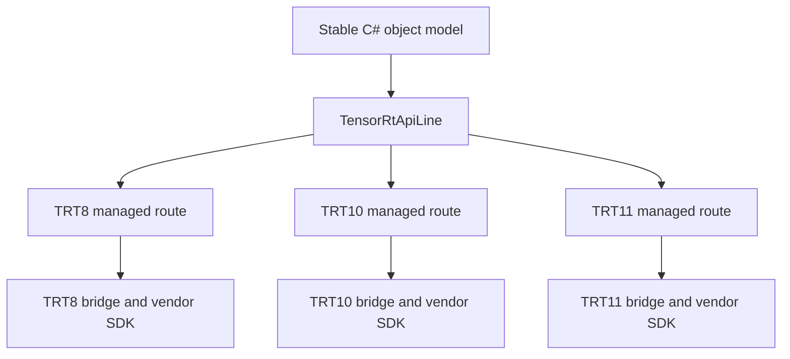

# TRT8/TRT10/TRT11 跨版本策略

TensorRtSharp4.0 同时维护 TensorRT 8.6、10.11 和 11.0。目标不是把三代 SDK 压成一套最低公分母，
也不是让用户靠 PATH 猜测加载到了哪版 DLL，而是在公共能力上提供稳定的 C# 对象模型，在差异处保留
明确的 API line、manifest、native bridge、version guard、runtime package key 和诊断。

本文解释这套三线策略如何落到仓库结构、代码路由、构建产物和用户选择上。

## 适用读者

- 同时部署多个 TensorRT 大版本的应用维护者。
- 正在新增或提升 TensorRT API 的贡献者。
- 负责 native build、runtime package 和 package consumer 验证的工程师。
- 遇到 DLL 能加载但 API line/version mismatch 的排障人员。

## 为什么不能只有一个 Bridge DLL

TensorRT 大版本会新增、重命名或移除 C++ 方法，也会改变 network creation、binding、serialization 和
plugin 接口。即使某个 C++ 类名保持不变，其 vtable 和方法契约也不一定相同。

如果一个 bridge 在运行时随便加载可找到的 `nvinfer.dll`，可能出现三种危险结果：

1. 编译期按 TRT11 头文件生成，运行时加载 TRT10 DLL，入口存在但内部类型布局不匹配。
2. 托管层以为某能力所有版本都有，旧版本只能到调用时才抛 EntryPointNotFound。
3. TRT8 legacy binding 与 TRT10/11 tensor API 被错误混用，数据绑定语义不一致。

因此项目将版本差异变成一等数据，而不是环境变量的偶然结果。

## 三线结构



仓库中的隔离点如下：

| 维度 | TRT8 | TRT10 | TRT11 |
| --- | --- | --- | --- |
| Public C header | `native/include/jyppx/tensorrt/trt8.h` | `native/include/jyppx/tensorrt/trt10.h` | `native/include/jyppx/tensorrt/trt11.h` |
| Manifest | `native/manifests/tensorrt/v8` | `native/manifests/tensorrt/v10` | `native/manifests/tensorrt/v11` |
| Native source | `native/src/tensorrt/v8/api.cpp` | `native/src/tensorrt/v10/api.cpp` | `native/src/tensorrt/v11/api.cpp` |
| Managed line | `TensorRt8` | `TensorRt10` | `TensorRt11` |
| Windows preset families | TRT8/CUDA11, TRT8/CUDA12 | TRT10/CUDA11, TRT10/CUDA12 | TRT11/CUDA12, TRT11/CUDA13 |

公共实现可以位于 `native/src/tensorrt/common`，但只能由各 line 的 `api.cpp` 在正确 guard 下引入。
“文件共享”不表示“API 在所有版本存在”。

## TensorRtApiLine 是运行时契约

`TensorRtApiLine` 定义在 `src/JYPPX.Shared/Interop/TensorRtApiLine.cs`。logger、builder、runtime、network、
engine 和 context wrapper 都保存自己的 `Line`。例如 builder 创建 network/config，或 runtime 反序列化
host memory 时，托管层先检查参与对象属于同一 line。

```csharp
using var logger = new TensorRtLogger(TensorRtApiLine.TensorRt11);
using var builder = new TensorRtBuilder(logger);
using var network = builder.CreateNetwork(stronglyTyped: true);
using var config = builder.CreateBuilderConfig();
```

这里 line 不是显示标签。`NativeBridgeApi` 根据它选择 `jyppx_trt8_*`、`jyppx_trt10_*` 或
`jyppx_trt11_*` 入口；native object 又用 line/kind 校验句柄，避免跨版本对象被误传。

## Public API 稳定不等于行为完全相同

高层 wrapper 尽量保留统一名称，但版本差异必须明确表达。`TensorRtBuilder.CreateNetwork(bool)` 是一个
典型例子：

- TRT8 adapter 不公开 strongly typed network policy，请求时抛受控 `NotSupportedException`。
- TRT10 使用对应 creation flag。
- TRT11 本身按新语义创建 strongly typed network，不复用 TRT10 的位值假设。

类似地，TRT8 legacy binding compatibility、TRT10 tensor API、TRT11 新 serialization/runtime controls
可以放在 partial wrapper 或能力查询中。不能为了统一签名，在旧版本返回一个看似有效但没有 vendor
语义的默认值。

推荐三种跨版本表达：

| 差异类型 | 推荐表达 |
| --- | --- |
| 所有 line 都有且语义相同 | 统一 property/method，内部 line route |
| 部分 line 有、可安全探测 | `TryGet...`、capability snapshot 或明确 NotSupported |
| ownership/ABI 根本不同 | 版本专属 wrapper/方法，不伪造公共入口 |

## 编译时 Major Guard

native source 不只依赖目录名，还检查 build 时 vendor major。常见模式是：

```cpp
#if JYPPX_HAS_TENSORRT && JYPPX_TENSORRT_VERSION_MAJOR_NUM == 10
// TensorRT 10 vendor call
#else
// dependency missing or version mismatch status
#endif
```

`native/src/tensorrt/common/object.cpp` 提供 `report_vendor_missing`、`report_vendor_mismatch`、
`report_vendor_exception` 和 `report_vendor_seh_exception`。因此错误能区分：bridge 没有检测到 TensorRT、
bridge 编译版本不符、vendor C++ exception、Windows structured exception。

这比让 loader 返回统一的 “DLL load failed” 更利于定位问题。

## Manifest 也必须按 Line 分开

每条 manifest API 都包含 version line、entry point、参数方向和 ownership。一个接口只存在于 TRT11 时，
应只进入 v11 manifest；若 TRT8/10 有等价但不同入口，则分别描述并由高层 wrapper 统一。

提升 deferred API 时按以下顺序审计：

1. 在三代 vendor headers 中分别搜索方法。
2. 在对应 import library/DLL 中验证 symbol 或可链接调用。
3. 比较参数类型、返回 ownership 和 deprecated/removal 状态。
4. 为真实存在的 line 写 manifest/native 实现。
5. 对不存在的 line 返回明确 capability/NotSupported，或不暴露该方法。
6. 重新生成 interop 并运行 ABI/export parity。

Header 声明不是 binary symbol 的充分证据。历史上 vendor 头文件声明但 LIB/DLL 不提供的接口必须继续
deferred，不能用只通过 generator 的假实现填补。

## Runtime Key 把 SDK 组合固定下来

`pack/runtime/runtime-packages.manifest.json` 当前记录 18 个 runtime key：6 个 Windows 组合与 12 个
Linux 组合。key 同时编码 OS/architecture、TensorRT、CUDA 和 cuDNN，例如：

```text
win-x64-trt8.6-cuda11.8-cudnn8.9
win-x64-trt10.11-cuda12.9-cudnn9.22
win-x64-trt11.0-cuda13.2-cudnn9.22
linux-x64-ubuntu22.04-trt11.0-cuda12.9-cudnn9.22
```

runtime key 不是兼容性宣传名，而是构建和收集 native asset 的输入。选择错误可能同时引入 bridge、
`nvinfer`、CUDA runtime 与 cuDNN 不匹配。

## Windows 六个 Native Preset

`CMakePresets.json` 为 Windows 提供以下 release 组合：

| Runtime key | Preset | TensorRT | CUDA |
| --- | --- | --- | --- |
| `win-x64-trt8.6-cuda11.8-cudnn8.9` | `win-x64-trt8-cuda11-release` | 8 | 11.8 |
| `win-x64-trt8.6-cuda12.1-cudnn8.9` | `win-x64-trt8-cuda12-release` | 8 | 12.1 |
| `win-x64-trt10.11-cuda11.8-cudnn8.9` | `win-x64-trt10-cuda11-release` | 10 | 11.8 |
| `win-x64-trt10.11-cuda12.9-cudnn9.22` | `win-x64-trt10-cuda12-release` | 10 | 12.9 |
| `win-x64-trt11.0-cuda12.9-cudnn9.22` | `win-x64-trt11-cuda12-release` | 11 | 12.9 |
| `win-x64-trt11.0-cuda13.2-cudnn9.22` | `win-x64-trt11-cuda13-release` | 11 | 13.2 |

构建单个组合：

```powershell
cmake --preset win-x64-trt10-cuda12-release
cmake --build --preset win-x64-trt10-cuda12-release --parallel
```

构建成功只证明该 preset 使用的 headers/libs 可以编译链接。它不自动证明另外五个组合，也不证明
生成 DLL 的导出和运行时 PATH 正确。

## Managed Route 如何避免入口漂移

generated entry points 和 `NativeBridgeApi` line switch 共同保证路由。常用路径包括：

- `src/JYPPX.TensorRtSharp/Internal/Interop/Generated/NativeMethodsTensorRt.Generated.g.cs`
- `src/JYPPX.TensorRtSharp/Internal/Interop/Generated/NativeBridgeApi.TensorRtBindings.Generated.g.cs`
- `src/JYPPX.TensorRtSharp/Internal/Interop/Runtime/NativeBridgeApi.CrossVersionLineBindings.cs`
- `src/JYPPX.TensorRtSharp/Internal/Interop/Runtime/NativeBridgeApi.RuntimeCreation.cs`
- `src/JYPPX.TensorRtSharp/Internal/Interop/Builder/NativeBridgeApi.BuilderConfigCore.cs`
- `src/JYPPX.Shared/Generated/GeneratedEntryPointNames.g.cs`

维护者不应在业务 wrapper 中直接写 DLL 文件名或 entry point 字符串。manifest 和 generator 是唯一的
声明源，line route 是唯一的版本选择点。

## 版本差异下的对象生命周期

无论 line 如何变化，public object 必须保持这些不变量：

- logger 被 builder/runtime 借用期间保持存活。
- network、config、profile、host memory 由调用者明确释放。
- runtime 与待反序列化数据属于同一 line。
- engine 创建 context；context 不接受另一 engine/line 的 handle。
- copied snapshot 不保存 vendor borrowed pointer。
- safe handle 只在 internal 层出现。

若某代 SDK 改变 owner 规则，wrapper 应为该 line 单独实现，而不是假设统一析构顺序。

## 三层版本诊断


排障时依次确认：

1. 项目 restore 的 package ID/version/runtime key。
2. 输出目录 bridge 报告的 target line 与 build info。
3. 实际加载的 TensorRT/CUDA/cuDNN 版本。
4. 当前操作在该 line 是否有真实实现。

只看 `nvinfer.dll` 文件名不足以证明版本链一致。

## 验证命令

### 生成与托管构建

```powershell
pwsh -NoProfile -File .\eng\Generate-Bindings.ps1
pwsh -NoProfile -File .\eng\Test-BindingGeneratorOutputs.ps1
dotnet build .\TensorRtSharp.sln -c Debug --no-restore --nologo -m:1
```

### 三代 ABI 声明

```powershell
pwsh -NoProfile -File .\eng\Test-TensorRtNativeAbiSurface.ps1 `
  -TensorRtLines 8,10,11
```

### 单组合 native build

```powershell
$preset = 'win-x64-trt11-cuda12-release'
cmake --preset $preset
cmake --build --preset $preset --parallel
```

### Runtime root 解析与输入检查

```powershell
$key = 'win-x64-trt11.0-cuda12.9-cudnn9.22'
$roots = pwsh -NoProfile -File .\eng\Resolve-RuntimeRoots.ps1 `
  -RuntimePackageKey $key | ConvertFrom-Json

pwsh -NoProfile -File .\eng\Validate-WindowsRuntimeInputs.ps1 `
  -RuntimePackageKey $key `
  -TensorRtRoot $roots.tensorRtRoot `
  -CudaRoot $roots.cudaRoot `
  -CudnnRoot $roots.cudnnRoot
```

## 结果怎么解释

| 结果 | 解释 |
| --- | --- |
| version guard compile pass | 指定 header line 的代码形状成立 |
| ABI missing declarations = 0 | manifest entry point 都有对应 line header 声明 |
| PE missing exports = 0 | 指定 bridge DLL 导出预期入口 |
| adapter reports expected major | bridge build line 与探针一致 |
| dependency probe passed | 依赖可加载和读取版本 |
| runtime smoke passed | 指定操作在该 key/host 真实通过 |
| `blocked-by-cuda-driver` | 当前 driver 不支持目标 CUDA runtime，不能算 passed |

不要把一个 Windows runtime key 的通过结果外推到 Linux，也不要把 CUDA12.9 结果外推到 CUDA13.2。

## 常见问题

### DLL 加载成功但报告 version mismatch

输出目录或 PATH 混入了另一 runtime key 的 DLL。先打印 package identity、bridge build info 和 vendor probe，
再清理应用输出目录。不要通过复制单个 `nvinfer.dll` 拼凑组合。

### TRT8 中 strongly typed network 抛 NotSupported

这是 wrapper 的显式版本边界，不是缺失 DLL。选择 TRT8 支持的 network creation policy，或切换到有该
能力的 runtime key。

### TRT11 新 API 为什么没有出现在 TRT10

检查 v11 manifest、header 和 vendor symbol。版本专属能力不应为了 API 对称而生成空壳 TRT10 入口。

### 一个 preset 通过，matrix 是否完成

不是。每个 preset 有独立 SDK roots、compiler/linker 输入和产物。matrix claim 必须有逐组合证据。

### Readiness blockers 为 0 是否等于 runtime 全通过

不是。readiness 主要检查包身份和资产/消费前置条件；runtime smoke、callback proof 和 post-publish proof
是独立状态。

## 边界说明

本文描述的是跨版本工程契约。CMake build、manifest match、ABI declaration 与 dependency probe 都不是
公开 package runtime proof。Linux key 的存在也不表示已有 runner evidence。未取得真实 public channel、
clean consumer、runtime exit 0 和 owner record 时，不得写成已发布。

固定状态仍为：

- `performsPublish=false`
- `canPublishPublicly=false`
- `canCloseReleaseIssue=false`

## 跨版本提交清单

- [ ] 三代 vendor header 和 binary symbol 已分别审计。
- [ ] manifest 只进入真实适用的 v8/v10/v11 目录。
- [ ] native source 有 build-time major guard 和 no-throw status。
- [ ] generated entry point 与 line route 一致。
- [ ] public wrapper 保持 line、owner、disposed 和 copied snapshot 不变量。
- [ ] 六个 Windows preset 的声明没有互相外推。
- [ ] ABI declaration、PE export、focused smoke 分别记录。
- [ ] runtime key 精确包含 TensorRT/CUDA/cuDNN 组合。
- [ ] blocked/skip 没有被改写成 passed。
- [ ] 文档没有把某代专属能力写成三代通用。

## 下一步

- [为什么不是简单 P/Invoke](why-not-plain-pinvoke.md)
- [Windows 本地开发环境准备](windows-local-dev-environment.md)
- [Runtime Package 和 Split Package 怎么选](runtime-package-selection.md)
- [Runtime 版本矩阵阅读指南](runtime-package-matrix-reading-guide.md)
