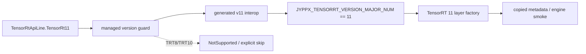

# TensorRT 11 Modern Layers Guide

TensorRT 11 引入或强化了一批 modern layer 和 metadata 能力。TensorRtSharp4.0 对 TRT11 专属能力必须保留 version guard，不能让 TRT8 或 TRT10 路径误调用。

## 推荐阅读对象

- `smoke/NetworkTrt11ModernLayersSmokeRunner`
- TRT11 manifest
- native `v11` source
- managed wrapper 中的 version guard

## 实现原则

- TRT11 专属 API 只在 TRT11 wrapper 或 guard 后暴露。
- 公共 API 文档需要说明最低 TensorRT line。
- smoke 输出应包含 TensorRT line 和 skipped/blocked 原因。
- 新增 layer wrapper 时同步更新 manifest、native source、interop、C# wrapper 和质量测试。

## 证据要求

每个 modern layer 至少记录：

- layer 创建是否成功。
- 输入输出 tensor dtype 和 shape。
- TRT line。
- unsupported line 的 guard 行为。
- 是否执行到 engine build 或只覆盖 network build。

## 边界

TRT11 文章不能把版本专属能力写成所有 TensorRT 版本通用能力。跨版本一致封装的目标是行为清晰，不是抹平 ABI 差异。

## 为什么 modern layer 必须单独成篇

TensorRT 的 major line 不只是 DLL 名变化，layer factory、shape 宽度、metadata 和可选硬件能力也会变化。
TensorRtSharp4.0 将 TRT11 专属入口放在 `src/JYPPX.TensorRtSharp/Network/TensorRtNetworkDefinition.Trt11ModernLayers.cs`、
`src/JYPPX.TensorRtSharp/Network/TensorRtNetworkDefinition.Trt11AdvancedLayers.cs`、
`src/JYPPX.TensorRtSharp/Network/TensorRtNetworkDefinition.Trt11Attention.cs` 等 partial wrapper 中，再通过 line guard
进入 v11 native adapter。这样 public API 仍是强类型对象，但错误 line 会在调用边界被拒绝。



这条链同时由 manifest、native source、generated interop 和 managed wrapper 约束。仅在 C# 中出现方法名，不能证明
native ABI 存在；仅在 manifest 中出现 entrypoint，也不能证明 owner-safe wrapper 已完成。

## 两类 runner，各自回答不同问题

`smoke/NetworkTrt11ModernLayersSmokeRunner/Program.cs` 构建 squeeze/unsqueeze identity network，执行 engine
build、deserialize、binding、enqueue 和 readback。它回答最小可执行路径是否闭环，并输出：

```text
TensorMetadata InputDims=... DimNames=... AllowedFormats=...
LayerMetadata Squeeze=... Unsqueeze=... Output=...
HostMemory=... IOTensors=... Readiness=True BindingReady=True OutputMatch=True
```

`smoke/NetworkTrt11ModernLayerMetadataRunner/Program.cs` 更偏向 layer factory 与 metadata probe，覆盖 scatter、
one-hot、cumulative、assertion、grid sample、normalization-v2、dynamic quantize-v2、rotary embedding、KV cache、
safe network v2 和 attention v2。MoE、distributed collective 受 GPU/运行时能力影响，被显式标为 optional。

这两类证据不能互换：`Status=created` 是 network/layer 创建证据，`OutputMatch=True` 才是该最小网络的 enqueue/readback
证据；optional skip 也不能写成 modern layer 全部运行通过。

## Squeeze/Unsqueeze 最小闭环

runner 用 shape tensor 指定 axes，并在 squeeze 后再 unsqueeze：

```csharp
using TensorRtLayer axesLayer = network.AddConstant(
    new TensorRtDims(new[] { 1 }),
    TensorRtWeights.FromInt32Array(new[] { 0 }));
using TensorRtTensor axes = axesLayer.GetOutput(0);

using TensorRtLayer squeeze = network.AddSqueeze(input, axes);
using TensorRtTensor squeezed = squeeze.GetOutput(0);
using TensorRtLayer unsqueeze = network.AddUnsqueeze(squeezed, axes);
using TensorRtTensor output = unsqueeze.GetOutput(0);
network.MarkOutput(output);
```

这里同时检查 `TensorRtTensor.IsShapeTensor`、`IsExecutionTensor`、dimension name 和 allowed formats。shape tensor
与 execution tensor 的角色不能只靠 dtype 猜测，metadata 输出必须与 network 实际状态一致。

## Dims64 与 copied metadata

TRT11 的 64 位维度通道由 `src/JYPPX.TensorRtSharp/Core/TensorRtDims64.cs`、
`src/JYPPX.TensorRtSharp/Layers/TensorRtLayer.Trt11Dims64.cs` 和
`native/manifests/tensorrt/v11/trt11-seventeenth-batch-dims64.manifest.json` 对齐。metadata runner 对每个必需 probe
输出 `Shape64=` 与 `Ext64=`，并要求 `Dims64Evidence` 数量与创建成功数一致。

`TensorRtLayerTensorMetadata` 是复制后的结构，包含 tensor name、dtype、location、allowed formats、flags 和
`DimensionExtents64`。它避免 public 调用方持有 TensorRT layer 内部 tensor 指针；layer 与 tensor wrapper 仍遵循
父对象先存活、子对象先释放的顺序。

## Attention 与可选能力

Attention v2 的强类型入口位于 `src/JYPPX.TensorRtSharp/Layers/TensorRtAttention.cs`，ABI 描述位于
`native/manifests/tensorrt/v11/trt11-thirty-sixth-batch-attention.manifest.json`。query/key/value 的 rank、head
布局、normalization 和 causal mask 都是模型契约，不能因为 layer 创建成功就假设任意 transformer 可运行。

MoE 与 distributed collective 还依赖更具体的 TensorRT/GPU 或多设备能力。runner 对已知“返回 null object”的能力
缺口输出 `Status=skipped Optional=True Reason=...`，其他异常仍是 failed。这一分支设计防止把可选环境限制吞成绿灯。

## 构建与运行

```powershell
$repo = "."
$case = "..\downloads\cases\trt11-modern-layers"
New-Item -ItemType Directory -Force -Path "$case\logs" | Out-Null
Set-Location $repo

dotnet build .\smoke\NetworkTrt11ModernLayersSmokeRunner\NetworkTrt11ModernLayersSmokeRunner.csproj `
  -c Debug --no-restore --nologo
$env:JYPPX_ENABLE_DEVELOPMENT_PROBING = "1"
dotnet .\smoke\NetworkTrt11ModernLayersSmokeRunner\bin\Debug\net8.0\NetworkTrt11ModernLayersSmokeRunner.dll `
  --tensor-rt-line 11 2>&1 | Tee-Object "$case\logs\identity.log"
dotnet .\smoke\NetworkTrt11ModernLayerMetadataRunner\bin\Debug\net8.0\NetworkTrt11ModernLayerMetadataRunner.dll `
  2>&1 | Tee-Object "$case\logs\metadata.log"
```

用 `--tensor-rt-line 10` 调用第一个 runner 应得到专注 TRT11 的 `Skipped=True`，这是 version guard 证据，不是
TRT10 runtime failure。运行前应通过 runtime manifest 和 PATH 确认加载的是同一个 TRT11/CUDA 组合。

## 诊断决策表

| 现象 | 首查 | 结论边界 |
| --- | --- | --- |
| requested line 不是 11 | CLI 与 `TensorRtApiLine` | 正确 skip，不重试 native call |
| builder/runtime unsupported | environment snapshot | 记录 adapter message |
| layer `Status=failed` | 对应 manifest、native last error | 不计入 created |
| optional layer skipped | GPU/多设备能力 | 不影响必需 probe 计数 |
| `Dims64Evidence` 不足 | metadata getter 与 shape | 视为门禁失败 |
| readback mismatch | binding、stream sync、shape | 视为 runtime smoke 失败 |

## 合并新 wrapper 的五项检查

1. v11 manifest 使用明确的 `JYPPX_TENSORRT_VERSION_MAJOR_NUM == 11` guard。
2. native adapter 不把异常跨 C ABI 抛出，字符串和数组使用 caller-buffer 或 copied struct。
3. generated interop 的参数宽度、枚举和 ownership 与 manifest 一致。
4. managed wrapper 返回 `TensorRtLayer`、`TensorRtTensor` 或 copied metadata，不暴露无语义 `IntPtr`。
5. runner 同时覆盖 positive TRT11 路径和 unsupported line 行为，并保存输出 marker。

## Proof boundary 与下一步

本文及两个 runner 证明 source/build/smoke 层面的 TRT11 modern layer 路径，不代表任意 transformer、MoE 或多设备
模型已完成精度验证，也不是 clean package-consumer proof。当前 `performsPublish=false`、
`canPublishPublicly=false`、`canCloseReleaseIssue=false`。

继续阅读：[TRT8/TRT10/TRT11 跨版本策略](trt-cross-version-strategy.md)、
[Network layer coverage 博客版](blog-network-layer-coverage-guide.md) 与 [常见问题排查总表](troubleshooting-index.md)。
