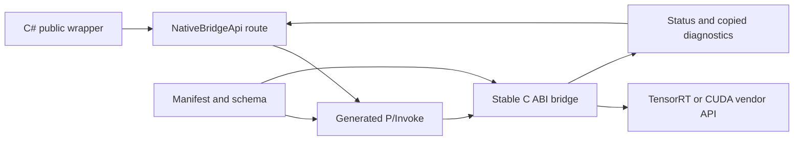
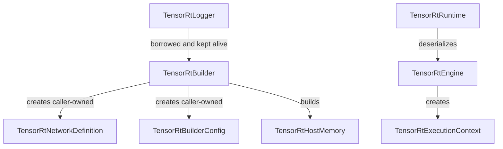

# 为什么 TensorRtSharp4.0 不是简单 P/Invoke

TensorRT 和 CUDA 都有 C/C++ 入口，把函数签名翻译成 `[DllImport]` 似乎很快。但“能调用一个
DLL 符号”和“给 C# 用户一套可升级、可释放、可诊断的推理 API”不是同一个问题。前者只处理
调用约定，后者还要处理 C++ ABI、对象所有权、版本线、异常、字符串和数组复制、GPU 异步执行、
native asset 选择以及离开源码树后的包消费。

TensorRtSharp4.0 因此采用 manifest 驱动的 C ABI bridge、generated interop 和 owner-safe wrapper。
这篇文章从一条调用的完整路径解释这项选择，并给出维护者可以实际执行的验证方法。

## 适用读者

- 正在评估 TensorRT .NET 绑定架构的开发者。
- 需要给现有 P/Invoke 层补生命周期和跨版本治理的维护者。
- 想理解本项目 manifest、native bridge、generated code 与 public wrapper 分工的贡献者。
- 遇到“本地能编译，换机器就找不到 DLL 或崩溃”问题的应用开发者。

## 解决问题

简单 P/Invoke 常把以下问题留给业务代码：

1. C++ 虚函数表是否能跨编译器和版本稳定调用。
2. 返回的对象由谁释放、何时释放、父对象能否先释放。
3. TensorRT 8、10、11 是否真的导出同一个能力。
4. C++ exception 或 Windows structured exception 是否越过托管边界。
5. `char*`、数组、borrowed pointer 和 device pointer 在调用返回后是否仍有效。
6. CUDA stream 上的异步工作是否在 host buffer 释放前完成。
7. NuGet 消费端是否得到正确的 bridge 与 NVIDIA DLL。

这些不是附加功能，而是 native SDK 进入托管语言后必须回答的 API 契约。

## 五层调用链

项目把一次 public API 调用拆成五层，每层只承担可验证的责任。



对应的仓库锚点是：

| 层 | 权威路径 | 责任 |
| --- | --- | --- |
| API 描述 | `native/manifests/bridge-api.schema.json` 与 `native/manifests` | 入口名、参数方向、ownership、版本线 |
| C ABI 声明 | `native/include/jyppx/tensorrt/trt8.h`、`trt10.h`、`trt11.h` | 稳定导出形状与版本隔离 |
| native 实现 | `native/src/tensorrt/v8/api.cpp`、`v10/api.cpp`、`v11/api.cpp` | vendor 调用、guard、异常收敛 |
| generated interop | `src/JYPPX.Shared/Generated/GeneratedNativeMethods.g.cs` | P/Invoke 声明和 entry point 一致性 |
| 托管路由 | `src/JYPPX.TensorRtSharp/Internal/Interop/*/NativeBridgeApi.*.cs` | 按 owner 选择 API line、检查 status、复制输出 |
| public wrapper | `src/JYPPX.TensorRtSharp` 与 `src/JYPPX.CudaSharp` | 生命周期、参数校验、易用对象模型 |

manifest 不是文档备注。`eng/Generate-Bindings.ps1` 会把它转换为 native catalog、entry point 常量和
托管声明，`eng/Test-BindingGeneratorOutputs.ps1` 则验证必填字段、重复 ID、重复导出和生成幂等性。

## C++ ABI 为什么不能直接当公共契约

TensorRT 的核心对象是 C++ interface。虚函数布局、析构入口、枚举宽度以及版本新增/删除方法都会
影响 ABI。若托管层直接模拟 vtable，调用者实际上依赖特定编译器、特定头文件和特定二进制布局。
一次 SDK 升级就可能把“成功解析符号”变成错误槽位调用。

项目 bridge 只导出 C 调用约定函数，并把 vendor 对象装进带有 magic、line、kind 和 payload 的
桥接对象。结构与检查逻辑位于 `native/src/tensorrt/common/object.hpp` 和
`native/src/tensorrt/common/object.cpp`。每次调用都可以验证：

- 句柄不是 null。
- magic 表明它确实来自本 bridge。
- 句柄所属 TensorRT line 与入口一致。
- object kind 是 runtime、builder、engine 等预期类型。

这比把 `void*` 传回业务层多了一层工作，却能把“把 TRT10 engine 交给 TRT11 context”从随机行为
变成明确的 invalid argument。

## 状态码和异常必须在 ABI 内收敛

C++ exception 不能穿过 P/Invoke。Windows 上 vendor DLL 还可能触发 SEH。bridge 通过
`native/src/common/error_state.cpp` 保存线程侧诊断，并由 TensorRT object helper 将 dependency missing、
version mismatch、C++ exception 和 SEH 转为稳定 status。

托管层的 `NativeStatus.ThrowIfFailed` 再读取复制后的 category/message，抛出带语义的托管异常。
这条路线保留了三个重要信息：哪一层失败、失败属于参数/依赖/运行时哪一类、当前 bridge 期望哪条
TensorRT line。直接让 AccessViolation 或 EntryPointNotFound 冒到用户代码，无法提供这种诊断。

字符串和数组也不能把 vendor 指针原样返回。本项目优先使用：

- caller-buffer：先查询 required size，再由调用方分配并复制 UTF-8 文本。
- count/copy：先取得元素数，再复制到固定布局的 native/managed 数组。
- copied snapshot：把只读元数据投影为托管 record/class，不保存 borrowed pointer。

## 生命周期不是一个 Dispose 就结束

`IDisposable` 只有在 ownership 已明确时才有意义。以 builder 为例，`TensorRtBuilder` 创建 native
builder，但 TensorRT 借用 logger。wrapper 因此保存 `_loggerKeepAlive`，在创建时登记 borrower，
释放 builder 后再解除借用。相关实现位于 `src/JYPPX.TensorRtSharp/Builder/TensorRtBuilder.cs`。

native 对象本身由内部 `SafeTensorRtObjectHandle` 持有，释放时统一调用
`jyppx_trt_object_destroy`。这个 safe handle 位于
`src/JYPPX.TensorRtSharp/Internal/Handles/SafeTensorRtObjectHandle.cs`，不会出现在 public API 中。

典型所有权可以画成：



“caller-owned”意味着调用者负责 `Dispose`，不表示对象之间没有 line 或执行顺序约束。builder、network
和 config 必须属于同一 `TensorRtApiLine`；engine 与 execution context 也必须保持版本一致。

## CUDA 的难点是异步所有权

CUDA 的 `cudaMalloc`/`cudaFree` 看似比 C++ object 简单，但 stream 会让释放时序变复杂。host 发起
异步复制后立即返回，如果 pinned buffer 或 device memory 过早释放，错误可能在之后的同步点才出现。

`CudaMemory`、`CudaPinnedMemory`、`CudaStream` 和 `CudaEvent` 将 handle 放在 wrapper 内部，并对
size、offset、count 和 disposed state 做托管校验。同步复制适合简单数据；异步复制要求 pinned host
memory 和显式 stream；跨设备复制还必须提供 source/destination device 语义。

公开用法表达的是“内存对象”和“执行顺序”，不是裸地址：

```csharp
using var stream = new CudaStream();
using var host = new CudaPinnedMemory(4096);
using var device = new CudaMemory(4096);

host.CopyFrom(new byte[4096]);
device.CopyFromAsync(host, stream);
stream.Synchronize();
```

这段代码的关键不是少写一个 `IntPtr`，而是把 host buffer、device allocation 和 stream 的存活区间
放进同一个可审查的作用域。

## 跨版本路由为何不能交给 DLL 搜索顺序

`TensorRtApiLine` 明确列出 8、10、11。`NativeBridgeApi` 按 line 选择不同 entry point，而不是加载到
哪个 DLL 就调用哪个。native 入口也检查编译时检测到的 major；line 不匹配时返回 vendor mismatch。

因此一个能力要成为跨版本公共 API，至少需要：

1. 每条适用版本的 manifest 记录。
2. 对应 `trt8.h`/`trt10.h`/`trt11.h` 声明。
3. 各版本 native source 的真实实现或明确 NotSupported。
4. generated interop 与托管 line switch。
5. wrapper 对缺失能力的受控行为。
6. ABI、PE export、smoke 或质量门证据。

让系统 PATH 决定加载哪个 `nvinfer.dll` 无法替代这套契约。

## 为什么 deferred 是必要状态

有些接口不是“再写一个 DllImport”就安全。例如 allocator、output allocator、debug listener、plugin
resource acquire/release 涉及 vendor 回调托管代码、in-flight callback、no-throw trampoline、borrowed
device/tensor pointer 和 detach-before-release。没有 native owner 与真实 runtime proof 时，把这些入口公开
只会把悬空指针风险包装得更漂亮。

因此 manifest 可以记录 deferred row。它说明接口已进入覆盖账本，但还没有满足 public contract。
旧 deferred 记录也不会为了提高数字而删除；真实实现完成后通过 coverage alias 表达
`implemented-with-deferred-history`。

## 本地 build 与真实消费是两层证据

源码 solution build 可以证明托管项目编译，但不能证明 NuGet restore 后 native DLL 会正确进入输出目录。
项目用 `eng/Test-PackageConsumer.ps1` 和 `eng/Test-RuntimePackageReadiness.ps1` 检查包身份、native asset、
consumer project 和 smoke 分类。

证据必须按层描述：

| 结果 | 能证明 | 不能证明 |
| --- | --- | --- |
| generator 幂等 | manifest 与 generated output 一致 | vendor runtime 可执行 |
| solution build | 托管/项目引用可编译 | clean package consumer 可运行 |
| native ABI parity | 声明与导出账本一致 | 所有代码路径行为正确 |
| package restore/build | 包布局可消费 | runtime smoke 成功 |
| dependency probe | DLL 和版本可探测 | 推理或 callback 已执行 |
| runtime smoke exit 0 | 该指定路径在该主机通过 | 其它 runtime key 自动通过 |

## 维护者验证流程

在仓库根目录运行：

```powershell
pwsh -NoProfile -File .\eng\Generate-Bindings.ps1
pwsh -NoProfile -File .\eng\Test-BindingGeneratorOutputs.ps1
dotnet build .\TensorRtSharp.sln -c Debug --no-restore --nologo -m:1
pwsh -NoProfile -File .\eng\Test-TensorRtNativeAbiSurface.ps1
dotnet test .\tests\JYPPX.ProjectQuality.Tests\JYPPX.ProjectQuality.Tests.csproj `
  -c Debug --no-restore --filter "FullyQualifiedName~Binding"
```

如果修改了 native 实现，还要使用与目标 runtime key 对应的 CMake preset 构建，并对生成 DLL 做 PE
export parity。若修改包布局，则在 E 盘 clean workspace 中运行 package consumer；不要用源码目录下的
ProjectReference 结果替代包证据。

## 输出怎么读

- generator 报告 manifest API count 且第二次生成 hash 不变，说明声明链稳定。
- ABI surface 的 missing declaration 为 0，只说明 manifest entry point 有 header 声明。
- native build 通过说明指定 SDK line 能编译和链接，不自动证明另一条 line。
- package consumer 的 restore/build/native-copy 都成功后，仍要单独读取 smoke 分类。
- `blocked-by-cuda-driver` 是主机兼容阻塞，不能写成 passed，也不能写成 bridge API 缺失。

## 排障决策表

| 症状 | 首查位置 | 不应采用的修复 |
| --- | --- | --- |
| `EntryPointNotFoundException` | runtime key、bridge DLL、generated entry point | 把 PATH 指向任意旧 bridge |
| object line mismatch | wrapper 的 `Line` 与 runtime package | 强转或复用其它 line 的 handle |
| native error 无上下文 | common error state 与 `NativeStatus` | 捕获后静默返回默认值 |
| dispose 后随机崩溃 | borrower/owner 和 stream 同步顺序 | 暴露 handle 让业务层自行释放 |
| 本地 build 过、consumer 失败 | package targets 与 native copy | 用 ProjectReference 证明包可用 |
| callback precheck 过、真实调用未发生 | runtime markers 与 in-flight 记录 | 把 dry-run 写成 callback proof |

## 边界说明

本文证明的是架构与仓库实现路径可审计，不是某个公开包已经发布，也不是所有 runtime 组合已通过。
manifest/source matched 不等于 API 已安全公开；wrapper compiled 不等于 runtime proof；本地 nupkg 或
direct package path 也不等于 post-publish proof。

本项目当前仍保持：

- `performsPublish=false`
- `canPublishPublicly=false`
- `canCloseReleaseIssue=false`

## 检查清单

- [ ] public API 没有向用户暴露 `IntPtr`、`SafeHandle` 或 borrowed device/plugin/tensor pointer。
- [ ] C ABI 返回 status，C++ exception 与 SEH 不跨 ABI。
- [ ] 字符串采用 caller-buffer，列表采用 count/copy，元数据采用 copied snapshot。
- [ ] owner、borrower、dispose 与异步 stream 顺序有代码和测试表达。
- [ ] TRT8、TRT10、TRT11 只在真实存在的版本实现能力。
- [ ] package consumer 结果与 source build 结果分开记录。
- [ ] deferred 历史没有通过删除记录被伪装成完成。

## 下一步

- [从接口清零到 deferred 边界提升](interface-zero-to-deferred-boundary.md)
- [TRT8/TRT10/TRT11 跨版本策略](trt-cross-version-strategy.md)
- [C# Wrapper 生命周期设计](csharp-wrapper-lifetime-design.md)
- [Package Consumer Runtime Proof Playbook](package-consumer-runtime-proof-playbook.md)
