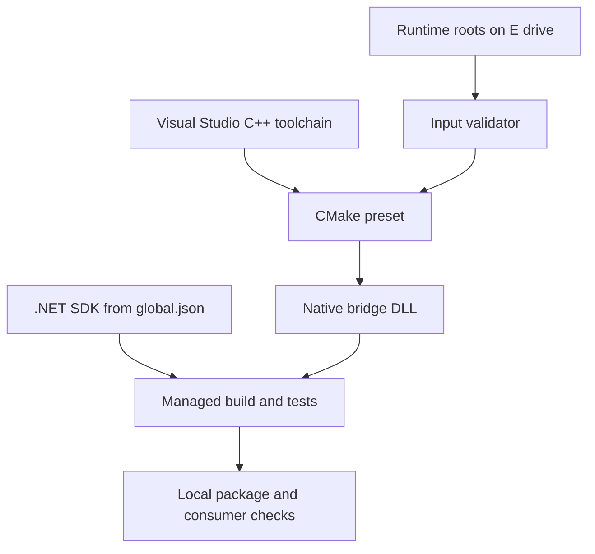

# Windows 本地开发环境准备

本文面向需要在 Windows x64 上修改、编译和验证 TensorRtSharp4.0 的维护者。普通用户消费托管包和
匹配的 runtime package，不一定需要完整 C++ toolchain；但只要修改 manifest、native bridge、CUDA/TensorRT
wrapper 或 runtime packaging，就必须让 .NET、MSVC、CMake、TensorRT、CUDA 和 cuDNN 属于一个明确组合。

本文从空环境开始建立可复现工作区，重点是“先验证输入，再构建产物”，并把大 SDK、包和日志放在 E 盘。

## 适用读者

- 第一次从源码构建本项目 C++ bridge 的 Windows 开发者。
- 需要复现 TRT8/TRT10/TRT11 native matrix 的维护者。
- 修改 binding generator、manifest 或 runtime package 的贡献者。
- 排查 header/lib/DLL、MSVC、CUDA driver/runtime 不一致的工程师。

## 最终环境结构



建议在 E 盘准备专用目录：

```text
E:\TensorRtSharpAssets\
  nvidia\
    TensorRT-8.6.1.6-cuda11.8\
    TensorRT-10.11.0.33-cuda12.9\
    TensorRT-11.0.0.114-cuda13.2\
    cudnn-8.9\
    cudnn-9.22\
  package-feed\
  build-logs\
  consumer\
```

仓库保持在 E 盘。模型、ONNX、engine、plan、nupkg、SDK archive 和大日志也放在这个工作区，避免系统盘
Downloads/Temp 变成不可审计的依赖来源。

## 工具清单

| 工具 | 仓库用途 | 最低检查 |
| --- | --- | --- |
| Git | 版本和 diff 管理 | `git --version` |
| PowerShell 7 | 执行 `eng/*.ps1` | `$PSVersionTable.PSVersion` |
| .NET SDK | solution、tests、generator | `dotnet --info` 与 `global.json` |
| Visual Studio 2022 | MSVC、Windows SDK、CMake generator | Desktop development with C++ workload |
| CMake 3.27+ | 使用 `CMakePresets.json` | `cmake --version` |
| NVIDIA driver | 执行 CUDA/TensorRT smoke | `nvidia-smi` |
| CUDA Toolkit | 编译 CUDA bridge、提供 runtime | runtime key 对应 major.minor |
| TensorRT SDK | headers、import libs、DLL | runtime key 对应 8.6/10.11/11.0 |
| cuDNN | runtime asset 和 package | runtime key 对应 major/version |

版本以仓库 `global.json`、`CMakePresets.json` 和 `pack/runtime/runtime-packages.manifest.json` 为准，
不要把文章中的工具版本当不可变常量。

## 第一步：确认仓库与工具

在 Developer PowerShell 或已初始化 MSVC 的 PowerShell 中运行：

```powershell
Set-Location E:\GitSpace\TensorRT-CSharp-API-4.0\TensorRtSharp4.0

git status --short
dotnet --info
cmake --version
pwsh --version
where.exe cl
where.exe cmake
```

`where.exe cl` 没有结果时，通常是没有安装 C++ workload，或终端没有加载 Visual Studio 开发环境。
先修复 toolchain，再改 CMake cache；普通 PowerShell 中手工拼接几十个 MSVC 路径不是稳定方案。

保存环境快照：

```powershell
$logRoot = 'E:\TensorRtSharpAssets\build-logs'
New-Item -ItemType Directory -Force $logRoot | Out-Null
dotnet --info | Out-File (Join-Path $logRoot 'dotnet-info.txt')
cmake --version | Out-File (Join-Path $logRoot 'cmake-version.txt')
$PSVersionTable | Out-File (Join-Path $logRoot 'powershell-version.txt')
nvidia-smi | Out-File (Join-Path $logRoot 'nvidia-smi.txt')
```

## 第二步：选择唯一 Runtime Key

Windows 当前有六个组合：

| Runtime key | Preset |
| --- | --- |
| `win-x64-trt8.6-cuda11.8-cudnn8.9` | `win-x64-trt8-cuda11-release` |
| `win-x64-trt8.6-cuda12.1-cudnn8.9` | `win-x64-trt8-cuda12-release` |
| `win-x64-trt10.11-cuda11.8-cudnn8.9` | `win-x64-trt10-cuda11-release` |
| `win-x64-trt10.11-cuda12.9-cudnn9.22` | `win-x64-trt10-cuda12-release` |
| `win-x64-trt11.0-cuda12.9-cudnn9.22` | `win-x64-trt11-cuda12-release` |
| `win-x64-trt11.0-cuda13.2-cudnn9.22` | `win-x64-trt11-cuda13-release` |

key 同时决定 TensorRT、CUDA、cuDNN 与 bridge target。不要选择 TRT11 preset，却把 TRT10 import library 放进
PATH；configure 可能成功，link 或 runtime 才会暴露问题。

## 第三步：配置本地 Runtime Roots

公开 manifest 只保存可移植默认值，本机路径写入：

- 示例：`pack/runtime/runtime-packages.local.example.json`
- 本地覆盖：`pack/runtime/runtime-packages.local.json`

本地文件应被 Git 忽略。按实际 E 盘目录填写后，用 resolver 读取，不要让各脚本各自猜路径：

```powershell
$key = 'win-x64-trt10.11-cuda12.9-cudnn9.22'
$roots = pwsh -NoProfile -File .\eng\Resolve-RuntimeRoots.ps1 `
  -RuntimePackageKey $key | ConvertFrom-Json

$roots | Format-List
```

预期得到 `tensorRtRoot`、`cudaRoot`、`cudnnRoot`。这些目录需要指向解压后的 SDK 根，不是某个单独 DLL。

## 第四步：构建前验证输入

```powershell
pwsh -NoProfile -File .\eng\Validate-WindowsRuntimeInputs.ps1 `
  -RuntimePackageKey $key `
  -TensorRtRoot $roots.tensorRtRoot `
  -CudaRoot $roots.cudaRoot `
  -CudnnRoot $roots.cudnnRoot
```

输入检查应在 CMake 之前执行。它能提前发现：

- TensorRT include/lib/bin 不属于同一 package。
- 只有 import library，没有运行时 DLL。
- CUDA major 与 key 不符。
- cuDNN 8/9 文件名和目标 major 不一致。
- 本地 root 不存在或指向 archive 上层目录。

如果 validator 失败，修 root，不要从其它 SDK 目录临时复制单个 DLL。

## 第五步：生成绑定

只改文档通常不需要生成；修改 manifest、schema、template、entry point 或 interop shape 时必须执行：

```powershell
pwsh -NoProfile -File .\eng\Generate-Bindings.ps1
pwsh -NoProfile -File .\eng\Test-BindingGeneratorOutputs.ps1
```

关注这些输出：

- `native/generated/bridge_api_catalog.g.h`
- `native/generated/bridge_entrypoints.g.h`
- `src/JYPPX.Shared/Generated/GeneratedEntryPointNames.g.cs`
- `src/JYPPX.TensorRtSharp/Internal/Interop/Generated/NativeMethodsTensorRt.Generated.g.cs`
- `src/JYPPX.CudaSharp/Internal/Interop/Generated/NativeMethodsCuda.Generated.g.cs`

幂等测试失败时修 manifest/generator/template，不要手改 generated file。

## 第六步：配置与编译 Native Bridge

以下示例使用前面选择的 TRT10/CUDA12 preset：

```powershell
$preset = 'win-x64-trt10-cuda12-release'
$configureLog = 'E:\TensorRtSharpAssets\build-logs\trt10-cuda12-configure.log'
$buildLog = 'E:\TensorRtSharpAssets\build-logs\trt10-cuda12-build.log'

cmake --preset $preset *>&1 | Tee-Object $configureLog
if ($LASTEXITCODE -ne 0) { throw "CMake configure failed: $LASTEXITCODE" }

cmake --build --preset $preset --parallel *>&1 | Tee-Object $buildLog
if ($LASTEXITCODE -ne 0) { throw "CMake build failed: $LASTEXITCODE" }
```

输出位于 `build-out` 下以 preset 命名的子目录。Windows Release 构建至少应得到 TensorRT/CUDA bridge DLL；具体文件名和
目录由 CMake targets 决定，不要用其它 preset 的旧 DLL 填补缺失产物。

## 第七步：验证 ABI 与导出

manifest、public header、编译链接和 PE export 是四层不同证据。先运行三代声明检查：

```powershell
pwsh -NoProfile -File .\eng\Test-TensorRtNativeAbiSurface.ps1 `
  -TensorRtLines 8,10,11
```

再对本次构建的 DLL 执行仓库已有 PE export parity gate。若手工排障，可先看依赖：

```powershell
dumpbin /dependents .\build-out\win-x64-trt10-cuda12-release\bin\Release\jyppxtrtbridge.dll
```

`dumpbin` 只能帮助定位依赖和导出，不能证明实际 vendor 调用成功。

## 第八步：构建托管 Solution

先 restore 一次，后续验证使用 `--no-restore` 避免无意网络下载：

```powershell
dotnet restore .\TensorRtSharp.sln
dotnet build .\TensorRtSharp.sln -c Debug --no-restore --nologo -m:1
```

完整 build 应为 0 warning / 0 error。若并行 build 因共享 `obj` 文件发生写入冲突，先关闭 build server，
再用 `-m:1` 串行复跑：

```powershell
dotnet build-server shutdown
dotnet build .\TensorRtSharp.sln -c Debug --no-restore --nologo -m:1
```

不要把一次并发写入冲突记录成源码功能失败，也不能忽略串行复跑结果。

## 第九步：运行分层测试

```powershell
dotnet test .\tests\JYPPX.ProjectQuality.Tests\JYPPX.ProjectQuality.Tests.csproj `
  -c Debug --no-restore --filter "FullyQualifiedName~Binding|FullyQualifiedName~NativeAbi"
```

修改具体 wrapper 时再加对应 focused tests。运行 runtime smoke 前，确认目标 bridge 和 NVIDIA DLL 已进入
同一个隔离输出目录，避免全局 PATH 污染测试结果。

## 第十步：本地包与 Consumer

托管包项目位于 `pack/JYPPX.TensorRT.CSharp.API`。本地 pack 输出放到 E 盘：

```powershell
$feed = 'E:\TensorRtSharpAssets\package-feed'
New-Item -ItemType Directory -Force $feed | Out-Null

dotnet pack .\pack\JYPPX.TensorRT.CSharp.API\JYPPX.TensorRT.CSharp.API.csproj `
  -c Debug --no-restore -o $feed
```

随后可运行 `eng/Test-BridgePackageConsumer.ps1` 或与目标 runtime key 对应的 package consumer gate。
本地 feed、direct nupkg、ProjectReference 和 bridge-only build 都只是本地工程证据，不是 public package
consumer runtime proof。

## 环境验证阶梯

| 阶段 | 成功标准 | 仍未证明 |
| --- | --- | --- |
| 工具探测 | dotnet/CMake/MSVC 可调用 | NVIDIA roots 正确 |
| root validator | 目标 SDK 文件齐全 | native bridge 能链接 |
| generator | 绑定稳定、无重复 | vendor symbol 存在 |
| CMake build | 指定组合编译链接 | runtime 能加载所有 DLL |
| ABI/export | 声明与产物一致 | API 行为正确 |
| solution build | 托管项目编译 | GPU runtime 执行 |
| local consumer | 包布局和 copy 可验证 | public channel/clean runtime proof |

## 常见问题

### CMake 找不到 NvInfer.h

`TensorRtRoot` 应指向包含 include/lib/bin 的 SDK 根。检查 resolver 输出和 key，不要只设置 PATH。

### Linker 找不到 TensorRT symbol

确认 header 与 import library 来自同一个 TensorRT build。若 header 声明而 vendor binary 不提供 symbol，
应记录 candidate evidence 并保持 deferred，不能用空实现绕过 linker。

### DLL 找不到或加载了错误版本

先检查应用输出目录，再检查 PATH 顺序。将 dependency probe 的实际路径和版本写入日志；不要从系统目录
或另一 runtime key 随手复制 DLL。

### CUDA error 35

这通常是 NVIDIA driver 不支持目标 CUDA runtime。更换兼容 driver 或选择较低 runtime key，并保留
`blocked-by-cuda-driver` 分类。它不是 build success，也不是 API missing。

### Windows Defender Application Control 拒绝测试 DLL

记录错误码和签名状态，使用项目提供的签名/consumer 选项处理。不要关闭系统安全策略来制造一次性通过。

### Restore 把包下载到系统盘

本篇不要求下载额外包。执行 `--no-restore` 的验证不会发起 restore。确需首次 restore 时，先设置受控的
NuGet cache/feed 策略并记录位置，用后清理本批临时资产；不要把模型、SDK 或 nupkg 长期留在 Downloads/Temp。

## 边界说明

本文是环境与 source build 教程。local SDK、native build、solution build、local package 和 dependency probe
都不等于 clean public package consumer、real-model runtime、post-publish verification 或 owner authorization。

本阶段不执行发布，保持 `performsPublish=false`、`canPublishPublicly=false`、`canCloseReleaseIssue=false`。

## 完成清单

- [ ] 仓库和大资产位于 E 盘受控工作区。
- [ ] .NET、PowerShell、CMake、MSVC 与 driver 快照已保存。
- [ ] 选择了唯一 runtime key 与 preset。
- [ ] local runtime roots 不进入 Git。
- [ ] Windows runtime input validator 通过。
- [ ] binding generator 与幂等测试通过。
- [ ] 指定 native preset configure/build 通过。
- [ ] ABI declaration 与 PE export parity 通过。
- [ ] solution build 0 warning / 0 error。
- [ ] 测试和 consumer 结果按证据级别记录。
- [ ] C 盘 Downloads/Temp 无本批重资产残留。

## 下一步

- [TensorRtSharp C++ 原生桥接源码编译总教程](tensorrtsharp-source-build-cpp-guide.md)
- [Runtime Package 和 Split Package 怎么选](runtime-package-selection.md)
- [Windows CMake 源码构建指南](source-build-cmake-windows-guide.md)
- [常见问题排查总表](troubleshooting-index.md)
