# YOLO 全系列配置与后处理指南

`samples/YoloVision` 的目标不是在仓库里内置某个特定 YOLO 权重，而是为 YOLO-family 模型提供一套可审计的配置底座。模型、labels、图片和许可证由用户或发布 owner 选择；样例负责把输入 shape、输出 layout、任务类型和托管后处理边界讲清楚。

当前样例已经覆盖以下托管能力：

- YOLOv5、v6、v7、v8、v9、v10、v11、v26 和 custom family 标记。
- `det`、`cls`、`seg`、`obb`、`pose`、`sem` 任务标记。
- `--list-capabilities` 离线能力矩阵，不依赖 CUDA、TensorRT、ONNX 模型、labels 或图片。
- `[1,84,8400]` channel-first 和 `[1,8400,84]` box-first 输出布局推断。
- objectness 自动判断和显式指定。
- confidence filtering。
- class-aware 和 class-agnostic NMS。
- segmentation mask compose、pose keypoint、OBB angle、semantic map 的托管辅助类型。
- end-to-end NMS 输出校验模型。

这篇文章适合公众号或博客发布，也适合作为接入一个新 YOLO 模型前的工作单。它把“下载模型”“确认导出方式”“构建 engine”“运行样例”“检查输出”和“归档证据”拆成独立步骤，避免一条看似成功的命令承担全部结论。

## 全链路

```mermaid
flowchart LR
    A["模型来源与许可证"] --> B["E盘 case workspace"]
    B --> C["ONNX/labels/input SHA256"]
    C --> D["TensorRtExec build-only"]
    D --> E["YoloVision profile/task"]
    E --> F["decode/NMS/任务后处理"]
    F --> G["JSON/SVG/run log"]
    G --> H["sample-run evidence"]
    H --> I["owner review"]
```



`D` 只能证明构建或诊断；`G` 只有在真实模型、真实输入、输出语义和日志 hash 齐全时，才可能进入
`real-model-runtime` 候选；`I` 之后仍不能替代 clean external package consumer 或 post-publish proof。

## 为什么先做配置底座

YOLO 系列的 ONNX 输出并不完全统一。不同 family、export 脚本、opset、NMS 插入方式和 task 会影响输出 tensor：

- 有的模型输出 `[box + class]`，没有 objectness。
- 有的模型输出 `[box + objectness + class]`。
- 有的模型把 NMS 放在图内或 plugin 内，输出已经是 end-to-end detection。
- segmentation 需要 mask coefficients 和 prototype。
- pose 需要 keypoint count 和 stride。
- OBB 需要 angle channel 和角度单位。
- semantic segmentation 输出常常不是检测框，而是类别图或 logits map。

如果直接把某一种 YOLOv8 detection decode 写死为“YOLO 支持”，项目会很快在其它 family 上失真。因此本阶段先把 family/task/profile/layout/postprocess 元数据补齐，让后续每个真实模型都能按清单接入。

## 基本运行命令

先查看当前 family/task 支持矩阵：

```powershell
dotnet run --project .\samples\YoloVision -- --list-capabilities
```

该命令只输出支持范围，不会加载 TensorRT runtime，也不会把任意外部模型声明为已验证。它适合用于文档、CI smoke、资产清单规划和下一步模型接入前的能力对照。

真实模型运行命令示例：

```powershell
dotnet run --project .\samples\YoloVision -- `
  --model .\models\yolo.onnx `
  --labels .\models\coco.names `
  --input-data .\models\yolo-preprocessed-fp32.bin `
  --input-shape 1x3x640x640 `
  --tensor-rt-line 10 `
  --family v8 `
  --task det `
  --layout auto `
  --has-objectness auto `
  --nms-mode class-aware `
  --confidence 0.25 `
  --iou-threshold 0.45
```

默认样例可以用 synthetic input 证明 TensorRT 管线和托管 decode 路径，但这不是目标检测质量证明。要写成真实 smoke passed，必须提供模型、labels、图片、预处理后 tensor、hash、授权信息和真实输出日志。

## 从模型获取开始

不要把模型直接放在仓库或 `C:\Users\<you>\Downloads`。为每个案例建立独立的 E 盘目录：

```text
E:\TensorRtSharpAssets\yolo-cases\<case-id>\
  source\
    model.onnx
    labels.txt
    sample.jpg
  derived\
    input-fp32.bin
    engine.plan
  reports\
    tensor-rt-exec-build.json
    yolovision-output.json
    yolovision-output.svg
    run.log
  evidence\
    asset-manifest.json
    sample-run-evidence-record.json
```

建议先记录来源，再下载或复制已有资产：

```powershell
$case = "E:\TensorRtSharpAssets\yolo-cases\yolov8n-det"
New-Item -ItemType Directory -Force -Path "$case\source","$case\derived","$case\reports","$case\evidence" | Out-Null
Get-Date -Format o | Tee-Object -FilePath "$case\source\acquired-at.txt"
Get-FileHash "$case\source\model.onnx" -Algorithm SHA256
Get-FileHash "$case\source\labels.txt" -Algorithm SHA256
Get-FileHash "$case\source\sample.jpg" -Algorithm SHA256
```

模型下载命令必须由 owner 按模型官方页面和许可证执行。文章只记录 URL、commit/tag、license、
下载时间和 SHA256，不把未经授权的权重提交进仓库，也不把本地下载结果写成项目自带资产。

## 六任务接入矩阵

下面的矩阵是“最小接入合同”。真实模型的 output shape、layout、stride、objectness 和后处理以
模型导出说明与实际 inspector report 为准，不能只套用 family 名称。

| task | 常见输入 profile | 主要输出角色 | 必须核对的元数据 | 推荐命令差异 |
| --- | --- | --- | --- | --- |
| `det` | `1x3x640x640` | boxes、scores、class ids | objectness、class count、NMS mode | `--nms-mode class-aware` |
| `cls` | `1x3x224x224` | class scores/top-k | labels 顺序、top-k、softmax/logit | `--task cls --input-shape 1x3x224x224` |
| `seg` | `1x3x640x640` | boxes、mask coefficients、prototypes | mask dimension、crop/resize、threshold | `--task seg` |
| `obb` | `1x3x1024x1024` | rotated boxes、angle、scores | angle unit、angle range、class count | `--task obb --layout auto` |
| `pose` | `1x3x640x640` | boxes、keypoints、scores | keypoint count、stride、visibility | `--task pose` |
| `sem` | 以模型导出为准 | semantic logits/map | map shape、class palette、argmax | `--task sem --layout auto` |

仓库中的机器可读来源：

```text
samples/YoloVision/yolo-model-matrix.json
samples/YoloVision/yolovision-task-output-contract.json
samples/assets/yolovision-assets.template.json
samples/assets/yolovision-article-case-pack.json
```

## 每个任务的命令骨架

先用 TensorRtExec 生成 build-only 报告，再用 YoloVision 做任务特定运行。以下命令只展示参数合同，
模型路径和输出路径都放在 E 盘 case workspace：

```powershell
$case = "E:\TensorRtSharpAssets\yolo-cases\yolov8n-det"

dotnet run --project .\applications\TensorRtExec -- `
  --onnx "$case\source\model.onnx" `
  --saveEngine "$case\derived\engine.plan" `
  --minShapes images:1x3x640x640 `
  --optShapes images:1x3x640x640 `
  --maxShapes images:4x3x640x640 `
  --buildOnly `
  --exportReport "$case\reports\tensor-rt-exec-build.json"

dotnet run --project .\samples\YoloVision -- `
  --model "$case\source\model.onnx" `
  --labels "$case\source\labels.txt" `
  --input-data "$case\derived\input-fp32.bin" `
  --input-shape 1x3x640x640 `
  --tensor-rt-line 10 `
  --family v8 `
  --task det `
  --layout auto `
  --has-objectness auto `
  --nms-mode class-aware `
  --confidence 0.25 `
  --iou-threshold 0.45 `
  *> "$case\reports\run.log"
```

替换任务时，至少同步替换 `--task`、profile、family、输入 tensor 名称和输出 contract：

```text
cls  -> --task cls --input-shape 1x3x224x224
seg  -> --task seg --input-shape 1x3x640x640
obb  -> --task obb --input-shape 1x3x1024x1024
pose -> --task pose --input-shape 1x3x640x640
sem  -> --task sem --layout auto
```

如果模型是图内 NMS 或 end-to-end 输出，必须把 `layout`、`nms-mode` 和“是否再次 NMS”写入 manifest；
不能对已经做过 NMS 的输出再次套用普通 detection decode。

## 输入数据边界

`YoloVision` 现在区分三类输入：

- 未传 `--input` / `--input-data`：使用 `zeros`、`ones` 或 `ramp` 合成 tensor，只能证明 pipeline。
- `--input <path>`：读取 raw byte tensor，byte 数量必须等于输入元素数量，并归一化到 `[0,1]`。
- `--input-data <path>`：读取预处理好的 float tensor，支持 `.bin`/`.raw` float32 或文本浮点值，元素数量必须和 `--input-shape` 完全一致。

图片解码、resize、letterbox、通道顺序、归一化和 padding 仍由 owner 的预处理命令负责，并写入 asset manifest。这样可以避免样例把某个 YOLO family 的图像策略硬编码成全系列默认行为。

## 输出布局选择

常见 detection 输出有两类：

- Channel-first：`[1, 84, 8400]`，通道通常是 4 个 box 值加 80 类分数。
- Box-first：`[1, 8400, 84]`，每个候选框一行。

`--layout auto` 会根据 shape 推断；如果模型输出存在歧义，应显式指定。`--has-objectness auto` 会在 class count 可判断时自动选择 objectness 规则，否则应根据模型文档指定。

运行前后都要保存 binding metadata：

```powershell
pwsh -NoProfile -ExecutionPolicy Bypass `
  -File .\eng\Test-YoloVisionOutputReport.ps1 `
  -InputPath "$case\reports\yolovision-output.json" `
  -OutputPath "$case\reports\yolovision-output-validation.json" `
  -Strict
```

报告中至少应能回溯 `input tensor name/shape/dtype`、`output tensor name/shape`、layout、
objectness、NMS、模型/输入/labels/engine/output/log SHA256。`YoloVision Passed=True` 只应来自真实
run log；文章中的 expected evidence line 不是运行结果。

## NMS 模式

class-aware NMS 只在同一 class 内抑制重叠框，适合多数标准检测输出。class-agnostic NMS 不区分类别，适合某些 end-to-end 或部署策略要求更强全局抑制的模型。

样例中 `YoloPostprocessOptions` 支持 `YoloNmsMode.ClassAware`、`YoloNmsMode.ClassAgnostic` 和 `YoloNmsMode.None`。命令行可用 `--nms-mode class-aware|class-agnostic|none` 选择，也可用 `--no-nms` 临时关闭 NMS 只保留 score filtering。项目质量测试已经覆盖这些模式的托管行为，但真实模型仍要用实际图像验证阈值、类别和框坐标。

## Segmentation、Pose、OBB、Semantic

本阶段对高级任务的策略是“先提供安全辅助结构，再接具体模型”：

- Segmentation：`YoloMaskComposer` 负责从 coefficients/prototypes 组合 mask，但 crop、resize、threshold 规则需要模型元数据确认。
- Pose：`YoloPoseDecoder` 提供 keypoint 快照结构，keypoint count/stride 必须来自模型说明。
- OBB：`YoloObbDecoder` 记录角度和单位，角度通道位置不能猜。
- Semantic：`YoloSemanticMap` 表达语义图尺寸与类别数据，后续可接 argmax 或调色板输出。

这些能力让样例可以逐步支持 det/seg/pose/obb/sem，而不需要每次重写 runner。

### 任务专属检查

- `det`：随机抽查 score、classId、box 坐标，确认 letterbox 逆变换只执行一次。
- `cls`：确认 labels 顺序与模型 export 一致，区分 logits、softmax 和 top-k。
- `seg`：保存一张原图叠加 mask，检查 prototype 到原图的 resize/crop 方向。
- `obb`：保存旋转框角点和 angle 原值，注明角度单位与顺/逆时针约定。
- `pose`：逐点检查 keypoint count、visibility 和坐标回映射，不把框中心当作关键点。
- `sem`：保存 map shape、argmax 类别和 palette，确认没有误写成 detection boxes。

## 严格证据归档

单个案例建议同时保存以下文件，并用同一个 `case-id` 互相引用：

```text
asset-manifest.json
onnx-engine-build-evidence-sidecar.yolovision.json
tensor-rt-exec-build.json
yolovision-output.json
yolovision-output.svg
run.log
sample-run-evidence-record.json
```

检查顺序：

1. 先验证 JSON schema 和路径存在。
2. 再核对每个文件 SHA256 与 manifest。
3. 再检查 stdout/stderr 中的 TensorRT line、bridge/CUDA metadata 和 exit code。
4. 最后由 owner review 模型许可证、输出语义和截图。

以下材料不得替代真实模型证明：synthetic input、build-only、parse-only、sidecar-only、
dependency-probe-only、截图、`TensorRtExec report`、`OnnxToEngine report`、local feed、
ProjectReference 和 direct `.nupkg`。

## 资产清单

每个真实 YOLO demo 都应填写 `samples/assets/yolovision-assets.template.json`，至少包括：

- 模型名称、family、task、source URL、license、download URL、SHA256、opset、export command。
- labels 来源、license、class count、SHA256。
- 测试图片来源、license、SHA256。
- 输入 tensor name、shape、layout、dtype。
- 输出 tensor name、shape、layout、class count、objectness 规则。
- resize、padding、color order、scale、mean/std。
- NMS location 和 NMS mode。
- segmentation/pose/OBB/semantic 的任务专属元数据。
- 实际 run command 和 evidence lines。

在这些字段未补齐前，`isSmokePassed` 必须保持 `false`。这不是保守主义，而是为了让发布材料经得起复现。

## 常见问题排查

| 现象 | 优先检查 | 不要误判为 |
| --- | --- | --- |
| parser 成功但 decode 为空 | output shape、layout、objectness、class count | 模型一定不支持 |
| 框整体偏移 | resize/letterbox、padding、BGR/RGB、逆变换 | NMS 阈值问题 |
| seg mask 错位 | prototype layout、crop/resize、mask threshold | engine 构建失败 |
| pose 点数量不对 | keypoint count、stride、visibility channel | box decode 成功 |
| OBB 角度反向 | angle unit/range、顺逆时针约定 | GPU 精度问题 |
| sem 输出被当作 boxes | task contract、map shape、argmax | 需要再次 NMS |
| `blocked-by-cuda-driver` | driver、CUDA、TensorRT/cuDNN runtime key | API 已实现 |
| 只看到 `YoloVision Passed=True` | 是否有真实模型、输入、labels、hash 和 validator | package-consumer-runtime proof |

## 推荐接入顺序

1. 先选定一个许可证清晰、导出流程稳定的 detection ONNX。
2. 填写 asset manifest，记录 hash 和模型 I/O。
3. 用 `--buildOnly` 或 TensorRtExec 先验证 ONNX 能构建 engine。
4. 再运行 `samples/YoloVision`，确认输出 layout、objectness、class count。
5. 调整 confidence 和 IoU threshold，记录真实图片输出。
6. 最后再推进 seg、pose、OBB 或 semantic 模型。

这样可以把“构建成功”“管线跑通”“检测质量可接受”拆成三类证据，避免一个日志承担过多语义。

## 发布前检查清单

- [ ] 模型来源、许可证、版本/commit 和 SHA256 已记录。
- [ ] labels、图片或预处理 tensor 的许可证和 SHA256 已记录。
- [ ] TensorRtExec build report 与 engine SHA256 已归档。
- [ ] task/profile/layout/objectness/NMS 与 task contract 一致。
- [ ] output JSON/SVG、stdout/stderr、run log 和 log SHA256 已归档。
- [ ] 真实运行 validator 通过，且没有把 build-only 或 synthetic evidence 晋级。
- [ ] 文章中的数值、截图和命令与仓库案例文件一致。
- [ ] package-consumer-runtime、post-publish 和 release authorization 仍由独立 owner gate 处理。

### 下一篇文章

完成一篇 detection 案例后，可以沿同一模板拆成六篇更具体的文章：分类模型、
分割 mask、姿态关键点、旋转框、语义分割和 end-to-end NMS。每篇文章都应只增加真实模型
和任务元数据，不复制一条无法复核的“全系列都通过”结论。
