# YoloVision 全任务系列总览：从统一配置到可审计运行证据

## 写在前面

YoloVision 是 TensorRtSharp4.0 面向 YOLO 系列的统一 C# 样例入口。

它把 YOLOv5、YOLOv6、YOLOv7、YOLOv8、YOLOv9、YOLOv10、YOLOv11、YOLOv26、YOLOX 和 custom profile 放在同一套命令行与结果模型中，并覆盖 `det`、`cls`、`seg`、`obb`、`pose`、`sem` 六类任务。

“统一入口”不等于“所有 family/task 组合都已经由真实模型验证”。

本文首先解释三层矩阵的不同职责，再给出从资产获取、ONNX 构建、离线预检、真实运行到 owner evidence 的完整工作流。这样既能复用托管底座，也不会把 support matrix 误写成 `real-model-runtime` 证明。

## 适用读者

- 想把已有 YOLO-family ONNX 接入 TensorRT 与 C# 的开发者。
- 需要比较不同任务输出契约的模型部署工程师。
- 准备撰写 YOLO 系列案例文章的项目维护者。
- 需要审计模型来源、许可证、hash、日志与输出的发布负责人。

开始前建议具备基础的 ONNX、TensorRT、PowerShell 和 .NET 使用经验，并先确认主机上的 TensorRT、CUDA 与驱动版本匹配。

## 一张图看懂完整链路

```mermaid
flowchart LR
    A["Owner-approved model / labels / image"] --> B["Record source, license and SHA256"]
    B --> C["Export or inspect ONNX"]
    C --> D["TensorRtExec build-only report"]
    D --> E["YoloVision preflight"]
    E --> F["YoloVision real inference"]
    F --> G["Output JSON / SVG / logs"]
    G --> H["Owner review and validators"]
    H --> I["real-model-runtime candidate"]
    I --> J["Independent package consumer proof"]
```



图中的每一级都增加证据，但不能跳级。

engine、build report、preflight report、截图或 SVG 都不能单独证明检测、分类、mask、关键点或旋转框正确。

## 最重要的概念：三层能力与证据

仓库中有三份看起来相似、实际职责不同的材料。

### 第一层：托管能力矩阵

`samples/YoloVision/YoloCapabilityMatrix.cs` 由 10 个 family 和 6 个 task 做笛卡尔积，共生成 60 行。

- 其中 55 行标记为 supported。
- 5 行 unsupported 都是 YOLOX 的非 detection 任务。
- 它描述 CLI、profile、decoder 和辅助 metadata 是否存在。
- 它可以通过 `--list-capabilities` 离线输出。
- 它不读取模型，不加载 TensorRT，也不执行 inference。

因此，这一层回答的是：“托管样例能否表达这个 family/task 意图？”

它不回答：“某个官方权重是否已经在这台主机上输出了正确结果？”

离线查看表格：

```powershell
dotnet run --project .\samples\YoloVision -- --list-capabilities
```

输出机器可读 JSON：

```powershell
dotnet run --project .\samples\YoloVision -- --list-capabilities --json
```

### 第二层：模型资产规划矩阵

`samples/YoloVision/yolo-model-matrix.json` 只有 10 个 family entry。

它记录更保守的 `supportedTasks`、模型来源提示、ONNX 导出注意事项和后处理说明。

这一层反映“当前已规划、已确认或仍待 owner 资产验证的现实路径”，不会因为托管枚举存在就宣称所有模型都已跑通。

当前 source-tree 真实运行证据只覆盖：

- YOLOv10 detection 的官方六列 end-to-end 输出路径。
- YOLOX-S detection 的官方 raw grid/stride 输出路径。

其他 entry 多数仍是 `managed-postprocess-ready`、`planned-runtime-proof`、`requires owner assets` 或 future planning。

### 第三层：任务输出契约

`samples/YoloVision/yolovision-task-output-contract.json` 按 6 个 task 描述：

- primary output roles；
- required/optional metadata；
- managed surface；
- TensorRtExec profile hint；
- owner evidence 要求；
- proof boundary。

该文件中所有 `canPromoteRealModelRuntime` 和 `canPromotePackageConsumerRuntime` 都是 `false`。

这是刻意设计的边界：机器可读契约负责约束输入，不负责替 owner 批准证据。

### 三层对照

| 层 | 文件或类型 | 回答的问题 | 不能证明 |
| --- | --- | --- | --- |
| 托管能力 | `YoloCapabilityMatrix` | CLI/decoder 是否能表达 family/task | 真实模型输出正确 |
| 资产规划 | `yolo-model-matrix.json` | 哪些 family/task 有现实接入路线 | 每个组合都已运行 |
| 输出契约 | `yolovision-task-output-contract.json` | owner 必须提供哪些 metadata/evidence | 包消费端与发布后可用性 |

发布文章时必须同时读这三层，不能只引用其中最宽松的一层。

## Family 现状怎么读

| Family | 规划矩阵中的任务 | 当前重点 |
| --- | --- | --- |
| YOLOv5 | det、cls、seg | 明确 layout、objectness 与 prototype metadata |
| YOLOv6 | det | 不猜测 objectness 或 graph-side NMS |
| YOLOv7 | det、pose | pose 需要 keypoint count/stride/role |
| YOLOv8 | det、cls、seg、obb、pose | 任务面宽，但每项都要独立 owner evidence |
| YOLOv9 | det、seg | 托管 decoder 可用，真实证明仍待资产 |
| YOLOv10 | det | 官方 `[1,N,6]` source-tree evidence 已存在 |
| YOLOv11 | det、cls、seg、obb、pose | matrix-ready，仍需真实模型回填 |
| YOLOv26 | det、cls、seg、obb、pose、sem | future planning；不能仅凭名称宣称支持 |
| YOLOX | det | detection-only；官方 YOLOX-S raw head 路径已验证 |
| custom | det、cls、seg、obb、pose、sem | 所有 tensor name/shape/role 都由 owner 明示 |

family 只选择默认 profile，不会替你识别任意 exporter 的私有输出协议。

同一 family 经不同工具、版本和参数导出后，也可能产生不同 output layout、graph-side NMS 或辅助 tensor。

## 六类任务的输出差异

| Task | 主要输出 | 关键 metadata | 托管结果 |
| --- | --- | --- | --- |
| `det` | boxes、scores、classes | layout、class count、box format、score rule、NMS | `YoloVisionResult.Detections` |
| `cls` | logits / probabilities | class count、labels、Top-K、softmax policy | `Classifications` |
| `seg` | detections、coefficients、prototypes | output role、prototype shape、mask policy | `Segmentations` |
| `obb` | boxes、scores、classes、angles | angle output/unit/range、rotated-box layout | `OrientedBoxes` |
| `pose` | detections、keypoints | keypoint count/stride/layout/visibility | `Poses` |
| `sem` | dense semantic map | map size、class count、argmax、resize policy | `SemanticMap` |

`seg` 是实例分割，依赖检测候选与 prototype 组合。

`sem` 是整幅图逐像素分类，不能复用 `seg` 的 mask coefficient 契约。

## 推荐 E 盘工作区

真实模型、图片、engine、tensor 和日志通常较大，建议全部放在独立 E 盘目录：

```text
E:\TensorRtSharpAssets\cases\<case-id>\
  source\
  models\
  labels\
  images\
  tensors\
  engines\
  reports\
  logs\
  evidence\
```

仓库只保留模板、命令、schema 和小型结构化 evidence。

不要把第三方模型、私有图片、生成的 engine 或大日志直接提交到 Git。

## 资产获取与许可证记录

每个 case 至少记录：

1. 模型仓库、release/tag 或训练产物来源。
2. 下载 URL 与下载时间。
3. 模型、代码、labels、输入图片各自的许可证。
4. 导出工具、版本、opset 与完整命令。
5. ONNX 输入输出名、shape、dtype 和动态维度。
6. 原始权重、ONNX、labels、图片的 SHA256。

计算 hash：

```powershell
Get-FileHash -Algorithm SHA256 E:\TensorRtSharpAssets\cases\my-yolo\models\model.onnx
Get-FileHash -Algorithm SHA256 E:\TensorRtSharpAssets\cases\my-yolo\labels\labels.txt
Get-FileHash -Algorithm SHA256 E:\TensorRtSharpAssets\cases\my-yolo\images\input.ppm
```

“公开可下载”不等于“允许随仓库再分发”。

许可证不清楚时，只记录来源并要求用户自行获取，不要把资产打包进 release。

## TensorRtExec 只负责 build 证据

以动态 batch、固定空间尺寸为例：

```powershell
dotnet run --project .\applications\TensorRtExec -- `
  --onnx E:\TensorRtSharpAssets\cases\my-yolo\models\model.onnx `
  --saveEngine E:\TensorRtSharpAssets\cases\my-yolo\engines\model.plan `
  --minShapes images:1x3x640x640 `
  --optShapes images:1x3x640x640 `
  --maxShapes images:4x3x640x640 `
  --fp16 `
  --buildOnly `
  --exportReport E:\TensorRtSharpAssets\cases\my-yolo\reports\build-report.json
```

`--exportReport` 是当前规范参数。

build-only 能证明 parser/build/profile/serialization 路径执行过，但不能证明模型在真实图片上输出正确。

## 先做 YoloVision Preflight

preflight 不加载 TensorRT，不解析 ONNX，也不执行 inference。

它用于检查 family/task 意图、资产路径、输入来源冲突和 metadata 完整性：

```powershell
dotnet run --project .\samples\YoloVision -- `
  --model E:\TensorRtSharpAssets\cases\my-yolo\models\model.onnx `
  --labels E:\TensorRtSharpAssets\cases\my-yolo\labels\labels.txt `
  --image E:\TensorRtSharpAssets\cases\my-yolo\images\input.ppm `
  --preprocessed-output E:\TensorRtSharpAssets\cases\my-yolo\tensors\input.fp32.bin `
  --input-shape 1x3x640x640 `
  --family custom `
  --task det `
  --layout auto `
  --preflight `
  --strict-preflight `
  --preflight-report E:\TensorRtSharpAssets\cases\my-yolo\reports\preflight.json
```

preflight 报告的分类是 `precheck`，不是 runtime proof。

## 内置图片预处理边界

`--image` 当前只解码未压缩 `.bmp` 和 `.ppm/.pnm`。

JPG/PNG 需要先由外部工具按模型约定解码并生成 float32 tensor，再使用 `--input-data`。

内置路径可以表达：

- NCHW 或 NHWC；
- RGB 或 BGR；
- letterbox 或 stretch；
- center 或 top-left letterbox；
- normalize 或 raw `0..255`；
- `--preprocessed-output` 持久化 float32 tensor。

它还会把 image/tensor hash、缩放尺寸和 padding 写入 output report。

## 六类任务命令骨架

下面命令展示参数位置，不代表相应模型已经通过 owner review。

### Detection

```powershell
dotnet run --project .\samples\YoloVision -- --model E:\TensorRtSharpAssets\cases\det\models\model.onnx --labels E:\TensorRtSharpAssets\cases\det\labels\labels.txt --image E:\TensorRtSharpAssets\cases\det\images\input.ppm --preprocessed-output E:\TensorRtSharpAssets\cases\det\tensors\input.fp32.bin --input-shape 1x3x640x640 --family v8 --task det --layout auto --has-objectness auto --nms-mode class-aware --confidence 0.25 --iou-threshold 0.45 --output-json E:\TensorRtSharpAssets\cases\det\reports\output.json --visualization-svg E:\TensorRtSharpAssets\cases\det\reports\output.svg
```

### Classification

```powershell
dotnet run --project .\samples\YoloVision -- --model E:\TensorRtSharpAssets\cases\cls\models\model.onnx --labels E:\TensorRtSharpAssets\cases\cls\labels\labels.txt --input-data E:\TensorRtSharpAssets\cases\cls\tensors\input.fp32.bin --input-shape 1x3x224x224 --family v8 --task cls --classification-output logits --class-count 1000 --top-k 5 --output-json E:\TensorRtSharpAssets\cases\cls\reports\output.json --visualization-svg E:\TensorRtSharpAssets\cases\cls\reports\output.svg
```

### Instance Segmentation

```powershell
dotnet run --project .\samples\YoloVision -- --model E:\TensorRtSharpAssets\cases\seg\models\model.onnx --labels E:\TensorRtSharpAssets\cases\seg\labels\labels.txt --image E:\TensorRtSharpAssets\cases\seg\images\input.ppm --preprocessed-output E:\TensorRtSharpAssets\cases\seg\tensors\input.fp32.bin --input-shape 1x3x640x640 --family v8 --task seg --output-role-map boxes:det,proto:mask-prototypes --mask-coefficient-count 32 --mask-threshold 0.5 --mask-spatial-transform --mask-coordinate-space model-input --mask-crop-to-box true --output-json E:\TensorRtSharpAssets\cases\seg\reports\output.json --visualization-svg E:\TensorRtSharpAssets\cases\seg\reports\output.svg
```

### Oriented Bounding Box

```powershell
dotnet run --project .\samples\YoloVision -- --model E:\TensorRtSharpAssets\cases\obb\models\model.onnx --labels E:\TensorRtSharpAssets\cases\obb\labels\labels.txt --input-data E:\TensorRtSharpAssets\cases\obb\tensors\input.fp32.bin --input-shape 1x3x1024x1024 --family v8 --task obb --output-role-map boxes:det,angles:obb-angle --obb-angle-output angles --angle-radians --output-json E:\TensorRtSharpAssets\cases\obb\reports\output.json --visualization-svg E:\TensorRtSharpAssets\cases\obb\reports\output.svg
```

### Pose

```powershell
dotnet run --project .\samples\YoloVision -- --model E:\TensorRtSharpAssets\cases\pose\models\model.onnx --labels E:\TensorRtSharpAssets\cases\pose\labels\labels.txt --input-data E:\TensorRtSharpAssets\cases\pose\tensors\input.fp32.bin --input-shape 1x3x640x640 --family v8 --task pose --output-role-map boxes:det,keypoints:pose-keypoints --pose-keypoints-output keypoints --keypoint-count 17 --keypoint-stride 3 --output-json E:\TensorRtSharpAssets\cases\pose\reports\output.json --visualization-svg E:\TensorRtSharpAssets\cases\pose\reports\output.svg
```

### Semantic Segmentation

```powershell
dotnet run --project .\samples\YoloVision -- --model E:\TensorRtSharpAssets\cases\sem\models\model.onnx --labels E:\TensorRtSharpAssets\cases\sem\labels\labels.txt --input-data E:\TensorRtSharpAssets\cases\sem\tensors\input.fp32.bin --input-shape 1x3x512x512 --family custom --task sem --semantic-output semantic --class-count 21 --output-json E:\TensorRtSharpAssets\cases\sem\reports\output.json --visualization-svg E:\TensorRtSharpAssets\cases\sem\reports\output.svg
```

## 输出 JSON、SVG 与日志

`--output` 和 `--output-json` 等价，生成 `yolovision-output.v1` 报告。

报告包含：

- family/task/profile；
- output tensor shape、value hash 与 bounded preview；
- labels/model/input hash；
- 阈值和任务结果摘要；
- 使用 `--image` 时的精确预处理 metadata；
- 不允许自动晋级 runtime proof 的 boundary block。

`--visualization-svg` 用于人工检查，但 SVG 仍只是派生产物。

真实运行还要分别保存 stdout、stderr、run log 和它们的 SHA256。

## 任务级校验重点

### Detection

确认 layout、objectness、score rule、box format、NMS 所在位置和坐标空间。

### Classification

确认输出是 logits 还是 probabilities、是否需要 softmax，以及 labels 顺序和类别数。

### Segmentation

确认 detection row 与 coefficient 的 `SourceIndex` 对齐、prototype shape、sigmoid、threshold、resize/crop policy。

### OBB

确认角度单位、范围、正方向、box layout，以及当前 NMS 是否真的是 rotated NMS。

### Pose

确认 keypoint count、stride、visibility 字段、坐标范围和 skeleton 语义。

### Semantic Segmentation

确认 NCHW logits 或 NHW class index、argmax 规则、ignore index、palette 和 resize policy。

## 证据阶梯

| 等级 | 典型材料 | 能证明什么 |
| --- | --- | --- |
| template-only | 模板、文章、命令骨架 | 字段和流程已规划 |
| precheck | YoloVision preflight | 配置/资产意图可检查 |
| build-only | TensorRtExec report、engine | ONNX 构建路径执行 |
| managed smoke | synthetic tensor/self-test | 托管 decoder 确定性行为 |
| real-model-runtime | 真模型、真输入、日志、hash、owner review | 指定 source-tree case 真实运行 |
| package-consumer-runtime | clean consumer 从包运行 | 包消费路径可用 |
| post-publish proof | 公开包/Release 下载后的独立验证 | 发布端资产可获取并运行 |

### 以下材料不得替代真实模型证明

- support matrix；
- parse-only、build-only、dry-run 或 capability probe；
- TensorRtExec/OnnxToEngine report；
- command preview、GUI screenshot 或 SVG；
- sidecar-only；
- local feed、ProjectReference 或 direct `.nupkg`；
- 仅写有 `real-model-runtime` 字符串的模板。

## Validator 顺序

结构化结果先过 output report validator：

```powershell
pwsh -NoProfile -ExecutionPolicy Bypass -File .\eng\Test-YoloVisionOutputReport.ps1 -Strict
```

owner 输入再过严格校验：

```powershell
pwsh -NoProfile -ExecutionPolicy Bypass -File .\eng\Test-YoloVisionRealAssetOwnerProofInput.ps1 -Strict
```

sample evidence 必须引用真实日志：

```powershell
pwsh -NoProfile -ExecutionPolicy Bypass -File .\eng\Test-SampleRunEvidenceRecord.ps1 -RequireExistingLog
```

validator 通过表示结构与所引用文件满足规则，最终技术结论仍需要 owner 审阅实际输出。

## 常见问题

### Matrix 显示 supported，模型为什么仍失败

supported 只说明托管表面存在。检查 exporter 输出顺序、tensor role、shape、class count、预处理和 TensorRT 算子支持。

### Build 成功但输出为空

优先检查 RGB/BGR、归一化、letterbox、输入 shape、objectness、score threshold 和 labels 数量。

### 多输出任务结果错位

不要按 output index 猜 role。用 `--output-role-map` 或任务专用 output 参数显式绑定，并检查 `SourceIndex`。

### JPG/PNG 无法通过 `--image`

这是当前 decoder 边界。外部解码并生成 float32 tensor，然后使用 `--input-data`；或者转换为无损 PPM/BMP 并记录转换 hash。

### `blocked-by-cuda-driver` 是否代表 API 缺失

不是。它表示当前主机驱动/runtime 无法完成验证，应保留日志并交由具备匹配 GPU 环境的 owner 执行。

### 可以直接把 source-tree evidence 当作 NuGet 证明吗

不可以。source-tree、local feed、ProjectReference 和 direct `.nupkg` 都不能替代 clean package consumer 与 post-publish 验证。

## 系列文章导航

- Detection：`yolovision-detection-tutorial.md`
- YOLOv8n Detection：`yolovision-detection-yolov8n-download-export-run.md`
- YOLOv10 End-to-End：`yolovision-yolov10-end-to-end-output-guide.md`
- YOLOX 官方运行：`yolovision-yolox-official-runtime-tutorial.md`
- Segmentation：`yolovision-segmentation-tutorial.md`
- Pose：`yolovision-pose-tutorial.md`
- OBB：`yolovision-obb-tutorial.md`
- Classification / Semantic：`yolovision-classification-semantic-tutorial.md`
- 真实 evidence 回填：`real-model-evidence-backfill-playbook.md`

## 发布前检查清单

- [ ] family/task 与真实 exporter 一致。
- [ ] ONNX 输入输出名、shape、dtype 已记录。
- [ ] model、labels、image、tensor、report、log 的 SHA256 已记录。
- [ ] 模型、labels、图片许可证已分别确认。
- [ ] TensorRtExec 命令使用 `--exportReport`，且只声明 build-only。
- [ ] YoloVision 命令只使用当前 CLI 参数。
- [ ] BMP/PPM 或外部 float32 预处理路径已说明。
- [ ] output JSON 与 SVG 已生成并人工复核。
- [ ] stdout/stderr/run log 已保存。
- [ ] task-specific metadata 已由 owner 确认。
- [ ] output report、owner input、sample evidence validators 已执行。
- [ ] 文章未把 preflight/build-only/screenshot 写成 runtime proof。
- [ ] package-consumer-runtime 与 post-publish proof 保持独立。

## 结语

YoloVision 的价值不是用一个 family 字符串掩盖模型差异，而是让不同 YOLO 任务共享一致的配置、报告和证据骨架。

接入新模型时，先用三层矩阵确定“代码能表达什么、现实规划到哪里、owner 还欠哪些材料”，再完成真实运行与审阅。这样扩展 family 或 task 时，得到的是可复现的工程案例，而不是无法追溯的一条成功截图。
