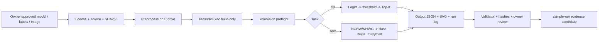

# YoloVision Classification 与 Semantic Segmentation 教程

Classification（`cls`）和 Semantic Segmentation（`sem`）都不产生检测框，但二者的输出契约完全不同：分类把一个类别向量排序成 Top-K，语义分割则为每个像素保留一组类别分数并执行 argmax。本文提供一条可执行、可审计的共同接入路径，并在每个分叉点说明两类任务各自需要的 metadata、输出检查和证据。

本文是 `samples/YoloVision` 的组合入口。分类的 labels/Top-K 深挖见 `yolovision-classification-yolov8n-labels-topk-guide.md`，语义图的 palette/resize-back 深挖见 `yolovision-semantic-segmentation-map-guide.md`。

## 先判断任务

| 项目 | Classification `cls` | Semantic Segmentation `sem` |
| --- | --- | --- |
| 典型输出 | `[C]`、`[1,C]`、`[C,1]` | `[C,H,W]`、`[1,C,H,W]`、`[1,H,W,C]` |
| 主输出 role | `raw-scores` / `logits` / `probabilities` | `semantic` |
| 核心操作 | threshold、降序排序、Top-K | layout 归一化、逐像素 argmax |
| labels 用途 | class id 到类别名 | class index 到像素类别名/颜色 |
| NMS | 不使用 | 不使用 |
| 主要风险 | labels 顺序、softmax 语义、crop/normalize | layout、class count、resize-back、ignore index、palette |
| 审核结果 | Top-K 类别、分数和输入语义一致 | class map、边界、类别和原图坐标一致 |

不要把 instance segmentation 的 boxes、mask coefficients、prototype 或 NMS 配置复制给 `sem`。实例分割属于 `--task seg`；`sem` 是 dense class map 路径。

## 全链路



`TensorRtExec build-only`、preflight、示例 JSON、SVG 和 validator 结果都是链路中的材料，但没有真实模型运行日志和 owner review 时，不能晋级为 `real-model-runtime`。

## E 盘案例工作区

模型、tensor、engine 和隔离 NuGet 缓存都放在 E 盘。本文不要求下载任何资产到 C 盘，也不建议删除系统 Temp 或用户 Downloads 中无法确认归属的文件。

```text
E:\TensorRtSharpAssets\cases\cls-sem
  cls\models
  cls\labels
  cls\images
  cls\tensors
  cls\engines
  cls\reports
  cls\logs
  sem\models
  sem\labels
  sem\images
  sem\tensors
  sem\engines
  sem\reports
  sem\logs
```

在运行任何转换工具前，先记录每项资产：

- 原始下载页和直接下载 URL。
- 权重、ONNX、labels、palette、输入图的许可证和再分发结论。
- 导出工具、版本、opset、命令、stdout/stderr 摘要。
- input tensor name、shape、dtype、layout、color order、resize/crop、normalize。
- output tensor name、shape、layout、class count 和 score 语义。

不要把一个并不存在的固定 `yolov8n-sem.pt` 当成官方语义分割资产。`samples/assets/yolovision-article-case-pack.json` 将 sem 明确标为 owner-provided compatible model；分类 case 则以 `yolov8n-cls` 为命令骨架，两者都需要 owner 审核许可证。

用 PowerShell 计算 hash：

```powershell
Get-FileHash -Algorithm SHA256 E:\TensorRtSharpAssets\cases\cls-sem\cls\models\model.onnx
Get-FileHash -Algorithm SHA256 E:\TensorRtSharpAssets\cases\cls-sem\cls\labels\labels.txt
Get-FileHash -Algorithm SHA256 E:\TensorRtSharpAssets\cases\cls-sem\sem\models\model.onnx
Get-FileHash -Algorithm SHA256 E:\TensorRtSharpAssets\cases\cls-sem\sem\labels\palette.json
```

## 预处理输入

YoloVision 内置 `.bmp`/`.ppm` 路径支持 stretch、letterbox 或抗锯齿短边缩放 + center crop，并支持 RGB/BGR、NCHW/NHWC 和 normalization scale。先用 `--preprocess-only` 固化 tensor 和 hash：

```powershell
dotnet run --project .\samples\YoloVision -- `
  --preprocess-only `
  --image E:\TensorRtSharpAssets\cases\cls-sem\cls\images\input.ppm `
  --preprocessed-output E:\TensorRtSharpAssets\cases\cls-sem\cls\tensors\input-fp32.bin `
  --input-shape 1x3x224x224 `
  --tensor-layout NCHW `
  --color-order RGB `
  --resize shorter-side-center-crop `
  --resize-shorter-side 224
```

这一步是 preprocessing evidence，不是 TensorRT enqueue。官方 YOLOv8n-cls 使用短边 224 + center crop 224、RGB/NCHW、`1/255`、mean 0/std 1；其他分类模型仍要以 exporter 合同为准。语义分割也可能要求特殊 padding 和 resize-back。遇到不匹配的模型，使用 owner-approved preprocess pipeline 生成 float32 tensor，并把工具版本、完整命令、输出元素数和 SHA256 一起归档。

## Classification 输出契约

`YoloSampleRunner.DecodeClassifications` 接受 `[C]`、`[1,C]` 和 `[C,1]`。如果提供 `--class-count`，它必须与输出类别数严格相等；否则从 shape 推导。随后依次执行：

1. 拒绝 NaN/Infinity。
2. 按 `--classification-score-mode raw|logits|probabilities` 保留、softmax 或严格验证分数。
3. 使用 `--confidence` 过滤。
4. 按 score 降序排序并用 `--top-k` 截断。

decoder 只有在显式指定 `--classification-score-mode logits` 时才执行数值稳定 softmax。`probabilities` 模式要求每项位于 `[0,1]` 且总和在 `1 +/- 0.001` 内；`raw` 保留旧接口语义。owner 必须记录模型输出究竟是 raw logits、sigmoid score 还是 probability；否则即使 Top-K 顺序看似合理，score 也不可解释。

labels 行数应与 class count 一致，且行序就是 class id。labels 内容或顺序变化后必须重新计算 `labelsSha256`，不能只审查 Top-K 截图。

## Semantic 输出契约

`YoloSampleRunner.DecodeSemanticMap` 接受以下浮点输出：

- `[C,H,W]`：直接复制为 class-major values。
- `[1,C,H,W]`：直接复制为 class-major values。
- `[1,H,W,C]`：当 `--class-count C` 与最后一维匹配、且第二维不是 C 时，转换成 class-major values。

其他 rank、batch 不为 1 或元素数量不匹配会受控失败。为了避免 `H` 或 `W` 恰好等于 class count 时产生 layout 歧义，真实 case 必须同时记录 ONNX/engine binding shape、`classCount` 和 exporter 的 layout 声明。

`YoloSemanticMap` 保留 `C*H*W` 个浮点值。`YoloVisionVisualizationWriter` 在绘制 SVG 时才对每个采样像素沿 class 维执行 argmax；预览最多采样为 32 列、24 行。SVG 是便于人工审核的降采样视图，不是完整 class-index map，也不代替 output JSON 或原始 output tensor hash。palette、ignore index、void class、resize-back 和 crop rule 仍由 owner metadata 负责。

## 构建 Classification Engine

先建立 engine 和 build-only report：

```powershell
dotnet run --project .\applications\TensorRtExec -- `
  --onnx E:\TensorRtSharpAssets\cases\cls-sem\cls\models\model.onnx `
  --saveEngine E:\TensorRtSharpAssets\cases\cls-sem\cls\engines\model.plan `
  --minShapes images:1x3x224x224 `
  --optShapes images:1x3x224x224 `
  --maxShapes images:8x3x224x224 `
  --fp16 `
  --buildOnly `
  --exportReport E:\TensorRtSharpAssets\cases\cls-sem\cls\reports\build-report.json
```

真实 input tensor name 不一定是 `images`。应以 ONNX/engine binding 为准修改 profile；不要为了让命令成功而保留错误名称。

## 构建 Semantic Engine

```powershell
dotnet run --project .\applications\TensorRtExec -- `
  --onnx E:\TensorRtSharpAssets\cases\cls-sem\sem\models\model.onnx `
  --saveEngine E:\TensorRtSharpAssets\cases\cls-sem\sem\engines\model.plan `
  --minShapes images:1x3x512x512 `
  --optShapes images:1x3x512x512 `
  --maxShapes images:2x3x512x512 `
  --fp16 `
  --buildOnly `
  --exportReport E:\TensorRtSharpAssets\cases\cls-sem\sem\reports\build-report.json
```

build report 证明 parser/build/serialization 路径，不证明 Top-K 正确，也不证明 class map、argmax 或 resize-back 正确。

## 离线 Preflight

Classification：

```powershell
dotnet run --project .\samples\YoloVision -- `
  --preflight `
  --family v8 --task cls `
  --model E:\TensorRtSharpAssets\cases\cls-sem\cls\models\model.onnx `
  --labels E:\TensorRtSharpAssets\cases\cls-sem\cls\labels\labels.txt `
  --input-data E:\TensorRtSharpAssets\cases\cls-sem\cls\tensors\input-fp32.bin `
  --input-shape 1x3x224x224 `
  --classification-output output0 --classification-score-mode probabilities `
  --class-count 1000 --top-k 5 `
  --preflight-report E:\TensorRtSharpAssets\cases\cls-sem\cls\reports\preflight.json
```

Semantic Segmentation：

```powershell
dotnet run --project .\samples\YoloVision -- `
  --preflight `
  --family custom --task sem `
  --model E:\TensorRtSharpAssets\cases\cls-sem\sem\models\model.onnx `
  --labels E:\TensorRtSharpAssets\cases\cls-sem\sem\labels\labels.txt `
  --input-data E:\TensorRtSharpAssets\cases\cls-sem\sem\tensors\input-fp32.bin `
  --input-shape 1x3x512x512 `
  --semantic-output semantic `
  --class-count 21 `
  --preflight-report E:\TensorRtSharpAssets\cases\cls-sem\sem\reports\preflight.json
```

preflight schema 必须为 `yolovision-preflight.v1`，`proofClassification=precheck`，所有 execution/promotion flag 保持 false。`ready-for-runtime-precheck` 只表示资产和配置足以进入下一步。

## 执行 Classification

```powershell
dotnet run --project .\samples\YoloVision -- `
  --family v8 --task cls `
  --model E:\TensorRtSharpAssets\cases\cls-sem\cls\models\model.onnx `
  --labels E:\TensorRtSharpAssets\cases\cls-sem\cls\labels\labels.txt `
  --input-data E:\TensorRtSharpAssets\cases\cls-sem\cls\tensors\input-fp32.bin `
  --input-shape 1x3x224x224 `
  --classification-output output0 --classification-score-mode probabilities `
  --class-count 1000 --confidence 0 --top-k 5 `
  --output-json E:\TensorRtSharpAssets\cases\cls-sem\cls\reports\output.json `
  --visualization-svg E:\TensorRtSharpAssets\cases\cls-sem\cls\reports\topk.svg
```

分类日志至少核对：

```text
Profile Family=v8 Task=cls
InputSource=external
Classification Class=... Score=...
Postprocess Task=cls
Expected real-log marker: YoloVision Passed=True
```

使用 `--confidence 0` 是为了完整比较 Top-K，不代表所有模型都应采用该阈值。最终阈值必须进入 case metadata 和 review。

## 执行 Semantic Segmentation

```powershell
dotnet run --project .\samples\YoloVision -- `
  --family custom --task sem `
  --model E:\TensorRtSharpAssets\cases\cls-sem\sem\models\model.onnx `
  --labels E:\TensorRtSharpAssets\cases\cls-sem\sem\labels\labels.txt `
  --input-data E:\TensorRtSharpAssets\cases\cls-sem\sem\tensors\input-fp32.bin `
  --input-shape 1x3x512x512 `
  --semantic-output semantic `
  --class-count 21 `
  --output-json E:\TensorRtSharpAssets\cases\cls-sem\sem\reports\output.json `
  --visualization-svg E:\TensorRtSharpAssets\cases\cls-sem\sem\reports\class-map.svg
```

语义分割日志至少核对：

```text
Profile Family=custom Task=sem
InputSource=external
SemanticMap Classes=21 Width=... Height=... Values=...
Postprocess Task=sem
Expected real-log marker: YoloVision Passed=True
```

若日志中出现 detection boxes、objectness 或 NMS，应回到 `--task`、输出 role 和模型导出契约检查；它们不属于 sem 核心路径。

## 输出 JSON 检查

仓库中的最小结构示例是：

- `samples/YoloVision/examples/yolovision-output-cls.example.json`
- `samples/YoloVision/examples/yolovision-output-sem.example.json`
- schema：`samples/YoloVision/yolovision-output.schema.json`
- task contract：`samples/YoloVision/yolovision-task-output-contract.json`

分类 output JSON 应核对 `task=cls`、`outputs[].role=probabilities`、`postprocess.classificationScoreMode=probabilities`、shape、`postprocess.topK`、每个 prediction 的 `classId`、`className` 和 `score`。语义 output JSON 应核对 `task=sem`、`outputs[].role=semantic`、shape、`classCount`、`width`、`height` 和 `valueCount=C*H*W`。

两者都应包含 model/input/output identity、SHA256、runtime host metadata 和严格 boundary。示例 JSON 中的 `synthetic-ramp`、空 hash 和 `isRuntimeProof=false` 是 schema 演示，不是可晋级证据。

## 验证与证据归档

先验证仓库示例，再验证 owner 产出的两个报告：

```powershell
pwsh -NoProfile -ExecutionPolicy Bypass -File .\eng\Test-YoloVisionOutputReport.ps1 -Strict

pwsh -NoProfile -ExecutionPolicy Bypass -File .\eng\Test-YoloVisionOutputReport.ps1 `
  -InputPath @(
    'E:\TensorRtSharpAssets\cases\cls-sem\cls\reports\output.json',
    'E:\TensorRtSharpAssets\cases\cls-sem\sem\reports\output.json'
  ) `
  -OutputPath E:\TensorRtSharpAssets\cases\cls-sem\validation.json `
  -Strict
```

然后按 `samples/assets/yolovision-article-case-pack.json` 和 `samples/assets/yolovision-real-asset-owner-backfill-pack.json` 回填：

- model/labels/image/preprocessed tensor/engine/output JSON/run log SHA256。
- build-only report、preflight report 和各自 SHA256。
- stdout/stderr summary、expected evidence lines、host OS/GPU/driver/CUDA/TensorRT。
- 分类的 `topK`、score/softmax 语义和 labels count。
- sem 的 `mapWidth`、`mapHeight`、`argmaxRule`、palette SHA256、ignore/void class 和 resize-back rule。
- owner review、reviewedAtUtc 和是否允许公开使用的明确结论。

`Test-YoloVisionOutputReport.ps1` 只验证结构和边界。真实候选还应经过 `eng/Test-YoloVisionRealAssetOwnerProofInput.ps1 -Strict`、importer 和 `eng/Test-SampleRunEvidenceRecord.ps1 -RequireExistingLog`。

## 常见故障

| 现象 | 优先检查 | 处理 |
| --- | --- | --- |
| Top-K 类别稳定但明显错误 | labels 行序、RGB/BGR、center crop、mean/std | 对照 exporter 预处理，重建 tensor 并更新 hash |
| Top-K score 超出 `[0,1]` | raw logits 被当成 probability | 记录 activation 语义；使用 `--classification-score-mode logits` 显式 softmax |
| 分类只输出一个类别 | `--top-k`、`--confidence`、输出 shape | 查看 binding 和 JSON shape，确认不是 `[1,1]` 或阈值过高 |
| sem shape 被当成 NCHW | `--class-count` 与 NHWC 最后一维 | 用 exporter/Netron/binding 证明 layout，消除维度歧义 |
| sem SVG 边界错位 | letterbox/crop/padding/resize-back | 记录 scale/pad，把 class map 还原到原图坐标后再 review |
| sem 颜色错误 | palette 行序、ignore index、void policy | hash palette，按 class index 逐项核对 |
| validator 通过但不能晋级 | 使用了示例、synthetic input 或缺少 log/hash | validator 是结构门；补真实运行与 owner review |
| CUDA/TensorRT 不可用 | host/runtime/bridge 版本不匹配 | 记录 `blocked-by-cuda-driver` 或具体依赖错误，不能写成通过 |

## 代码入口

- `samples/YoloVision/YoloSampleRunner.cs`：classification shape/Top-K 和 semantic NCHW/NHWC 解码。
- `samples/YoloVision/YoloRuntimeOutputRoleResolver.cs`：`--classification-output`、`--semantic-output` 与 output role。
- `samples/YoloVision/YoloVisionOutputReport.cs`：结构化 JSON、predictions 和 boundary。
- `samples/YoloVision/YoloVisionVisualizationWriter.cs`：Top-K bars 和 semantic argmax SVG。
- `samples/YoloVision/YoloSemanticMap.cs`：class-major map 与元素数量约束。
- `samples/YoloVision/Program.cs`：CLI、日志和 expected real-log `YoloVision Passed=True` 成功标记。

## Proof Boundary

以下材料不得替代真实模型证明：support matrix、build-only、parse-only、preflight、dry-run、synthetic input、示例 JSON、SVG/screenshot、sidecar-only、TensorRtExec report、OnnxToEngine report、local feed、ProjectReference、direct `.nupkg` 和 `blocked-by-cuda-driver`。

一条 `real-model-runtime` 候选必须把真实模型、许可证、labels/palette、输入、预处理 tensor、runtime output、日志、全部 SHA256、host metadata 和 owner review 绑定在一起。它仍不是 `package-consumer-runtime`；后者需要仓库外 clean consumer 从目标包渠道 restore/build/run。公开发布和 post-publish verification 继续由 release proof record 决定。

## 发布前检查清单

- [ ] 模型、labels、palette 和图片来源/许可证已由 owner 审核。
- [ ] 所有模型和派生资产都位于 E 盘 case workspace。
- [ ] ONNX input/output 名称、shape、layout 和 dtype 与命令一致。
- [ ] 分类 labels count、Top-K、threshold 和 softmax 语义已记录。
- [ ] sem class count、layout、argmax、palette、ignore index 和 resize-back 已记录。
- [ ] build report、preflight、output JSON、SVG、run log 和 SHA256 已归档。
- [ ] output report validator 和 sample-run evidence validator 均通过。
- [ ] 日志含真实 external input 与 `YoloVision Passed=True`，不是 synthetic/template。
- [ ] owner 已审查 Top-K 或完整 class map，而不只审查截图。
- [ ] 没有把本地验证提升成 `package-consumer-runtime`、发布批准或 post-publish proof。
