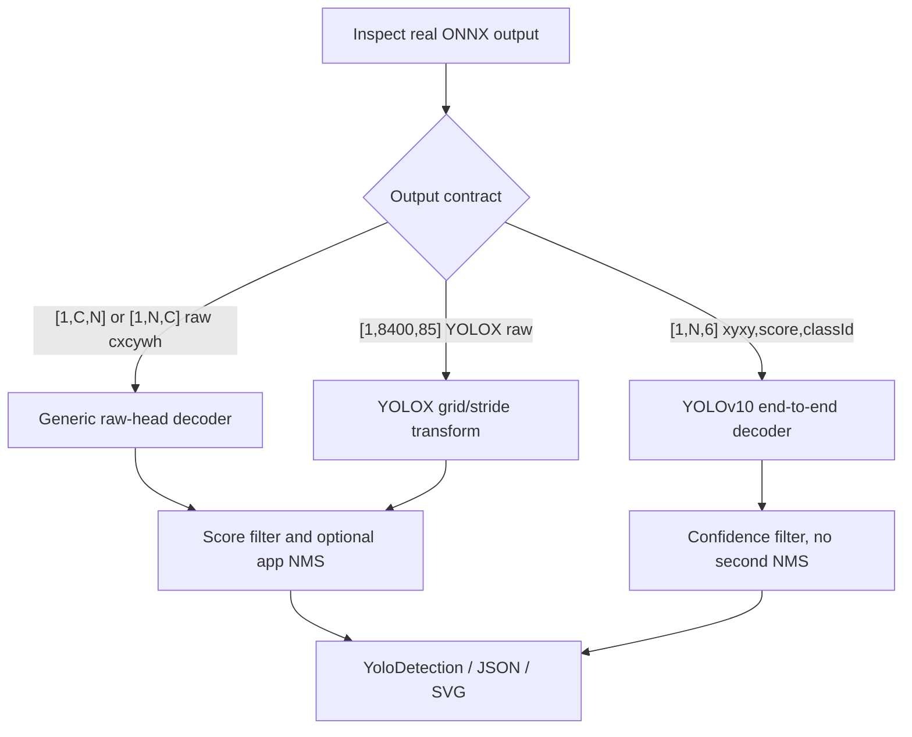

# YoloVision Detection 完整教程：Raw Head、YOLOv10 与 YOLOX

## 写在前面

检测模型的 ONNX 输出并没有一种通用形状。

常见 YOLO raw head 可能是 `[1,C,N]` 或 `[1,N,C]`，有些输出含 objectness，有些不含；YOLOv10 的部分 exporter 会输出 graph-side NMS 后的六列结果；YOLOX 还需要先做 grid/stride 变换。

YoloVision 把这三条路径放在同一套 `YoloDetection` 与 output report 中，但不会仅凭模型文件名猜输出协议。

本文从资产准备开始，给出当前 CLI 可直接执行的命令，解释 score、layout、NMS 和坐标边界，并说明如何把一次真实运行整理成可审计 evidence。

## 适用读者

- 使用 YOLOv5/v6/v7/v8/v9/v11 或 custom raw detection head 的开发者。
- 使用 `[1,N,6]` YOLOv10 end-to-end 导出的开发者。
- 使用官方 YOLOX-S `[1,8400,85]` 输出的开发者。
- 需要检查 C# 后处理和真实模型证明边界的维护者。

## 本文覆盖与不覆盖

覆盖：

- batch-1 rank-3 detection 输出；
- channels-first 与 boxes-first raw head；
- objectness 推断与显式覆盖；
- class-aware / class-agnostic / no NMS；
- YOLOv10 六列 end-to-end decoder；
- YOLOX grid/stride decoder；
- JSON、SVG、日志和 owner validation。

不覆盖：

- batch 大于 1 的 detection decode；
- 任意 exporter 的私有列顺序；
- 自动逆 letterbox 到 source-image 坐标；
- package-consumer-runtime 或 post-publish proof；
- segmentation、pose 或 OBB 的辅助输出。

## 三条检测路径



先检查真实 ONNX，再选择 `--layout` 和 family。

不要从 `yolov8n.onnx`、`yolov10n.onnx` 这样的文件名推断 tensor contract。

## E 盘 Case Workspace

建议每个检测模型使用独立目录：

```text
..\downloads\cases\yolo-det\
  source\
  models\
  labels\
  images\
  tensors\
  engines\
  reports\
  logs\
  evidence\
```

下文用 `$case` 减少命令长度：

```powershell
$repo = "."
$case = "..\downloads\cases\yolo-det"
Set-Location $repo
```

模型、图片、tensor、engine 和日志都留在 E 盘。

## 资产与许可证

owner 至少准备：

- detection ONNX 或可导出权重；
- 与 class index 完全对齐的 labels；
- 有明确来源和使用授权的输入图片；
- exporter 仓库、版本、commit/tag、命令和许可证；
- 模型预处理说明；
- 输出 tensor 名、shape、dtype、列语义和 NMS 位置。

分别计算 SHA256：

```powershell
Get-FileHash -Algorithm SHA256 "$case\models\model.onnx"
Get-FileHash -Algorithm SHA256 "$case\labels\labels.txt"
Get-FileHash -Algorithm SHA256 "$case\images\input.ppm"
```

模型许可证、代码许可证、labels 许可证和图片许可证可能不同，不能只记录一个 repository license。

## 检查 ONNX 输出契约

在 Netron 或 exporter 日志中记录：

1. 输入 tensor 名，例如 `images`。
2. 输入 shape，例如 `[1,3,640,640]`。
3. 输入 color order、normalize 和 resize policy。
4. 输出 tensor 名与 rank。
5. raw head 是 `[1,C,N]` 还是 `[1,N,C]`。
6. 四个 box 字段是 `cx,cy,w,h` 还是 `x1,y1,x2,y2`。
7. 是否包含 objectness。
8. class score 是 probability 还是 logit。
9. graph 是否已包含 NMS。
10. 坐标位于 model-input、normalized 还是 source-image 空间。

YoloVision generic decoder 只按 `cx,cy,w,h` 解释 raw head。

其他格式必须在 exporter 侧转换，或增加经过测试的专用 decoder。

## TensorRtExec Build-Only

```powershell
dotnet run --project .\applications\TensorRtExec -- `
  --onnx "$case\models\model.onnx" `
  --saveEngine "$case\engines\model.plan" `
  --minShapes images:1x3x640x640 `
  --optShapes images:1x3x640x640 `
  --maxShapes images:4x3x640x640 `
  --fp16 `
  --buildOnly `
  --exportReport "$case\reports\build-report.json"
```

报告能证明 ONNX parser、profile、builder 和 serialization 的这次执行。

它不执行 YoloVision detection decode，也不证明框、类别或 score 正确。

## 内置图片预处理

YoloVision `--image` 当前支持未压缩 BMP、PPM/PNM。

推荐把用于 evidence 的输入无损转换为 `.ppm`，记录转换工具和 hash。

JPG/PNG 不能直接传给 `--image`；请外部解码并生成 float32 `.bin/.raw`，再用 `--input-data`。

单独验证预处理：

```powershell
dotnet run --project .\samples\YoloVision -- `
  --preprocess-only `
  --image "$case\images\input.ppm" `
  --preprocessed-output "$case\tensors\input.fp32.bin" `
  --input-shape 1x3x640x640 `
  --tensor-layout NCHW `
  --color-order RGB `
  --resize letterbox
```

得到的 tensor hash 应写入真实资产记录。

## 路径一：Generic Raw Head

### 支持的 shape

generic decoder 只接受 batch-1 rank-3 输出：

- channels-first：`[1,C,N]`，例如 `[1,84,8400]`；
- boxes-first：`[1,N,C]`，例如 `[1,8400,84]`。

`--layout auto` 会调用 `YoloOutputLayoutInference.InferRank3`。

真实文章更推荐把 owner 已确认的 layout 显式写成：

- `--layout channels-first`；或
- `--layout boxes-first`。

### Channel 结构

没有 objectness：

```text
cx, cy, w, h, class0, class1, ...
C = classCount + 4
```

有 objectness：

```text
cx, cy, w, h, objectness, class0, class1, ...
C = classCount + 5
```

### Objectness 推断规则

当 `--has-objectness auto` 时：

1. 已知 class count 且 `C == classCount + 5`，判定存在 objectness。
2. 已知 class count 且 `C == classCount + 4`，判定不存在。
3. 未知 class count 时，兼容规则 `C == 85` 判定存在。
4. 其他情况判定不存在，并从剩余 channel 推导 class count。

owner 明确知道 exporter 契约时，应使用 `--has-objectness true|false`，不要把 auto 当作模型证明。

### Score 公式

存在 objectness：

```text
score = objectness * max(classScores)
```

不存在 objectness：

```text
score = max(classScores)
```

YoloVision 不在 generic decoder 中自动 sigmoid 或 softmax。

输入必须已经符合 exporter 的 score 语义。

### Fail-Closed 数值检查

generic decoder 会拒绝：

- 非有限 `confidence` 或 IoU threshold；
- 非有限 `cx/cy/w/h`；
- 非有限 objectness；
- 任意非有限 class score；
- 非有限 computed score；
- 小于 0 的 width 或 height。

异常会指出 detection row 或 class index，避免 `NaN` 静默绕过阈值和 NMS。

为保留现有兼容性，generic raw head 目前允许零宽或零高；这类结果仍应由 owner 视为可疑输出并人工检查。

### NMS

`--nms-mode class-aware`：只抑制同类别重叠框。

`--nms-mode class-agnostic`：不同类别之间也互相抑制。

`--nms-mode none` 或 `--no-nms`：只做 score filtering。

NMS 判断：

```text
IoU(candidate, kept) > iouThreshold
```

候选先按 score 降序，NMS 后再排序，最后应用 `--top-k`。

`SourceIndex` 保留原始候选 row，用于 seg/pose/OBB 辅助输出对齐和审计。

### Generic Preflight

```powershell
dotnet run --project .\samples\YoloVision -- `
  --model "$case\models\model.onnx" `
  --labels "$case\labels\labels.txt" `
  --image "$case\images\input.ppm" `
  --preprocessed-output "$case\tensors\input.fp32.bin" `
  --input-shape 1x3x640x640 `
  --family v8 `
  --task det `
  --layout channels-first `
  --has-objectness false `
  --nms-mode class-aware `
  --confidence 0.25 `
  --iou-threshold 0.45 `
  --preflight `
  --strict-preflight `
  --preflight-report "$case\reports\preflight.json"
```

### Generic Real Run

```powershell
dotnet run --project .\samples\YoloVision -- `
  --model "$case\models\model.onnx" `
  --labels "$case\labels\labels.txt" `
  --image "$case\images\input.ppm" `
  --preprocessed-output "$case\tensors\input.fp32.bin" `
  --input-shape 1x3x640x640 `
  --family v8 `
  --task det `
  --layout channels-first `
  --has-objectness false `
  --class-count 80 `
  --nms-mode class-aware `
  --confidence 0.25 `
  --iou-threshold 0.45 `
  --top-k 100 `
  --output-json "$case\reports\output.json" `
  --visualization-svg "$case\reports\output.svg"
```

把 `layout/objectness/class-count` 改成真实 ONNX 值，不要机械照抄示例。

## 路径二：YOLOv10 End-to-End

仅当输出严格为 batch-1 `[1,N,6]` 且列顺序是：

```text
x1, y1, x2, y2, score, classId
```

才使用 `--layout end2end`。

该 decoder 会：

- 校验 rank、batch 与六列；
- 校验坐标、score、class ID 都有限；
- 要求 `x2 > x1` 且 `y2 > y1`；
- 要求 score 在 `[0,1]`；
- 要求 class ID 是非负整数并位于 class count 内；
- 把 `xyxy` 转换成共享的 `cx,cy,w,h`；
- 按 confidence 与 Top-K 过滤；
- 强制关闭 application-side NMS。

之所以不再做第二次 NMS，是因为这条契约已经表示 end-to-end/graph-side NMS 结果。

运行示例：

```powershell
dotnet run --project .\samples\YoloVision -- `
  --model "$case\models\yolov10n.onnx" `
  --labels "$case\labels\coco.names" `
  --image "$case\images\input.ppm" `
  --preprocessed-output "$case\tensors\yolov10n-input.fp32.bin" `
  --input-shape 1x3x640x640 `
  --family v10 `
  --task det `
  --layout end2end `
  --class-count 80 `
  --confidence 0.25 `
  --top-k 100 `
  --output-json "$case\reports\yolov10n-output.json" `
  --visualization-svg "$case\reports\yolov10n-output.svg"
```

若真实 YOLOv10 exporter 返回 `[1,84,8400]` 或其他 raw head，必须回到 generic 路径。

详细官方资产与固定 hash 见 `yolovision-yolov10-end-to-end-output-guide.md`。

## 路径三：YOLOX

内置 `--family yolox` 是 detection-only profile。

官方 YOLOX-S 路径约定：

- input：NCHW；
- color：BGR；
- value：raw `0..255`，不 normalize；
- resize：top-left letterbox，fill 114；
- output：`[1,8400,85]` boxes-first；
- strides：8、16、32。

raw box transform：

```text
center = (rawXY + gridXY) * stride
size   = exp(rawWH) * stride
```

变换完成后再进入 generic objectness score filtering 与 application-side NMS。

运行示例：

```powershell
dotnet run --project .\samples\YoloVision -- `
  --model "$case\models\yolox_s.onnx" `
  --labels "$case\labels\coco.names" `
  --image "$case\images\input.ppm" `
  --preprocessed-output "$case\tensors\yolox-s-input.fp32.bin" `
  --input-shape 1x3x640x640 `
  --family yolox `
  --task det `
  --layout boxes-first `
  --class-count 80 `
  --nms-mode class-aware `
  --confidence 0.3 `
  --iou-threshold 0.45 `
  --output-json "$case\reports\yolox-s-output.json" `
  --visualization-svg "$case\reports\yolox-s-output.svg"
```

不要给 YOLOX profile 传 `cls/seg/obb/pose/sem`；这些组合是明确的 unsupported design boundary。

完整获取和 source-tree proof 见 `yolovision-yolox-official-runtime-tutorial.md`。

## 坐标空间与 Letterbox 边界

这是当前 generic Detection 最容易被忽略的边界。

YoloVision 可以在 output JSON 中记录 source image 尺寸、rounded resize 尺寸、有效 scale、padding 和 tensor hash。

但是 generic detection decoder 当前不会自动把模型输出框逆 letterbox 到 source-image 坐标。

因此：

- `YoloDetection.CenterX/CenterY/Width/Height` 保留模型输出的坐标空间；
- JSON/SVG 中的框不能仅因使用了 `--image` 就宣称是原图像素坐标；
- owner 必须记录 `coordinateSpace=model-input-pixels|normalized|source-image-pixels`；
- 若模型输出 normalized coordinates，先按真实 contract 转换；
- 若需要 source-image 坐标，应用 exporter-specific inverse transform 并补专门测试；
- 不要复用 segmentation 的 `--mask-spatial-transform` 来解释 detection boxes。

对于 center letterbox，概念上的逆变换是：

```text
sourceX = (modelX - padX) / effectiveScaleX
sourceY = (modelY - padY) / effectiveScaleY
```

但 rounding、clipping、half-open/closed box convention 都必须与具体 exporter 对齐。

当前教程把这一工作明确留给 owner，而不在通用路径中猜测。

## Output JSON 应检查什么

`--output-json` 生成 `yolovision-output.v1`。

至少检查：

- `family`、`task`、layout；
- confidence、IoU、Top-K 和 NMS mode；
- output tensor shape 与 `valueSha256`；
- detection count 与 top detections；
- 每个 detection 的 class、score、box 和 `SourceIndex`；
- model/labels/input SHA256；
- `--image` 对应的 source/preprocessed metadata；
- proof boundary flags 全部保持 false。

严格校验结构：

```powershell
pwsh -NoProfile -ExecutionPolicy Bypass -File .\eng\Test-YoloVisionOutputReport.ps1 -Strict
```

SVG 还应由 owner 与原始图片、Netron contract 和预期目标做人工比对。

## 真实运行日志

建议把 stdout/stderr 独立保存：

```powershell
dotnet run --project .\samples\YoloVision -- <真实参数> `
  1> "$case\logs\yolovision.stdout.log" `
  2> "$case\logs\yolovision.stderr.log"
```

运行材料至少包含：

- `Profile Family=... Task=det`；
- 真实 model/input/output 路径；
- output tensor shape；
- `Postprocess Task=det`；
- detection 摘要或明确的零检测结果；
- expected real-log marker：`YoloVision Passed=True`；
- stdout/stderr/run log SHA256；
- host、GPU、driver、CUDA、TensorRT 版本。

没有 stderr 时也要显式记录 `no-stderr-emitted`，不要留空含义。

## Owner Evidence 回填

推荐从 `samples/assets/yolovision-yolov8-det-candidate.template.json` 建立 case。

回填以下字段：

- model source/download/license/export/hash；
- labels source/license/class count/hash；
- PPM/BMP source/license/hash；
- preprocessed tensor path/hash；
- layout、box format、score rule、objectness、NMS；
- coordinate space、letterbox contract、source-image inverse policy；
- TensorRtExec report/engine/stdout/stderr hash；
- YoloVision JSON/SVG/stdout/stderr/run log hash；
- owner reviewer、时间与 acceptance decision。

owner 输入严格检查：

```powershell
pwsh -NoProfile -ExecutionPolicy Bypass -File .\eng\Test-YoloVisionRealAssetOwnerProofInput.ps1 -Strict
```

sample evidence 检查：

```powershell
pwsh -NoProfile -ExecutionPolicy Bypass -File .\eng\Test-SampleRunEvidenceRecord.ps1 -RequireExistingLog
```

## Proof Boundary

以下材料不得替代真实模型证明：

- 本文或任何命令片段；
- capability/model/task matrix；
- synthetic tensor 与 managed smoke；
- TensorRtExec build-only report；
- YoloVision preflight；
- engine、sidecar、JSON、SVG 或 screenshot 单独存在；
- local feed、ProjectReference、direct `.nupkg`；
- 未引用真实日志的 sample evidence 模板。

真实模型、真实输入、真实输出、hash、host metadata、owner review 和 validator 全部成立后，才可能形成 source-tree `real-model-runtime` 候选。

`package-consumer-runtime` 必须由干净的仓库外 consumer 使用实际包重新运行。

## 常见问题

### 输出 shape 无法自动识别

确认输出是 batch-1 rank-3，并显式设置 `--layout channels-first|boxes-first`。rank-2、rank-4 或自定义列格式需要专用 decoder。

### 检测全部被过滤

检查 score 是否已经 sigmoid、objectness 是否存在、class count 是否正确，以及 `--confidence` 是否适合真实模型。

### 检测数量异常多

检查是否关闭了 NMS、是否误把 graph-side NMS 输出当 raw head，或者 objectness/class score 解释错误。

### 框位置整体偏移

优先核对 letterbox alignment、padding、RGB/BGR、模型坐标空间，以及是否错误地把 model-input 坐标画在 source image 上。

### `NaN` 输出没有被忽略

这是预期行为。decoder 现在 fail closed，会抛出包含 row/class 位置的异常。先检查模型数值稳定性、输入 scale 和 precision。

### YOLOv10 出现重复框

先确认真实输出是否六列且已 graph-side NMS。只有这种 contract 才用 `--layout end2end`；raw head 应走 generic path 和 application-side NMS。

### YOLOX 框尺寸失真

确认使用 `--family yolox`、`[1,8400,85]`、strides 8/16/32、BGR、raw 0..255 和 top-left letterbox。

### TensorRtExec build 成功但 sample 失败

分别检查 TensorRT runtime 搜索路径、输入 shape、output contract 和 decoder。build-only 从来不保证 inference 或后处理正确。

如果日志状态是 `blocked-by-cuda-driver`，它表示当前主机驱动与 CUDA/TensorRT runtime 条件阻塞了真实执行，不等于 Detection API 或 decoder 缺失。保留完整日志和 host metadata，转交具备兼容 GPU 环境的 owner 重跑；不要把受控阻塞改写成成功 proof。

## 发布前检查清单

- [ ] 模型、labels、图片来源和许可证可追溯。
- [ ] ONNX/exporter/opset/输入输出 contract 已记录。
- [ ] 使用 BMP/PPM，或明确外部 float32 preprocessing。
- [ ] `--layout` 与真实 rank-3 shape 一致。
- [ ] objectness、class count、score 公式已确认。
- [ ] generic、end-to-end 或 YOLOX 路径选择正确。
- [ ] graph-side 与 application-side NMS 未重复。
- [ ] coordinate space 与 letterbox inverse policy 已记录。
- [ ] output JSON、SVG、stdout、stderr、run log 已生成。
- [ ] 所有资产和产物 SHA256 已回填。
- [ ] owner 已人工复核 detection 与原图目标。
- [ ] output/owner/sample evidence validators 已通过。
- [ ] 文章没有把 build-only/preflight 写成 runtime proof。
- [ ] package consumer 与 post-publish 证明保持独立。

## 结语

检测部署最危险的错误不是命令失败，而是命令成功却解释错了输出。

YoloVision 通过显式 layout、objectness、NMS、专用 YOLOv10/YOLOX decoder、fail-closed 数值校验和结构化 evidence 降低这种风险。真正发布案例时，仍要让真实 ONNX contract、预处理、坐标空间和 owner review 对上同一份输出，才能把“跑过”提升为“可复查”。
