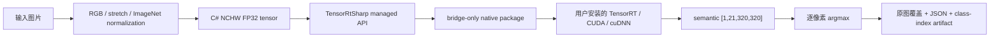
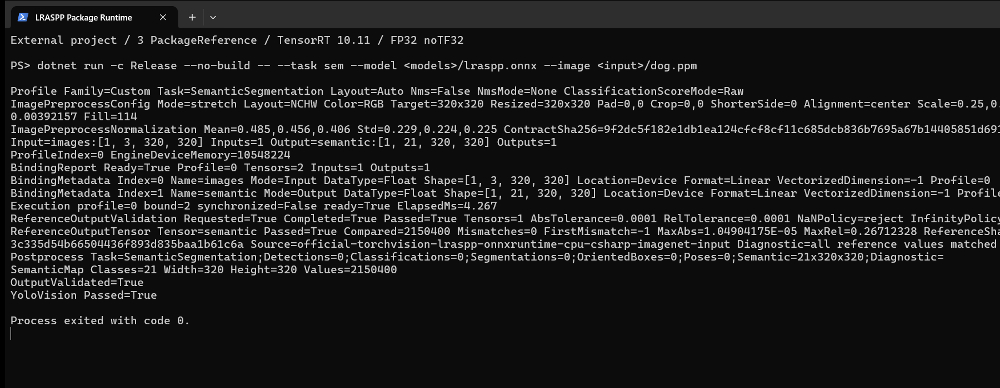
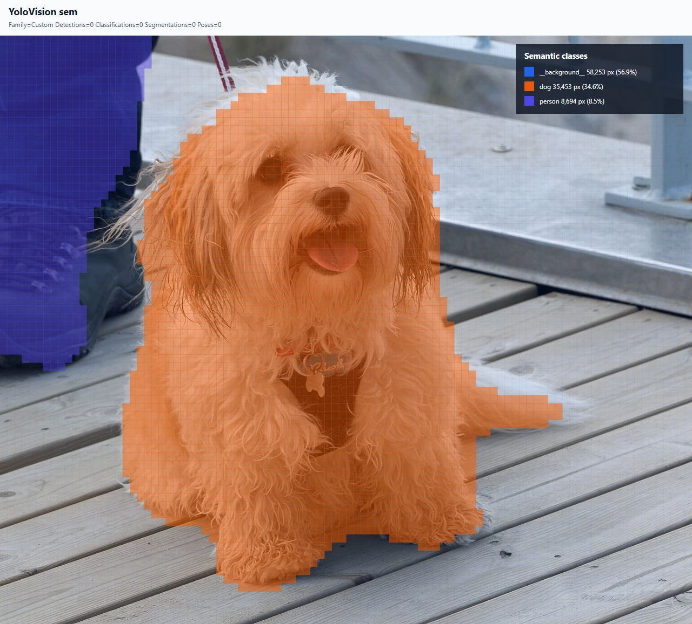

# 使用 TensorRtSharp4.0 在 C# 中运行 LRASPP 语义分割

本文从一个仓库外的空 .NET 控制台项目开始，完成 torchvision LRASPP MobileNetV3 Large 权重获取、ONNX 转换、公开 NuGet 包引用、图像预处理、TensorRT 推理、逐像素 argmax、结果校验和原图可视化。

最终程序会输出结构化 JSON、完整 `int32` 类别索引图和一张叠加到原图上的语义分割结果。模型、权重和原始张量只暂存在工作区外层目录，不进入 Git、NuGet 或 GitHub Release。

## 本文使用的项目与库

[TensorRtSharp4.0](https://github.com/guojin-yan/TensorRT-CSharp-API) 是 TensorRT/CUDA C API 的 C# 封装。本例消费三个职责分离的包：

| 包 | 作用 |
| --- | --- |
| `JYPPX.TensorRT.CSharp.API` | TensorRT managed API、环境探测、engine 构建与推理执行。 |
| `applications/YoloVision` | 图像预处理、语义张量解码、argmax、报告、artifact 和可视化。 |
| `JYPPX.TensorRT.CSharp.API.Runtime.win-x64.trt10.11.cuda12.9.cudnn9.22.Bridge` | 仅包含项目编译的 native bridge，不包含 NVIDIA 运行库。 |

CUDA、cuDNN 与 TensorRT 由用户自行安装。bridge 包负责 managed/native 连接，不负责分发 `nvinfer`、`cudart`、`cudnn` 或 `nvrtc`。



## 运行环境

本文实测环境如下。其他显卡可以复用流程，但 bridge 包必须匹配本机 TensorRT/CUDA 主版本。

| 项目 | 实测值 |
| --- | --- |
| 操作系统 | Windows 10 64-bit |
| .NET SDK | 10.0.301，消费项目目标框架 `net8.0` |
| GPU | NVIDIA GeForce RTX 3060 Laptop GPU |
| NVIDIA Driver | 576.02 |
| TensorRT | 10.11.0 |
| CUDA Toolkit | 12.9 |
| 模型 | torchvision LRASPP MobileNetV3 Large |

从源码仓库根目录打开 PowerShell，并统一使用变量组织目录。正文不依赖某个盘符或用户名：

```powershell
$repoRoot = (Resolve-Path .).Path
$workspaceRoot = Split-Path -Parent $repoRoot
$downloadRoot = Join-Path $workspaceRoot 'downloads/lraspp-mobilenet-v3-large-torchvision-v0.25.0'
$modelRoot = Join-Path $workspaceRoot 'models/YoloVision/SemanticSegmentation/lraspp-mobilenet-v3-large-torchvision-v0.25.0'
$articleInputRoot = Join-Path $downloadRoot 'article-input'
$referenceRoot = Join-Path $workspaceRoot 'work/lraspp-semantic-reference'
$demoRoot = Join-Path $workspaceRoot 'work/YoloVision.Semantic.Demo'
$resultRoot = Join-Path $demoRoot 'results'

New-Item -ItemType Directory -Force `
  -Path $downloadRoot, $modelRoot, $articleInputRoot, $referenceRoot, $demoRoot, $resultRoot |
  Out-Null
```

## 模型获取与许可证

本例固定到 torchvision `v0.25.0`：

| 项目 | 固定值 |
| --- | --- |
| 模型 | LRASPP MobileNetV3 Large |
| 权重 | `lraspp_mobilenet_v3_large-d234d4ea.pth` |
| 权重 URL | <https://download.pytorch.org/models/lraspp_mobilenet_v3_large-d234d4ea.pth> |
| torchvision revision | `torchvision-v0.25.0@8ac84ee75afb1c327902156b5336f56ad63b7e2f` |
| 权重 SHA256 | `d234d4eae9d55d5f76de18b77cf0dc62c66fe5c5482758209d00f950c92bb280` |
| 许可证 | `BSD-3-Clause` |

仓库提供了固定哈希的获取脚本。它同时获取权重、许可证、VOC 类别元数据和用于转换校验的参考图片：

```powershell
$python = (Get-Command python).Source

pwsh -NoProfile -ExecutionPolicy Bypass `
  -File (Join-Path $repoRoot 'eng/Acquire-TorchVisionLrasppOfficialAssets.ps1') `
  -AssetDirectory (Join-Path $downloadRoot 'source') `
  -ModelDirectory $modelRoot `
  -ReferenceOutputDirectory $referenceRoot `
  -PythonPath $python `
  -AllowDownload
```

获取成功只证明来源和哈希正确，不代表本项目获得了重新分发模型文件的授权。权重、ONNX 和脚本获取的参考图片不会随仓库或 NuGet 包发布。

## ONNX 转换与暂存

使用固定 torchvision revision 对应的 Python 环境导出模型：

```powershell
& $python (Join-Path $repoRoot 'eng/Invoke-YoloVisionSemanticReference.py') `
  --weights (Join-Path $modelRoot 'lraspp_mobilenet_v3_large-d234d4ea.pth') `
  --image (Join-Path $downloadRoot 'source/dog.jpg') `
  --onnx (Join-Path $modelRoot 'lraspp-mobilenet-v3-large-320.onnx') `
  --output-directory $referenceRoot `
  --export-onnx
```

用于机器清单复查的规范化转换命令如下：

```text
python eng/Invoke-YoloVisionSemanticReference.py --weights <models-root>/lraspp_mobilenet_v3_large-d234d4ea.pth --image <asset-root>/dog.jpg --onnx <models-root>/lraspp-mobilenet-v3-large-320.onnx --output-directory <artifact-root> --export-onnx
```

导出脚本只暴露 `model(images)["out"]`，使用 opset 17 和静态 batch。转换结果必须满足：

```text
images   float32 [1,3,320,320]
semantic float32 [1,21,320,320]
```

ONNX 固定信息：

| 项目 | 值 |
| --- | --- |
| 工作区暂存路径 | `models/YoloVision/SemanticSegmentation/lraspp-mobilenet-v3-large-torchvision-v0.25.0/lraspp-mobilenet-v3-large-320.onnx` |
| 文件长度 | `12,879,801` bytes |
| SHA256 | `3cb94e561bdefe606ed7d1a2c4d0296409bec066f3a39a9fe9dabd72b23728f8` |

这个 `models` 是源码仓库的同级目录，专门用于后续 Model Zoo 接管前的本地暂存。不要对模型执行 `git add`，也不要把它放进 `.nupkg`。

## 准备可公开展示的输入图片

模型转换用的 PyTorch Hub 图片没有获得随本文重新分发的批准，因此文章结果图改用 Wikimedia Commons 的 [Dog at Norre Vorupor Strand](https://commons.wikimedia.org/wiki/File:Dog_at_N%C3%B8rre_Vorup%C3%B8r_Strand.jpg)。作者为 `W.carter`，许可证为 [CC0 1.0](https://creativecommons.org/publicdomain/zero/1.0/)。

下载 1280 像素版本，并转换成预处理器支持的 PPM：

```powershell
$inputJpg = Join-Path $articleInputRoot 'dog-norre-vorupor-1280.jpg'
$inputPpm = Join-Path $articleInputRoot 'dog-norre-vorupor-1280.ppm'

Invoke-WebRequest `
  -Uri 'https://upload.wikimedia.org/wikipedia/commons/thumb/0/0d/Dog_at_N%C3%B8rre_Vorup%C3%B8r_Strand.jpg/1280px-Dog_at_N%C3%B8rre_Vorup%C3%B8r_Strand.jpg' `
  -OutFile $inputJpg

& $python -c "from PIL import Image; Image.open(r'$inputJpg').convert('RGB').save(r'$inputPpm')"
Get-FileHash $inputJpg, $inputPpm -Algorithm SHA256
```

期望值：

| 文件 | 尺寸 | SHA256 |
| --- | --- | --- |
| JPEG | `1280x1091` | `e678ecf8dab63da112812ada0553d72d46033e4e9ea3b568bf0e53d92e1d6910` |
| PPM | `1280x1091` | `2b719e7967d6094bdd2f05d2a3b30a0b8e3cd63ffa2ca473f4c1373a1e09e728` |

PPM 用于读取像素，JPEG 用于嵌入可视化。程序会校验两者尺寸一致，防止把预测覆盖到错误图片上。

## 使用公开包准备应用

`applications/YoloVision` 是完整应用并设置为 `IsPackable=false`。它通过共享 props 引用已发布的
`JYPPX.TensorRT.CSharp.API` 4 系列包，以及作者维护的
[OpenCV-CSharp-API](https://github.com/guojin-yan/OpenCV-CSharp-API)。应用本身不发布 YoloVision 案例 NuGet 包。

新建仓库外项目时，使用已核验的精确正式版本：

```powershell
dotnet add package JYPPX.TensorRT.CSharp.API --version "4.0.0"
dotnet add package JYPPX.OpenCV.CSharp.API --prerelease
dotnet add package JYPPX.OpenCV.runtime.win-x64 --prerelease
dotnet add package JYPPX.TensorRT.CSharp.API.Runtime.win-x64.trt10.11.cuda12.9.cudnn9.22.Bridge --version "4.0.0"
```

精确 `4.0.0` 固定正式版本，避免误选 API 不兼容的历史 `4.0.6170`。最后一个包 ID 必须按目标机器环境替换。它只包含项目自有 bridge；CUDA、cuDNN、TensorRT 和 NVRTC
继续由用户安装。仓库中的 YoloVision 项目直接运行当前源码，但 TensorRT/CUDA API 来自公开 NuGet 包。

## 编写程序入口

将 `Program.cs` 改为：

```csharp
using YoloVisionSample;

return YoloVisionCommand.Run(args);
```

`YoloVisionCommand` 已封装参数解析、图像预处理、TensorRT engine 构建、binding、执行、语义解码、JSON、artifact 和 SVG 输出。消费代码不接触裸 `IntPtr`，也不手工释放 CUDA/TensorRT owner。

## 编译并运行

先让用户安装的 TensorRT 能被运行时找到，并确认没有使用源码树 bridge 探测变量：

```powershell
$env:JYPPX_TENSORRT_ROOT = $env:TENSORRT_PATH
Remove-Item Env:JYPPX_NATIVE_BRIDGE_PATH -ErrorAction SilentlyContinue

dotnet restore
dotnet build -c Release --no-restore
```

设置结果文件和 21 类 VOC 标签：

```powershell
$labelsPath = Join-Path $referenceRoot 'voc-semantic.names'
$tensorPath = Join-Path $resultRoot 'input-csharp-imagenet.fp32.bin'
$jsonPath = Join-Path $resultRoot 'semantic-output.json'
$svgPath = Join-Path $resultRoot 'semantic-annotated.svg'
$semanticArtifactRoot = Join-Path $resultRoot 'semantic-map-artifacts'
$onnxPath = Join-Path $modelRoot 'lraspp-mobilenet-v3-large-320.onnx'

$runArgs = @(
  '--model', $onnxPath,
  '--labels', $labelsPath,
  '--image', $inputPpm,
  '--preprocessed-output', $tensorPath,
  '--output-json', $jsonPath,
  '--semantic-artifact-output-directory', $semanticArtifactRoot,
  '--visualization', $svgPath,
  '--visualization-background', $inputJpg,
  '--input-shape', '1x3x320x320',
  '--input-name', 'images',
  '--output-name', 'semantic',
  '--tensor-rt-line', '10',
  '--noTF32',
  '--family', 'custom',
  '--task', 'sem',
  '--class-count', '21',
  '--tensor-layout', 'NCHW',
  '--color-order', 'RGB',
  '--resize', 'stretch',
  '--scale', '0.003921568627451',
  '--mean', '0.485,0.456,0.406',
  '--std', '0.229,0.224,0.225'
)

dotnet run --project ./applications/YoloVision -c Release --no-build -- @runArgs
```

`--preprocessed-output` 会保存 C# 真正送入 TensorRT 的输入。严格比较必须基于这个张量生成 ONNX Runtime 参考，不能把 Pillow 与 C# 不同的缩放像素混成同一个输入：

```powershell
$strictReferenceRoot = Join-Path $resultRoot 'strict-reference'

& $python (Join-Path $repoRoot 'eng/Invoke-YoloVisionSemanticReference.py') `
  --weights (Join-Path $modelRoot 'lraspp_mobilenet_v3_large-d234d4ea.pth') `
  --image $inputJpg `
  --onnx $onnxPath `
  --output-directory $strictReferenceRoot `
  --csharp-tensor $tensorPath

$referenceOutput = Join-Path $strictReferenceRoot 'semantic.reference.json'
dotnet run --project ./applications/YoloVision -c Release --no-build -- @runArgs `
  --reference-outputs "semantic:$referenceOutput" `
  --reference-abs-tolerance 0.0001 `
  --reference-rel-tolerance 0.0001
```

返回码为 0，并出现 `OutputValidated=True` 和 `YoloVision Passed=True`，才算本次真实模型运行完成；这不是包消费或发布 proof。

## 已验证结果

下面的 Windows Terminal 窗口来自发布前的历史隔离消费验证。原始截图和证据分类保持不变；当前教程命令已经切换到使用公开核心包构建的 YoloVision 应用：



终端截图来自真实运行的 stdout，只筛选了不含机器路径的结果行；它不是手工填写的指标卡片。窗口中的历史包引用数量不作为当前公共包 post-publish 证明，输入输出合同、TensorRT 执行耗时、全部 logits 比较和退出码仍可复核。

程序生成的 SVG 已渲染成 PNG。橙色表示 `dog`，紫色表示 `person`，背景只保留低透明度覆盖；右上角图例给出每类像素数与占比：



本次真实结果：

| 检查 | 结果 |
| --- | --- |
| 外部消费项目 | 3 个 package library，0 个 ProjectReference |
| bridge 加载 | 输出目录自带 `.Bridge` 资产，未设置 `JYPPX_NATIVE_BRIDGE_PATH` |
| 输入合同 | `images:[1,3,320,320]` |
| 输出合同 | `semantic:[1,21,320,320]` |
| TensorRT/ONNX Runtime logits | 比较 `2,150,400` 个值，mismatch `0` |
| 最大绝对误差 | `1.04904175e-05` |
| class-index map | 比较 `102,400` 个像素，mismatch `0` |
| background | `58,253` 像素，`56.9%` |
| dog | `35,453` 像素，`34.6%` |
| person | `8,694` 像素，`8.5%` |
| 进程结果 | `OutputValidated=True`、`YoloVision Passed=True`、exit `0`（真实模型运行证据，不是包消费或发布 proof） |

狗的主体轮廓被完整覆盖，左侧人物腿部被分到 `person`。尾部和毛发边缘呈现阶梯状，来自 320x320 输出映射回 1280x1091 原图后的离散边界；这也是低分辨率语义分割部署时需要评估的精度代价。

两张图都来自同一次真实 TensorRT 执行：分割图由程序输出的 SVG 渲染，终端图由 Windows Terminal 窗口直接捕获。输入图片来源、许可证、运行哈希和两张图片的 SHA256 记录在 `samples/assets/yolovision-lraspp-semantic-article-visual-assets.json` 与 `samples/assets/yolovision-lraspp-semantic-article-runtime-evidence.json`。

## 结果文件

| 文件 | 用途 |
| --- | --- |
| `input-csharp-imagenet.fp32.bin` | C# 生成的 NCHW float32 输入张量。 |
| `semantic-output.json` | 模型合同、预处理、binding、reference 和结果摘要。 |
| `semantic-class-index.i32.bin` | 完整 `320x320`、int32 little-endian 类别索引图。 |
| `semantic-map-artifacts.manifest.json` | class-index SHA256、类别直方图和形状合同。 |
| `semantic-annotated.svg` | 嵌入 CC0 原图和语义覆盖图例的可视化。 |

class-index artifact 可独立复查：

```powershell
pwsh -NoProfile -ExecutionPolicy Bypass `
  -File (Join-Path $repoRoot 'eng/Test-YoloVisionSemanticMapArtifact.ps1') `
  -ManifestPath (Join-Path $semanticArtifactRoot 'semantic-map-artifacts.manifest.json') `
  -ExpectedClassIndexPath (Join-Path $strictReferenceRoot 'semantic-class-index-onnxruntime.i32.bin') `
  -OutputPath (Join-Path $resultRoot 'semantic-map-validation.json')
```

验证器必须输出：

```text
ValidationState=passed ClassIndexMatches=True HistogramMatches=True FailedFindingCount=0
```

## 常见问题

### 为什么必须显式设置 mean/std

LRASPP 使用 ImageNet normalization。只做 `1/255` 会改变 logits 和 argmax，结果不能与官方 torchvision 参考比较。

### 为什么关闭 TF32

本文目标是严格 FP32 logits 比较，因此使用 `--noTF32`。生产环境可以单独评估 TF32 的吞吐与精度，但不能把两种 tactic 的原始输出哈希混写成同一证据。

### 为什么不能直接比较 Python 预处理张量

不同图像库的 resize 插值细节可能不同。严格输出比较应先固定 C# 实际输入哈希，再让 ONNX Runtime 消费同一个 tensor。放宽容差不能修复“输入根本不同”的问题。

### 为什么不上传 ONNX

当前仓库只发布源码、managed 包和 bridge-only 包。模型文件留在工作区外层 `models`，后续由独立 Model Zoo 管理。

## 复查与边界

### 发布前 local-feed 证据复核

仓库内固定回归链路还提供受控负例：篡改一个 raw reference 值或 class-index 字节后，严格验证必须非零退出。可以运行：

```powershell
Set-Location $repoRoot
pwsh -NoProfile -ExecutionPolicy Bypass `
  -File ./eng/Test-YoloVisionSemanticLocalPackageConsumer.ps1
```

该回归脚本使用另一张未随文章分发的固定输入，以保持历史 reference 哈希稳定；它的负例不能替代本文 CC0 图片的正向结果。

本文主流程使用公开包；上面的严格 runner 和轻量 JSON 仍记录发布前 local-feed 运行，只能复核当时的输出与负例，不能改写为 post-publish 证明。本文也不是模型再分发授权，不授权创建 tag、GitHub Release 或推送任何包。
