# YoloVision Segmentation 多输出实战教程

YOLO instance segmentation（`--task seg`）在 detection 的 box/class/score 之外，还需要让每个保留框携带 mask coefficients，并与独立的 prototype tensor 组合。真正容易出错的不是 engine 能否生成，而是输出 role、channel layout、NMS 后的 source index、sigmoid、阈值、letterbox crop 和原图 resize-back 是否使用同一份模型契约。

本文绑定 `samples/YoloVision` 当前真实实现，从 E 盘资产准备、TensorRtExec build-only、YoloVision preflight/runtime、managed mask compose、JSON/SVG 到 owner evidence 验证形成一条完整路径。

## Seg 与 Sem 不同

| 项目 | Instance segmentation `seg` | Semantic segmentation `sem` |
| --- | --- | --- |
| 结果单位 | 每个 detection 一张实例 mask | 每个像素一个类别 |
| 典型输出 | detection rows + prototype tensor | dense class logits map |
| box/NMS | 使用 | 不使用 |
| 关键 metadata | class count、coefficient count、prototype shape、aux layout | class count、NCHW/NHWC、argmax、palette |
| YoloVision 结果 | `YoloVisionResult.Segmentations` | `YoloVisionResult.SemanticMap` |

不要把 `sem` 的逐像素 class map 当作 prototype，也不要让 `seg` 绕过 detection/NMS 后直接生成无归属的 mask。

## 当前实现边界

当前 managed runtime path 已完成：

1. 把实际 TensorRT outputs 复制为 pointer-free `YoloRuntimeOutputTensor`。
2. 将 detection output 解析为 box/class/score，并保留每个 detection 的 `SourceIndex`。
3. 根据 `maskCoefficientCount`、class count、objectness 和 layout 从原 detection row 读取 coefficients。
4. 接受 `[P,H,W]` 或 `[1,P,H,W]` prototype tensor。
5. 执行 coefficient × prototype 的线性组合和数值稳定 sigmoid。
6. 按 `--mask-threshold` 统计 prototype-grid active pixels。
7. 将概率 mask、active/total pixel count、value kind 和统计范围写入 output JSON。
8. 生成最多 `24x24` 采样的概率 mask SVG 预览。

当前通用 runner **不会**替模型猜测 letterbox crop、box crop 或 resize-back 到原图的规则。SVG 将 prototype probability grid 映射到 detection box，仅用于 owner 预览，不是模型特定的最终像素级 overlay。真实文章案例必须在 owner-approved adapter 中完成 crop/resize-back，并记录实现版本、参数和 hash。

## 全链路

```mermaid
flowchart LR
    A["Model + labels + image"] --> B["License + SHA256"]
    B --> C["Preprocess tensor on E drive"]
    C --> D["TensorRtExec build-only"]
    D --> E["YoloVision preflight"]
    E --> F["TensorRT multi-output enqueue"]
    F --> G["Detection rows + SourceIndex"]
    F --> H["Prototype P x H x W"]
    G --> I["Coefficient slice after NMS"]
    H --> J["Linear compose + stable sigmoid"]
    I --> J
    J --> K["Threshold stats + bounded SVG preview"]
    K --> L["Owner crop / resize-back adapter"]
    L --> M["JSON + log + hashes + review"]
```



## E 盘案例目录

```text
E:\TensorRtSharpAssets\cases\yolov8n-seg
  models
  labels
  images
  tensors
  engines
  reports
  logs
  overlays
```

仓库不捆绑模型和图片。owner 获取资产时必须保存：

- 模型主页、直接下载地址、许可证和再分发结论。
- 原始权重与导出 ONNX 的 SHA256。
- export 工具版本、opset、dynamic/static shape 和完整命令。
- labels 来源、许可证、行数和 SHA256。
- 输入图来源、许可证、原图尺寸和 SHA256。
- input layout、RGB/BGR、normalize、resize、padding 与 crop 规则。
- detection/prototype tensor name、shape、dtype、layout 和 coefficient count。

可以从 `samples/assets/yolovision-yolov8-seg-candidate.template.json` 和 `samples/assets/yolovision-article-case-pack.json` 的 `yolov8n-seg` case 开始回填。模板只是 owner action 清单，不是下载许可或 runtime proof。

## 模型获取与导出

以 owner 已审核许可的 YOLOv8 segmentation 权重为例，导出骨架是：

```powershell
yolo export `
  model=E:\TensorRtSharpAssets\cases\yolov8n-seg\models\yolov8n-seg.pt `
  format=onnx `
  opset=17 `
  simplify=True `
  dynamic=False `
  imgsz=640
```

本文不固定权重下载 URL，因为来源和许可证可能变化。导出后用 Netron、ONNX 工具或 TensorRtExec binding report 确认真实 tensor 名；命令里的 `images`、`boxes`、`proto` 只是示例，不能覆盖模型事实。

```powershell
Get-FileHash -Algorithm SHA256 E:\TensorRtSharpAssets\cases\yolov8n-seg\models\yolov8n-seg.pt
Get-FileHash -Algorithm SHA256 E:\TensorRtSharpAssets\cases\yolov8n-seg\models\yolov8n-seg.onnx
Get-FileHash -Algorithm SHA256 E:\TensorRtSharpAssets\cases\yolov8n-seg\labels\coco.names
Get-FileHash -Algorithm SHA256 E:\TensorRtSharpAssets\cases\yolov8n-seg\images\input.ppm
```

## 输出 Role 合同

`YoloRuntimeOutputRoleResolver` 支持显式 role map 和专用参数：

```text
--output-role-map boxes:det,proto:mask-prototypes
--detection-output boxes
--mask-prototypes-output proto
```

当前 `DecodeSegmentationRuntimeOutputs` 消费 detection + mask-prototypes 两个 role。Mask coefficients 预期嵌在 detection rows 中；虽然 resolver 能识别独立的 `mask-coefficients` role，当前通用 segmentation decoder 尚不消费独立 coefficient tensor。遇到三输出 exporter 时，不能假称它已支持，应在 owner adapter 中合并 coefficients，或新增受测试保护的显式三输出 decode path。

Prototype 只接受：

- `[P,H,W]`
- `[1,P,H,W]`

`P` 必须与 `--mask-coefficient-count` 一致。元素总数必须等于 `P*H*W`，否则受控失败。

## Detection Row 与 Coefficient

对于 coefficients 嵌在 detection rows 的模型，YoloVision 根据以下信息计算起始 channel：

```text
4 box channels + optional objectness + classCount + mask coefficients
```

当 shape 精确匹配时，runner 可以推断 objectness；无法唯一推断时应显式传 `--has-objectness true|false`。`--aux-channel-start` 可覆盖 coefficient 起点，`--aux-layout auto|channels-first|boxes-first` 控制逐框读取方式。

NMS 后不能使用“结果数组下标”重新取 coefficient。`YoloDetection.SourceIndex` 保留原 row index，`DecodeSegmentationOutputs` 用它选择对应 coefficients，从而维持 box 与 mask 的所有权关系。

## Probability 与阈值

`YoloMaskComposer.ComposeLinearMask` 保留原始线性组合 API，返回 `RawLogits`，因此现有调用者的入口没有删除。runtime segmentation 路径使用新增的 `ComposeProbabilityMask`：

```text
logit[x,y] = sum(coeff[p] * prototype[p,x,y])
probability[x,y] = sigmoid(logit[x,y])
```

sigmoid 对正负输入使用分支计算，避免大幅值指数溢出。`--mask-threshold` 取值必须在 `[0,1]`，默认 `0.5`。阈值进入 `YoloMultiOutputMetadata`、preflight、`YoloSegmentationMask`、JSON 和 SVG 预览；无效值受控报错。

## 预处理

先固定输入 tensor：

```powershell
dotnet run --project .\samples\YoloVision -- `
  --preprocess-only `
  --image E:\TensorRtSharpAssets\cases\yolov8n-seg\images\input.ppm `
  --preprocessed-output E:\TensorRtSharpAssets\cases\yolov8n-seg\tensors\input-fp32.bin `
  --input-shape 1x3x640x640 `
  --tensor-layout NCHW `
  --color-order RGB `
  --resize letterbox
```

这一步只证明预处理产物可复核。保存 source image hash、preprocessed tensor hash、scale、padX、padY、normalize scale 和 element count。若 exporter 使用不同 resize/crop 规则，应使用 owner-approved pipeline，不能为了复用命令强行改成 letterbox。

## TensorRtExec Build-Only

```powershell
dotnet run --project .\applications\TensorRtExec -- `
  --onnx E:\TensorRtSharpAssets\cases\yolov8n-seg\models\yolov8n-seg.onnx `
  --saveEngine E:\TensorRtSharpAssets\cases\yolov8n-seg\engines\yolov8n-seg.plan `
  --minShapes images:1x3x640x640 `
  --optShapes images:1x3x640x640 `
  --maxShapes images:4x3x640x640 `
  --fp16 `
  --workspace 1GiB `
  --buildOnly `
  --exportReport E:\TensorRtSharpAssets\cases\yolov8n-seg\reports\build-report.json
```

`--exportReport` 才是 build report 参数；旧文中的 `--exportProfile` 属于 profile artifact，不应用来替代 build report。build-only 证明 parser/builder/serialization 路径，不证明多输出运行或 mask 正确。

## YoloVision Preflight

```powershell
dotnet run --project .\samples\YoloVision -- `
  --preflight `
  --model E:\TensorRtSharpAssets\cases\yolov8n-seg\models\yolov8n-seg.onnx `
  --labels E:\TensorRtSharpAssets\cases\yolov8n-seg\labels\coco.names `
  --input-data E:\TensorRtSharpAssets\cases\yolov8n-seg\tensors\input-fp32.bin `
  --input-shape 1x3x640x640 `
  --family v8 --task seg `
  --class-count 80 `
  --output-role-map boxes:det,proto:mask-prototypes `
  --mask-coefficient-count 32 `
  --mask-threshold 0.5 `
  --aux-layout boxes-first `
  --preflight-report E:\TensorRtSharpAssets\cases\yolov8n-seg\reports\preflight.json
```

检查 `yolovision-preflight.v1`、`proofClassification=precheck`、`metadata.maskCoefficientCount=32`、`metadata.maskThreshold=0.5`，并确认所有 runtime execution/promotion flag 为 false。

## YoloVision Runtime

```powershell
dotnet run --project .\samples\YoloVision -- `
  --model E:\TensorRtSharpAssets\cases\yolov8n-seg\models\yolov8n-seg.onnx `
  --labels E:\TensorRtSharpAssets\cases\yolov8n-seg\labels\coco.names `
  --input-data E:\TensorRtSharpAssets\cases\yolov8n-seg\tensors\input-fp32.bin `
  --input-shape 1x3x640x640 `
  --family v8 --task seg `
  --class-count 80 `
  --layout auto --has-objectness auto `
  --nms-mode class-aware --confidence 0.25 --iou-threshold 0.45 `
  --output-role-map boxes:det,proto:mask-prototypes `
  --mask-coefficient-count 32 --mask-threshold 0.5 `
  --aux-layout boxes-first `
  --output-json E:\TensorRtSharpAssets\cases\yolov8n-seg\reports\output.json `
  --visualization-svg E:\TensorRtSharpAssets\cases\yolov8n-seg\overlays\mask-preview.svg
```

待采集的真实日志应包含 `Profile Family=v8 Task=seg`、external input、两个 output tensor、`Segmentations=...`、postprocess summary 和 expected real-log success marker。单输出 diagnostic、synthetic tensor 或缺少 prototype 时不能写成 mask runtime 通过。

## Output JSON 语义

每条 segmentation prediction 现在包含：

- `maskShape`：`[H,W]` prototype mask shape。
- `maskPixelCount`：达到阈值的 active prototype-grid pixel 数。
- `maskTotalPixelCount`：`H*W`。
- `maskThreshold`：本次 decode 使用的概率阈值。
- `maskValueKind`：`probability` 或兼容 raw API 的 `raw-logits`。
- `maskPixelCountScope=prototype-grid-before-crop-resize`：明确统计尚未经过模型特定 crop/resize-back。

示例位于 `samples/YoloVision/examples/yolovision-output-seg.example.json`，schema 位于 `samples/YoloVision/yolovision-output.schema.json`。output report 还复制 output tensor shape/value SHA256 和 pointer-free binding metadata，但示例中的 synthetic input 与空 hash 仍不是 runtime proof。

## SVG 预览语义

`YoloVisionVisualizationWriter` 读取真实 mask probability，按阈值选择单元格，并限制为最多 `24x24` 采样以控制 SVG 大小。每个单元格带 `data-mask-cell="true"`，opacity 随 probability 变化。

这个预览证明 managed mask values 被消费，不再只是整框填色；但它仍把 prototype grid 映射到 detection box，没有执行 exporter-specific crop/resize-back。正式文章截图应来自 owner adapter 的最终 overlay，并同时保留通用 SVG 作为 source-tree diagnostic。

## 严格验证

```powershell
pwsh -NoProfile -ExecutionPolicy Bypass -File .\eng\Test-YoloVisionOutputReport.ps1 `
  -InputPath E:\TensorRtSharpAssets\cases\yolov8n-seg\reports\output.json `
  -OutputPath E:\TensorRtSharpAssets\cases\yolov8n-seg\reports\output-validation.json `
  -Strict
```

validator 会检查：

- `maskShape` 为两个正维度，且乘积等于 `maskTotalPixelCount`。
- `0 <= maskPixelCount <= maskTotalPixelCount`。
- threshold 位于 `[0,1]`。
- value kind 与 pixel-count scope 合法。
- task/output/boundary/hash 字段没有把报告晋级为 proof。

真实候选还需运行 `eng/Test-YoloVisionRealAssetOwnerProofInput.ps1 -Strict`、owner importer 和 `eng/Test-SampleRunEvidenceRecord.ps1 -RequireExistingLog`。

## 故障排查

| 现象 | 原因 | 处理 |
| --- | --- | --- |
| metadata 为 null | 未提供 positive coefficient count | 增加 `--mask-coefficient-count` |
| 找不到 prototype | role/name 推断不匹配 | 显式 `--output-role-map` 或 `--mask-prototypes-output` |
| coefficient range 越界 | class count/objectness/aux start 错 | 核对 row channel count，显式相关参数 |
| prototype shape 拒绝 | 不是 `[P,H,W]` / `[1,P,H,W]` | 转换 exporter output 或新增受控 layout 实现 |
| mask 全黑/全白 | coefficient、prototype、sigmoid 或 threshold 错 | 对比 raw logits/probability，调整 owner-confirmed threshold |
| mask 与框不对应 | NMS 后 row index 丢失 | 确认使用 `YoloDetection.SourceIndex` 路径 |
| SVG 轮廓粗糙 | 有界 `24x24` diagnostic sampling | 用 owner adapter 生成最终分辨率 overlay |
| 原图 mask 偏移 | 缺少 letterbox crop/resize-back | 使用记录 scale/pad 的模型特定 adapter |
| validator 通过但仍不可晋级 | 只有结构化报告或 synthetic input | 补真实 log/hash/host metadata/owner review |

## 代码入口

- `samples/YoloVision/YoloSampleRunner.cs`：runtime role 路由、coefficient slice、prototype shape 与 mask compose。
- `samples/YoloVision/YoloMaskComposer.cs`：raw linear API、稳定 sigmoid 和 probability compose。
- `samples/YoloVision/YoloSegmentationMask.cs`：value kind、threshold、active pixel count。
- `samples/YoloVision/YoloRuntimeOutputRoleResolver.cs`：output role、aux metadata 和 `--mask-threshold`。
- `samples/YoloVision/YoloVisionOutputReport.cs`：mask report 字段。
- `samples/YoloVision/YoloVisionVisualizationWriter.cs`：有界概率网格 SVG。
- `eng/Test-YoloVisionOutputReport.ps1`：结构和数值一致性 validator。

## Proof Boundary

以下材料不得替代真实模型证明：build-only、parse-only、preflight、synthetic input、single-output diagnostic、示例 JSON、SVG/screenshot、sidecar-only、TensorRtExec report、OnnxToEngine report、local feed、ProjectReference、direct `.nupkg`、readonly diagnostics 和 `blocked-by-cuda-driver`。

`real-model-runtime` 候选需要 owner-approved 模型/labels/图片、许可证、预处理 tensor、真实两个 output、最终 crop/resize-back 规则、output JSON、run log、全部 SHA256、host metadata 和人工 mask review。它仍不是 `package-consumer-runtime`；后者需要仓库外 clean consumer 从目标包来源 restore/build/run。

## 发布前检查清单

- [ ] 模型、labels、图片来源、许可证和再分发结论已审核。
- [ ] 资产全部位于 E 盘 case workspace，未散落到 C 盘。
- [ ] input/detection/prototype tensor 名、shape、dtype 和 layout 已确认。
- [ ] class count、objectness、coefficient count/start/layout 已确认。
- [ ] `P` 与 coefficient count 一致，prototype shape 合法。
- [ ] mask threshold 进入 preflight、runtime、JSON 和 review。
- [ ] active/total pixels 与 shape 数学一致。
- [ ] owner adapter 完成并记录 crop/resize-back，或明确尚未完成。
- [ ] build report、preflight、output JSON、SVG、final overlay、run log 和 hash 已归档。
- [ ] output validator 与 sample-run evidence validator 均通过。
- [ ] 没有把本地结果写成公开 package、发布批准或 post-publish proof。
