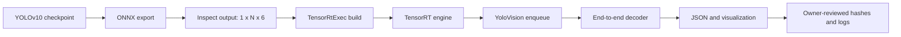

# YoloVision YOLOv10 End-to-End 输出接入：从官方模型到 TensorRT 结果

YOLOv10 的 one-to-one head 让部署端可以直接消费 NMS-free/end-to-end detection 结果，但这不等于“把
YOLOv8 的后处理换个 family 名称”就能工作。常见 YOLOv10 ONNX 输出是 `[1,N,6]`，每行表示
`x1,y1,x2,y2,score,classId`；传统 YOLO raw head 则通常输出 `xywh`、objectness 和逐类分数。两者如果走同一个
decoder，框坐标、类别和置信度都会被错误解释。

本教程使用仓库中的 `YoloVision`、`TensorRtExec` 和专用 end-to-end managed decoder，完成以下流程：

1. 从 YOLOv10 官方来源取得模型并记录许可证、版本和 SHA256。
2. 导出 ONNX，并先检查真实输出 shape，禁止靠 family 名称猜格式。
3. 使用 TensorRtExec 构建 TensorRT engine 和 build report。
4. 使用 YoloVision 的 `--layout end2end` 运行 `[1,N,6]` 输出。
5. 检查 output JSON、可视化、日志和 proof 边界。

本文中的命令是可复现操作路径。仓库当前已为官方 YOLOv10n v1.1 ONNX 留下一条 source-tree
`real-model-runtime` closure：`artifacts/interface-coverage/yolov10-official-runtime-proof-closure.json`。
其他 YOLOv10 模型、其他导出契约、公开包消费和发布仍需使用者提供模型、输入图、GPU 主机、日志和审核记录。

## 本仓库已验证的 YOLOv10n v1.1 闭环

为了避免文章只停留在“应该这样做”，本项目已经把官方 YOLOv10n v1.1 ONNX 走了一遍 source-tree
runtime proof。核心记录如下：

| 项目 | 值 |
| --- | --- |
| 上游仓库 | `https://github.com/THU-MIG/yolov10` |
| 上游 tag / revision | `v1.1` / `799ff3be47d21173bcf29b351820d4b8e955e0fe` |
| 许可证 | `AGPL-3.0-only`，公开再分发仍需 owner review |
| ONNX | `yolov10n.onnx`，`9,386,466` bytes，SHA256 `7025ea1913f9a259cf8a8465ed608e10610d1bb376db2e0348b13e3bd286e0d3` |
| TensorRT / CUDA | TensorRT `10.11.0`，CUDA Toolkit `12.9` |
| Engine | `17,365,068` bytes，SHA256 `21891d0dcfb322069f864b5395f1653182251c35e4d822d2cc2c02635a4d2000` |
| Input / Output | `images:[1,3,640,640]` -> `output0:[1,300,6]` |
| GPU / Driver | `NVIDIA GeForce RTX 3060 Laptop GPU` / `576.02` |
| Runtime result | `YoloVision Passed=True`，4 个 detection，top prediction `dog=0.91683036` |
| Output evidence | output JSON SHA256 `38aaddac4e6f22f6d230d6e36c9e787c4d407508d1cb5dea768d0967827a8c4f`，run log SHA256 `bb2c5958590c4ac074b969d90af87f3aedb38991054588434133a2f620ebc43e` |

这些值来自 `artifacts/interface-coverage/yolov10-official-runtime-proof-closure.json` 和
`samples/assets/yolovision-yolov10-official-assets.json`。大模型、engine、预处理 tensor 和原始日志仍留在 E 盘
download workspace，不提交进仓库；文章只引用 hash-pinned evidence。这个记录可以支撑“源码树真实模型运行已经走通”，
但不能支撑“NuGet 包已经公开可消费”“AGPL 资产可以随包再分发”或“发布 issue 可以关闭”。

## 1. 先看清数据流



关键边界在 `C`：只有真实输出是 batch-1 六列结构，并且列顺序确认为
`x1,y1,x2,y2,score,classId`，才使用 `--layout end2end`。如果导出结果是 `[1,84,8400]`、`[1,8400,84]`
或多个 raw head tensor，应使用相应 raw/metadata 路径，而不是强制套用本教程。

## 2. 环境与目录

建议把模型、Python 环境和构建产物放在空间充足的数据盘。以下示例使用 E 盘：

```powershell
$repo = "E:\GitSpace\TensorRT-CSharp-API-4.0\TensorRtSharp4.0"
$work = "E:\Models\YOLOv10"
New-Item -ItemType Directory -Force -Path $work | Out-Null
```

需要：

- Windows x64、.NET 8 SDK、Git、Python 3.9 或官方仓库当前支持版本。
- 与目标 TensorRT line 匹配的 CUDA、cuDNN、TensorRT 和本仓库 native bridge。
- NVIDIA 驱动与目标 CUDA runtime 兼容。
- 足够的 E 盘空间；不要把大型 checkpoint、ONNX 和 engine 放进源码仓库。

本教程不触发 GitHub Actions，也不发布 NuGet、GitHub Packages 或 GitHub Release。

在准备外部模型前，可以先验证当前源码的纯托管 decoder：

```powershell
Set-Location $repo
dotnet run --project .\samples\YoloVision -- --self-test-end2end
```

预期包含 `ManagedSmoke=YOLOv10EndToEnd Passed=True`、`Detections=2`、`ApplyNms=False`。该命令只处理固定数组，
明确输出 `IsRuntimeProof=False`，不能替代后文的真实模型运行。

## 3. 获取官方模型并记录来源

官方源码仓库：`https://github.com/THU-MIG/yolov10`。先查看仓库 LICENSE 和目标 release 的说明，再决定
内部使用、文章配图和再分发方式。不要因为 URL 可公开访问就默认 checkpoint 可以随项目包重新分发。

```powershell
Set-Location $work
git clone https://github.com/THU-MIG/yolov10.git source
Set-Location .\source
git rev-parse HEAD
```

从官方 Releases 页面下载目标 checkpoint。以 `yolov10n.pt` 为例，官方历史 v1.1 release 的常用地址是：

```powershell
curl.exe -L `
  "https://github.com/THU-MIG/yolov10/releases/download/v1.1/yolov10n.pt" `
  -o "$work\yolov10n.pt"

Get-FileHash "$work\yolov10n.pt" -Algorithm SHA256
Get-Item "$work\yolov10n.pt" | Select-Object FullName, Length, LastWriteTimeUtc
```

如果官方 release 已调整，应从当前 Releases 页面取得新地址，并同时记录 release tag、Git commit、下载 URL、
文件长度和 SHA256。文章或 evidence record 中不要只写“官方模型”。

## 4. 在隔离环境导出 ONNX

```powershell
Set-Location "$work\source"
python -m venv "$work\.venv"
& "$work\.venv\Scripts\python.exe" -m pip install --upgrade pip
& "$work\.venv\Scripts\python.exe" -m pip install -r .\requirements.txt
& "$work\.venv\Scripts\python.exe" -m pip install -e .
```

创建 `$work\export_onnx.py`：

```python
from ultralytics import YOLOv10

model = YOLOv10(r"E:\Models\YOLOv10\yolov10n.pt")
model.export(format="onnx", imgsz=640, opset=13, simplify=True)
```

执行并记录 stdout/stderr：

```powershell
& "$work\.venv\Scripts\python.exe" "$work\export_onnx.py" *>&1 |
  Tee-Object -FilePath "$work\export-onnx.log"

Get-FileHash "$work\yolov10n.onnx" -Algorithm SHA256
Get-FileHash "$work\export-onnx.log" -Algorithm SHA256
```

导出工具版本会改变图结构和输出契约。证据中至少记录 Python、PyTorch、Ultralytics/YOLOv10 fork、ONNX、
opset、imgsz、dynamic/static 和 simplify 设置。

## 5. 检查真实 ONNX 输出

不要直接进入 TensorRT build。先用 ONNX parser 查看 input/output 名称和 shape：

```powershell
@'
import onnx

path = r"E:\Models\YOLOv10\yolov10n.onnx"
model = onnx.load(path)

def dims(value_info):
    shape = value_info.type.tensor_type.shape
    return [d.dim_value if d.dim_value else d.dim_param for d in shape.dim]

for item in model.graph.input:
    print("INPUT", item.name, dims(item))
for item in model.graph.output:
    print("OUTPUT", item.name, dims(item))
'@ | & "$work\.venv\Scripts\python.exe" -
```

本仓库 end-to-end decoder 接受的契约是：

| 位置 | 含义 | 校验 |
| --- | --- | --- |
| 0 | `x1` | finite |
| 1 | `y1` | finite |
| 2 | `x2` | finite 且 `x2 > x1` |
| 3 | `y2` | finite 且 `y2 > y1` |
| 4 | `score` | finite，范围 `[0,1]` |
| 5 | `classId` | 非负整数；指定 class count 时不能越界 |

shape 必须是 `[1,N,6]`。当前 runner 明确只处理 batch 1；`[N,6]`、`[B,N,6]` 且 `B>1`、`[1,N,7]`
和不同列顺序都会失败，而不是被静默猜测。

## 6. 使用 TensorRtExec 构建 engine

假设真实 input 名称是 `images`，静态 shape 是 `1x3x640x640`：

```powershell
Set-Location $repo

dotnet run --project .\applications\TensorRtExec -- `
  --onnx "$work\yolov10n.onnx" `
  --saveEngine "$work\yolov10n.plan" `
  --tensor-rt-line 10 `
  --minShapes images:1x3x640x640 `
  --optShapes images:1x3x640x640 `
  --maxShapes images:1x3x640x640 `
  --workspace 1024 `
  --buildOnly `
  --skipInference `
  --exportReport "$work\yolov10n-build-report.json"
```

构建后记录：

```powershell
Get-FileHash "$work\yolov10n.plan" -Algorithm SHA256
Get-FileHash "$work\yolov10n-build-report.json" -Algorithm SHA256
```

TensorRtExec build report 证明参数解析、builder 配置和 engine artifact；它不是图像推理正确性证明。报告中的 output
shape 仍应与第 5 节检查结果交叉核对。

## 7. 准备真实输入

YoloVision 内置图片解码支持未压缩 BMP 和 PPM/PNM。JPG/PNG 可以先由可信工具转换为 PPM，或者在外部完成与
模型完全一致的预处理并通过 `--input-data` 提供 float32 tensor。

以 PPM 为例：

```powershell
Get-FileHash "$work\input.ppm" -Algorithm SHA256
```

还需要与模型训练集一致的 labels 文件，并确认行数等于 `--class-count`：

```powershell
$labels = Get-Content "$work\coco.names"
"LabelCount=$($labels.Count)"
Get-FileHash "$work\coco.names" -Algorithm SHA256
```

## 8. 运行 YoloVision

```powershell
Set-Location $repo

dotnet run --project .\samples\YoloVision -- `
  --model "$work\yolov10n.onnx" `
  --labels "$work\coco.names" `
  --image "$work\input.ppm" `
  --preprocessed-output "$work\input-yolov10n-fp32.bin" `
  --input-shape 1x3x640x640 `
  --tensor-rt-line 10 `
  --family v10 `
  --task det `
  --layout end2end `
  --class-count 80 `
  --confidence 0.25 `
  --top-k 100 `
  --output "$work\yolov10n-output.json" `
  --visualization "$work\yolov10n-output.svg" *>&1 |
  Tee-Object -FilePath "$work\yolov10n-run.log"
```

`--layout end2end` 会让 `YoloPostprocessOptions` 自动执行以下约束：

- `HasObjectness=false`，因为第 5 列已经是最终 score，不再乘 objectness。
- `ApplyNms=false`、`NmsMode=None`，因为 end-to-end 输出不能再做一次 application-side NMS。
- 按 score 降序并应用 `--top-k`，但不会压掉模型已经选择的重叠框。
- 将 `xyxy` 转成项目统一的 center-x、center-y、width、height 表示，同时保留 source row index。

即使用户额外传入普通 NMS 配置，end-to-end layout 仍会关闭二次 NMS。这是 decoder 契约，不是性能开关。

## 9. 检查结果与证据

```powershell
Get-FileHash "$work\input-yolov10n-fp32.bin" -Algorithm SHA256
Get-FileHash "$work\yolov10n-output.json" -Algorithm SHA256
Get-FileHash "$work\yolov10n-output.svg" -Algorithm SHA256
Get-FileHash "$work\yolov10n-run.log" -Algorithm SHA256
```

至少人工检查：

- 日志包含 `YoloVision Passed=True`，且进程 exit code 为 0。
- output JSON 的 family/task 是 `yolov10/det`，input/model/labels hash 与实际文件一致。
- detection 的 classId 在 labels 范围内，score、坐标和 source index 合理。
- SVG 框与原图目标一致，没有系统性偏移、镜像或缩放错误。
- engine binding metadata 与 ONNX input/output 名称、shape、dtype 对齐。

若要形成 real-model-runtime candidate，还应保留 GPU、driver、CUDA、cuDNN、TensorRT、bridge/package identity、
完整命令、stdout/stderr summary、owner reviewer 和审核时间。随后使用仓库的 sample-run/owner evidence validator，
不能用 screenshot 或 build report 代替运行日志。

## 10. 常见问题

### 输出是 `[1,84,8400]`

这不是六列 end-to-end contract。不要使用 `--layout end2end`；按真实 raw head 选择 channels-first/boxes-first、
class count、objectness 和 NMS 规则。

### 所有 classId 都越界

先检查第 6 列是否真是 classId。有些自定义导出把 class scores、batch index 或其他 metadata 放在该位置。确认列
顺序后再选择 decoder，不能为了绕过异常扩大 class count。

### 坐标出现 `x2 <= x1`

可能是输出实际采用 `xywh`，也可能是错误 tensor/列顺序。专用 decoder 会拒绝该行，避免生成负宽高框。

### 检测数量比预期多

确认模型导出是否真的包含 one-to-one/end-to-end 选择。如果输出仍是 pre-NMS candidates，应走应用侧 NMS 路径。
不要在 end-to-end layout 上重新打开 NMS 来掩盖错误 contract。

### 有 engine 但没有可信结果

engine 成功构建只证明 build path。还需要真实输入、正确预处理、enqueue、output JSON、可视化、hash、日志和人工审核。

## 11. Proof 边界

本仓库已经提供专用 managed decoder、managed smoke，以及官方 YOLOv10n v1.1 ONNX 的 source-tree
`real-model-runtime` closure。该 closure 证明这条本地 source-tree 路径完成了真实 TensorRT enqueue、
`output0:[1,300,6]` 读取、end-to-end decode 和 `YoloVision Passed=True`。它不是
`package-consumer-runtime`、公开包、post-publish、release-close proof，也不是 AGPL-3.0-only 资产的公开再分发批准。

只有当真实模型来源/许可证、ONNX/engine/input/labels/output/log hash、兼容主机元数据和 owner review 全部对齐，
并通过严格 validator 后，才能对那一条具体模型记录做更高层级判断。

## 总结

YOLOv10 部署的关键不是 family 名称，而是输出契约。先检查 ONNX，再用 `--layout end2end` 明确选择六列 decoder，
最后用真实输入、JSON、可视化和 hashes 验证结果。这样既能利用 YOLOv10 的 NMS-free 输出，又不会把它误当成
YOLOv8 raw head，更不会用第二次 NMS掩盖上游格式错误。
