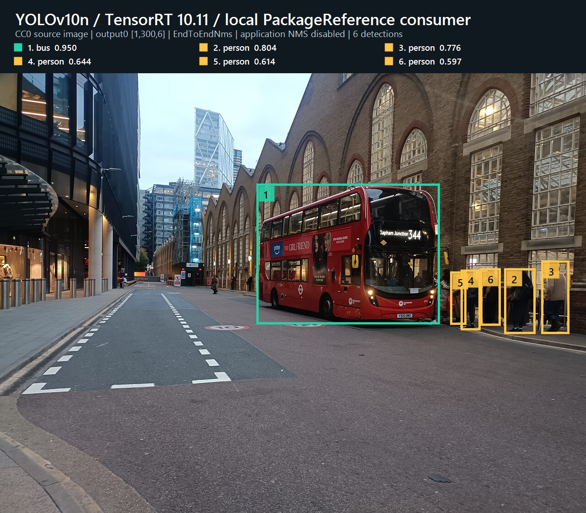
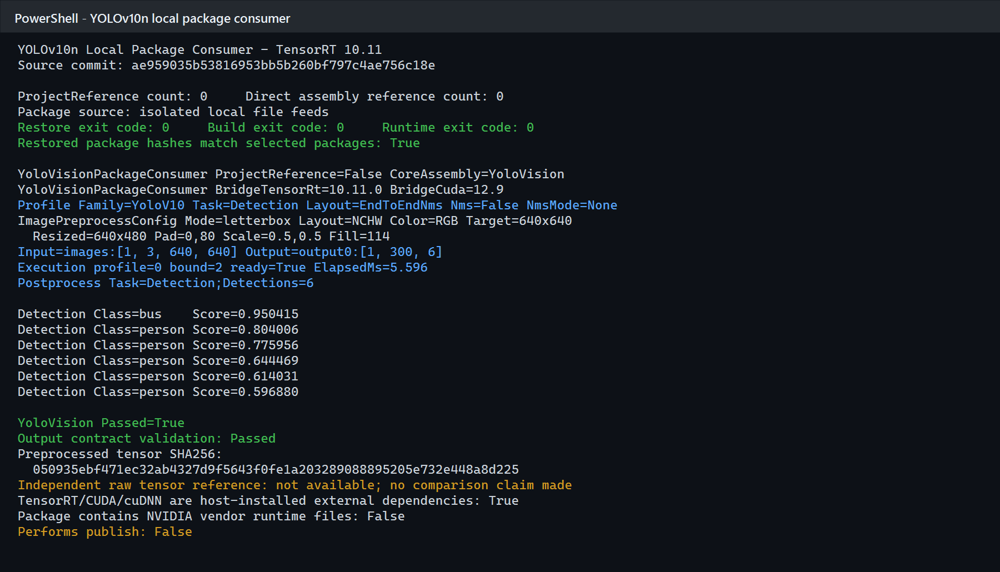

# 使用 TensorRtSharp4.0 在 C# 中运行 YOLOv10n：从官方模型到公开包应用

本文以 THU-MIG 官方 YOLOv10n v1.1 ONNX 为例，完整演示模型获取、ONNX 转换与合同确认、公开 4 系列包引用、图片预处理、TensorRT 推理、end-to-end 输出解码和原图结果绘制。

本次验证使用真实模型、CC0 图片和 TensorRT 10.11 实机执行。CUDA、cuDNN、TensorRT 由使用者按版本安装，项目包不携带 NVIDIA 厂商运行库；ONNX、engine 和预处理 tensor 暂存在仓库外层 `models` 或工作目录，不上传 GitHub。

## 本文使用的项目与库

TensorRtSharp4.0 的顶层托管命名空间是 `JYPPX.TensorRtSharp` 和 `JYPPX.CudaSharp`。本案例使用四层能力：

| 层次 | 项目或包 | 本案例职责 |
| --- | --- | --- |
| TensorRT 托管接口 | `JYPPX.TensorRtSharp` | 解析 ONNX、创建 engine/context、绑定 tensor、enqueue 并读取输出 |
| CUDA 托管接口 | `JYPPX.CudaSharp` | 管理 CUDA context、stream 和 device memory 生命周期 |
| 视觉任务接口 | `applications/YoloVision` | 图片预处理、模型配置、检测解码、JSON 报告和 SVG 可视化 |
| 图片解码 | `JYPPX.OpenCV.CSharp.API` | 由项目作者维护，负责 JPEG/PNG/BMP 图片读取 |

YOLOv10n v1.1 的关键点不是模型文件名，而是输出合同。本例的 `output0` 为 `[1,300,6]`，每行依次是：

```text
x1, y1, x2, y2, score, classId
```

模型图内已经完成候选筛选和 NMS，因此应用端必须使用 `EndToEndNms` 布局，并保持 `ApplyNms=false`、`NmsMode=None`。如果实际 ONNX 输出不是六列合同，就不能套用本文配置。

## 模型获取与许可证

### 2.1 官方模型

模型来自 [THU-MIG YOLOv10 v1.1 Release](https://github.com/THU-MIG/yolov10/releases/download/v1.1/yolov10n.onnx)：

| 项目 | 固定值 |
| --- | --- |
| 上游 revision | `799ff3be47d21173bcf29b351820d4b8e955e0fe` |
| 许可证 | `AGPL-3.0-only` |
| 文件 | `yolov10n.onnx` |
| 长度 | `9,386,466` bytes |
| SHA256 | `7025ea1913f9a259cf8a8465ed608e10610d1bb376db2e0348b13e3bd286e0d3` |

项目不再把模型或 NVIDIA 运行库打入 GitHub/Release 包。模型暂存位置为：

```text
models/YoloVision/Detection/yolov10n-thu-mig-v1.1/yolov10n.onnx
```

这里的 `models` 是仓库外层模型工作区，后续可迁移到独立 Model Zoo。机器可读来源和许可证记录位于 `samples/assets/yolovision-yolov10-official-assets.json`。

### 2.2 CC0 输入图片

实机输入为 Wikimedia Commons 的 `Liverpool Street Bus station 2025`，许可证为 [CC0 1.0](https://creativecommons.org/publicdomain/zero/1.0/)。运行使用 1280×961 PPM，SHA256 为：

```text
80715af66669147b049fec9386152bd45505f4e494a65079fdc55404d4589b8e
```

模型因 AGPL 再分发尚未获得项目所有者批准而不提交；结果图使用可公开再分发的 CC0 输入。

## 3. 获取模型

仓库提供哈希固定的获取脚本。输出目录应位于仓库外层：

```powershell
pwsh -NoProfile -ExecutionPolicy Bypass `
  -File ./eng/Acquire-YoloV10OfficialAssets.ps1 `
  -OutputRoot <downloads-root>/yolov10-agpl
```

脚本会下载官方 ONNX 与许可证、校验长度和 SHA256，并生成本地获取报告。将校验通过的 ONNX 暂存到上一节的 `models/YoloVision/Detection/...` 目录即可；不要把模型复制进 Git 仓库。

## ONNX 转换与暂存

本文实机数据使用官方已发布 ONNX，因此复现本次哈希不需要再次转换。如果业务模型来自 checkpoint，应固定官方源码 revision、Python、PyTorch、导出器版本、opset 和输入尺寸，再执行上游导出：

```powershell
git clone https://github.com/THU-MIG/yolov10.git <work-root>/yolov10
git -C <work-root>/yolov10 checkout 799ff3be47d21173bcf29b351820d4b8e955e0fe
python -m pip install -r <work-root>/yolov10/requirements.txt
```

```python
from ultralytics import YOLOv10

model = YOLOv10("<model-root>/yolov10n.pt")
model.export(format="onnx", imgsz=640, opset=13, simplify=True)
```

转换后必须先检查实际 ONNX：

```text
images:[1,3,640,640]
output0:[1,300,6]
```

重新导出的文件不保证与 v1.1 Release 文件同哈希，也可能导出 raw head。若输出为 `[1,84,8400]`、`[1,8400,84]` 或其他布局，应根据真实 tensor metadata 选择 decoder，不能仅凭“YOLOv10”名称推断。

## 5. 准备本机运行环境

本案例验证组合为 TensorRT `10.11.0`、CUDA Toolkit `12.9`、Windows x64 和 .NET 8。cuDNN、TensorRT、CUDA 由用户安装；bridge-only 包只包含本项目编译的 `jyppxtrtbridge.dll`。

还原并编译使用公开包的 YoloVision 应用：

```powershell
dotnet restore ./applications/YoloVision/YoloVision.csproj
dotnet build ./applications/YoloVision/YoloVision.csproj -c Release --no-restore
```

这些命令不会生成、推送或发布 YoloVision 案例包。

## 使用公开包准备应用

`applications/YoloVision` 是完整应用并设置为 `IsPackable=false`。它通过共享 props 引用已发布的
`JYPPX.TensorRT.CSharp.API` 4 系列包，以及作者维护的
[OpenCV-CSharp-API](https://github.com/guojin-yan/OpenCV-CSharp-API)。应用本身不发布 YoloVision 案例 NuGet 包。

新建仓库外项目时，可以让 NuGet 获取当前公开预览版，而不在文章中写死具体版本：

```powershell
dotnet add package JYPPX.TensorRT.CSharp.API --prerelease
dotnet add package JYPPX.OpenCV.CSharp.API --prerelease
dotnet add package JYPPX.OpenCV.runtime.win-x64 --prerelease
dotnet add package JYPPX.TensorRT.CSharp.API.Runtime.win-x64.trt10.11.cuda12.9.cudnn9.22.Bridge --prerelease
```

最后一个包 ID 必须按目标机器环境替换。它只包含项目自有 bridge；CUDA、cuDNN、TensorRT 和 NVRTC
继续由用户安装。仓库中的 YoloVision 项目直接运行当前源码，但 TensorRT/CUDA API 来自公开 NuGet 包。

## 编写程序入口

输入预处理合同如下：

| 项目 | 值 |
| --- | --- |
| 原图 | `1280×961` |
| 目标尺寸 | `640×640` |
| resize | `640×480` |
| padding | `x=0, y=80`，居中 |
| color/layout | `RGB / NCHW` |
| scale | `1/255` |
| fill | `114` |

生成的 float32 tensor 共 `1,228,800` 个值、`4,915,200` bytes，SHA256 为：

```text
050935ebf471ec32ab4327d9f5643f0fe1a203289088895205e732e448a8d225
```

程序入口通过 `YoloImagePreprocessor` 生成 tensor，随后调用 TensorRT 托管接口并交给 end-to-end decoder：

```csharp
YoloImagePreprocessResult imagePreprocess = YoloImagePreprocessor.Preprocess(
    imagePath,
    tensorPath,
    profile.InputShape,
    profile.Preprocess);

OnnxSampleMultiOutputResult runtime =
    TensorRtOnnxSample.RunSingleFloatInputOutputs(options);

YoloVisionResult result = YoloSampleRunner.DecodeOutput(
    runtime.PrimaryOutput.Values,
    runtime.PrimaryOutput.Shape.Values,
    profile);
```

`YoloDetectionDecoder.DecodeEndToEnd` 会检查 rank、六列长度、有限坐标、`x2>x1`、`y2>y1`、score 范围、整数 class id 和 class count。检测框再按 `scale=0.5`、`padY=80` 反变换回原图坐标。

## 编译并运行

准备好本机 TensorRT、CUDA、cuDNN 根目录后，直接运行 YoloVision 应用：

```powershell
$env:JYPPX_TENSORRT_ROOT = '<TensorRT-root>'

dotnet run --project ./applications/YoloVision -c Release --no-build -- `
  --model <models-root>/YoloVision/Detection/yolov10n.onnx `
  --labels <asset-root>/coco.names `
  --image <asset-root>/input.jpg `
  --preprocessed-output <result-root>/input.fp32.bin `
  --input-shape 1x3x640x640 --input-name images --output-name output0 `
  --tensor-rt-line 10 --family v10 --task det --layout end2end `
  --class-count 80 --confidence 0.25 --top-k 100 `
  --output-json <result-root>/yolov10n-output.json `
  --visualization <result-root>/yolov10n-result.svg `
  --visualization-background <asset-root>/input.jpg
```

脚本内部传给 YoloVision 的核心参数为：

```text
--input-shape 1x3x640x640
--input-name images
--output-name output0
--family v10
--task det
--layout end2end
--class-count 80
--confidence 0.25
--top-k 100
```

## 已验证结果

本次运行环境为 RTX 3060 Laptop GPU、驱动 `576.02`、TensorRT `10.11.0`、CUDA Toolkit `12.9`、.NET SDK `10.0.301`。结果不是模板或 dry-run：真实执行了图片预处理、TensorRT enqueue、输出读取和托管解码。



上图由同次 `yolovision-output.json` 中的 6 个检测框和 letterbox 参数反投影到 CC0 原图生成。编号与顶部图例对应，避免右侧密集 person 框的文字互相遮挡。



终端截图来自本次真实运行的 stdout，只移除了机器路径。两张图都来自同一次真实 TensorRT 执行，检测框、类别分布、shape、耗时和通过状态均未改写。

实际结果为：

| 类别 | 数量 | 最高置信度 |
| --- | ---: | ---: |
| bus | 1 | `0.950415` |
| person | 5 | `0.804006` |

关键运行事实：

```text
ProjectReference=False
BridgeTensorRt=10.11.0 BridgeCuda=12.9
Input=images:[1,3,640,640] Output=output0:[1,300,6]
Layout=EndToEndNms Nms=False NmsMode=None
Execution ElapsedMs=5.596
Postprocess Detections=6
YoloVision Passed=True
```

输出 JSON SHA256 为 `369878a520f0256000c57892f12bc72f97d8a3c2e4e6a94ed3c1fa774a35173e`，脱敏文本和机器证据分别位于：

```text
samples/assets/yolovision-yolov10n-local-package-consumer-tensorrt10.11.txt
samples/assets/yolovision-yolov10n-local-package-consumer-runtime-evidence.json
```

## 复查与边界

这两张图和对应 JSON 是发布前留下的历史 `local-package-consumer-runtime` 记录，原始分类和哈希保持不变。当前教程的执行入口已经改为使用公开核心包构建的 `applications/YoloVision`；新的公共包 post-publish 证明必须另行运行并生成新记录，不能覆盖历史证据。

本次没有可用的独立 raw tensor reference，因此不声称跨框架 raw output 或后处理逐值一致。固定输出 shape、预处理 tensor SHA256、类别分布和结果图均已校验，但它们不能替代独立参考。

它不证明新的公共包 post-publish 验证、Owner 验收或 AGPL 模型公开再分发授权。运行时仍应在目标机器确认：

1. TensorRT、CUDA、cuDNN 与 bridge-only 包版本组合一致。
2. 实际 ONNX 的输入输出名称、shape 和六列顺序符合合同。
3. restore graph 中核心 API 来自 NuGet，YoloVision 自身保持 `IsPackable=false`。
4. `ApplyNms=false`，不对 end-to-end 结果执行第二次 NMS。
5. bus 框覆盖车辆主体，5 个 person 框位于站台右侧，坐标无整体偏移。
6. 进程退出码为 0，最终标记为 `YoloVision Passed=True`。
