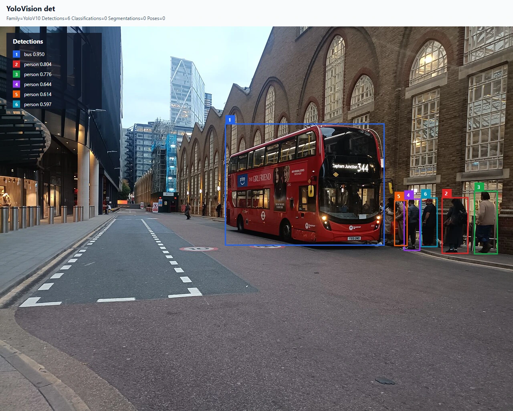
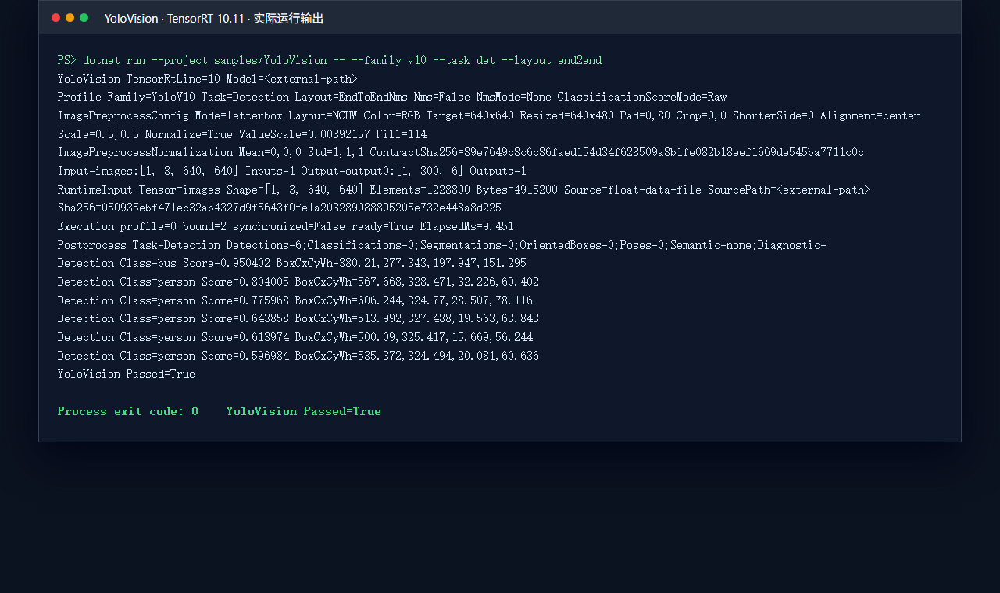

# YoloVision YOLOv10n 实机检测：从官方 ONNX 到 TensorRT 结果

本文以官方 YOLOv10n v1.1 ONNX 为例，完整演示 `samples/YoloVision` 如何读取 end-to-end 检测输出、构建 TensorRT runtime、执行真实图片推理并生成原图叠加结果。示例使用 `JYPPX.TensorRtSharp` 的 TensorRT 托管封装和 `JYPPX.CudaSharp` 的 CUDA 资源管理能力；CUDA、cuDNN、TensorRT 和 native bridge 均由使用者本机安装，不随项目发布。

本文只提交代码、哈希和脱敏截图。模型、输入图片、预处理 tensor、engine 和原始日志保存在仓库外层工作目录，后续可迁移到独立 model zoo。

## 本文使用的项目与库

本案例涉及三个项目层次：

| 层次 | 项目 | 作用 |
| --- | --- | --- |
| 托管 TensorRT | `src/JYPPX.TensorRtSharp` | 解析 ONNX、创建 execution context、绑定输入输出并读取 TensorRT 结果 |
| 托管 CUDA | `src/JYPPX.CudaSharp` | 提供 CUDA context、stream 和 device memory 的安全封装 |
| 用户示例 | `samples/YoloVision` | 完成图片预处理、end-to-end 解码、JSON 报告和 SVG 可视化 |

YOLOv10 与 YOLOv8 raw head 的关键区别是输出语义：本例输出为 `[1,300,6]`，每行依次是 `x1,y1,x2,y2,score,classId`，模型已经完成候选筛选，因此应用端不能再次执行 NMS。

## 模型获取与许可证

模型来源是 [THU-MIG/yolov10 v1.1 release](https://github.com/THU-MIG/yolov10/releases/download/v1.1/yolov10n.onnx)，上游 revision 为 `799ff3be47d21173bcf29b351820d4b8e955e0fe`，许可证为 `AGPL-3.0-only`。固定 ONNX 文件长度为 `9386466` bytes，SHA256 为 `7025ea1913f9a259cf8a8465ed608e10610d1bb376db2e0348b13e3bd286e0d3`。

项目提供 `eng/Acquire-YoloV10OfficialAssets.ps1` 和 `samples/assets/yolovision-yolov10-official-assets.json` 记录来源、版本、许可证和哈希。获取脚本的输出根目录应位于仓库外层：

```powershell
pwsh -NoProfile -ExecutionPolicy Bypass `
  -File ./eng/Acquire-YoloV10OfficialAssets.ps1 `
  -OutputRoot <downloads-root>/yolov10-agpl
```

AGPL 资产只用于本地实机验证；当前 `publicRedistributionOwnerApproval=false`，不会上传到 GitHub、NuGet 或 Release。

## ONNX 转换与暂存

本次实机运行直接使用官方已经发布的 ONNX，不重复转换，因此模型暂存位置为：

```text
<models-root>/YoloVision/Detection/yolov10n-thu-mig-v1.1/yolov10n.onnx
```

仓库相对模型记录写作 `models/YoloVision/Detection/yolov10n-thu-mig-v1.1/yolov10n.onnx`；实际模型文件仍位于仓库外层的 models 工作区。

如果使用者从 checkpoint 重新导出，必须在导出日志中记录 Python、PyTorch、YOLOv10/Ultralytics 版本、opset、输入尺寸和输出 shape。上游导出调用示例为：

```python
model.export(format="onnx", imgsz=640, opset=13, simplify=True)
```

这条命令是 checkpoint 到 ONNX 的转换方式，不保证生成图与官方 release 完全相同。转换完成后先用 ONNX parser 检查：

```text
images:[1,3,640,640]
output0:[1,300,6]
```

只有确认六列 end-to-end 合同后，才可以选择 `--layout end2end`。如果输出是 `[1,84,8400]` 或 `[1,8400,84]`，应改用对应的 raw head metadata，而不是强行套用本例 decoder。

## 创建本地包消费项目

本篇验证目标是源码树的真实模型运行，不把本地 `ProjectReference` 或临时 `.nupkg` 当作公开包证明，因此不会在本节伪造“包已发布”的结果。项目仍提供 `YoloVision.PackageConsumer` 和 `eng/Test-YoloVisionManagedPackageDryRun.ps1` 作为后续包消费验证入口；由于当前尚未获得发布授权，它们只能验证包布局和托管 API 兼容性，不能替代本篇 TensorRT 实机运行。

## 编写程序入口

`samples/YoloVision/Program.cs` 没有绕过托管 API 调用外部推理程序。核心路径可以归纳为下面几步；代码中的
`profile` 保存 family、task、输入 shape、预处理和后处理合同：

```csharp
YoloImagePreprocessResult imagePreprocess = YoloImagePreprocessor.Preprocess(
    imagePath,
    tensorPath,
    profile.InputShape,
    profile.Preprocess);

string[] effectiveArgs = AddOrReplaceArgument(
    args,
    "--input-data",
    imagePreprocess.TensorPath);
OnnxSampleOptions options = OnnxSampleOptions.FromArgs(effectiveArgs, "1x3x640x640");

OnnxSampleMultiOutputResult runtime =
    TensorRtOnnxSample.RunSingleFloatInputOutputs(options);
OnnxSampleOutputTensor output0 = runtime.PrimaryOutput;

YoloRuntimeOutputSet runtimeOutputs = new(runtime.Outputs.Select(output =>
    new YoloRuntimeOutputTensor(
        output.Name,
        YoloOutputTensorRole.Detection,
        output.Values,
        output.Shape.Values)));

YoloVisionResult result = YoloSampleRunner.DecodeOutput(
    output0.Values,
    output0.Shape.Values,
    profile);

YoloVisionOutputReport.Write(
    outputJsonPath,
    options,
    runtime,
    runtimeOutputs,
    profile,
    result,
    labels,
    labelsPath,
    imagePreprocess);

YoloVisionVisualizationWriter.Write(
    visualizationPath,
    result,
    labels,
    profile,
    options.InputShape.Values,
    imagePreprocess,
    null,
    visualizationBackgroundPath);
```

`YoloPostprocessOptions` 在 `EndToEndNms` layout 下强制 `HasObjectness=false`、`ApplyNms=false` 和
`NmsMode=None`。随后 `YoloDetectionDecoder.DecodeEndToEnd` 严格检查 `[1,N,6]`、value count、有限坐标、
`x2 > x1`、`y2 > y1`、`score` 范围、整数 class id 和 class count，最后才按置信度和 `top-k` 返回检测结果。
因此这里的“无第二次 NMS”是代码合同，不是文章里的使用建议。

运行入口需要显式写出模型、标签、输入图片、输入 shape 和输出布局：

```powershell
dotnet run --project ./samples/YoloVision -- `
  --model <models-root>/YoloVision/Detection/yolov10n-thu-mig-v1.1/yolov10n.onnx `
  --labels <asset-root>/coco.names `
  --image <asset-root>/liverpool-street-bus-station-1280.ppm `
  --preprocessed-output <evidence-root>/input-yolov10n.fp32.bin `
  --input-shape 1x3x640x640 `
  --tensor-rt-line 10 `
  --family v10 `
  --task det `
  --layout end2end `
  --class-count 80 `
  --confidence 0.25 `
  --top-k 100 `
  --output-json <evidence-root>/yolov10n-output.json `
  --visualization <evidence-root>/yolov10n-output.svg `
  --visualization-background <asset-root>/liverpool-street-bus-station-1280.jpg
```

`--image` 负责把 PPM 转为 RGB、NCHW、640×640 centered letterbox 的 float32 tensor；`--visualization-background` 让程序把模型坐标反变换回 1280×961 原图，并在原图上绘制检测框。

## 编译并运行

先准备用户安装的 TensorRT 10.11、CUDA 12.9 和本项目 native bridge。Windows 环境变量只用于 loader 探测：

```powershell
$env:JYPPX_NATIVE_BRIDGE_PATH = <bridge-root>/jyppxtrtbridge.dll
$env:JYPPX_TENSORRT_ROOT = <TensorRT-root>
$env:JYPPX_ENABLE_DEVELOPMENT_PROBING = "true"
dotnet build ./TensorRtSharp.sln -c Release
```

本次真实运行使用 RTX 3060 Laptop GPU、驱动 `576.02`、TensorRT `10.11.0.33`、CUDA `12.9`。机器相关 engine 不提交仓库；运行结束只保留 `sample-run-evidence`、图片和脱敏日志摘要。

## 已验证结果

下面两张图都来自同一次真实 TensorRT 执行。第一张是程序生成 SVG 渲染后的原图叠加结果，第二张是同一份 stdout 的脱敏终端窗口渲染。终端截图来自本次真实运行的 stdout，不是指标卡片或手工填写的示意图。





输入图片是 Wikimedia Commons 的 `Liverpool Street Bus station 2025`，许可证为 [CC0 1.0](https://creativecommons.org/publicdomain/zero/1.0/)。来源、原图 SHA256、两张结果图 SHA256 和同次运行关系记录在 `samples/assets/yolovision-yolov10n-article-visual-assets.json`。

本次运行结果：

| 类别 | 数量 | 最高置信度 |
| --- | ---: | ---: |
| bus | 1 | 0.950402 |
| person | 5 | 0.804005 |

机器证据还记录了 `images:[1,3,640,640] -> output0:[1,300,6]`、center letterbox、9.451 ms 执行耗时、`Nms=False`、输出 JSON SHA256 `7286d3c47270f0a3c19aaa5e28d1e8546a82ae5485076d4311aad98babdb834a`、运行日志 SHA256 `76fdb0e23b87f412392d8480346b32568c6ea0a9b69e509cc636790d8accf424` 和最终标记 `YoloVision Passed=True`。

## 复查与边界

复查时至少确认：

1. ONNX 输入输出名称、shape 和六列顺序与 decoder 合同一致。
2. 预处理 tensor 的 RGB/NCHW/letterbox 参数与运行日志一致。
3. bus 框覆盖车辆主体，五个 person 框位于站台右侧，坐标没有整体偏移。
4. `YoloVision Passed=True` 且进程退出码为 0；JSON、SVG、tensor 和日志 hash 可追溯。

本篇证明的是源码树 `real-model-runtime`：真实模型、真实图片、TensorRT enqueue、输出读取和结果绘制均已完成。它不证明公开 NuGet/GitHub 包、仓库外 clean consumer、post-publish、Owner 接受或 AGPL 模型公开再分发授权。CUDA、cuDNN、TensorRT、native bridge 和模型文件都由使用者按版本安装或获取。
