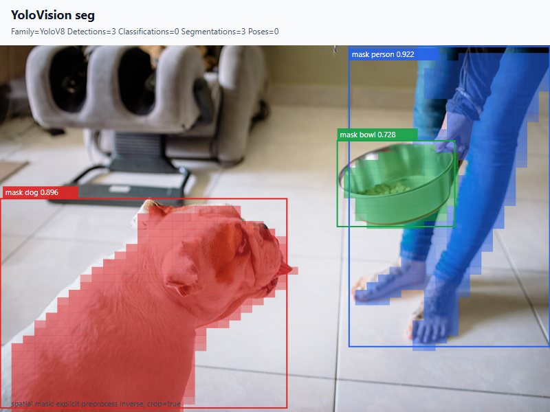
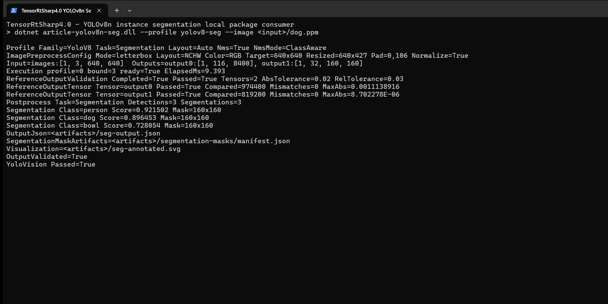

# C# 使用 TensorRtSharp4.0 运行 YOLOv8n 实例分割

本文从空的 `.NET 8` 控制台项目开始，完整演示 YOLOv8n-seg 权重获取、ONNX 转换、本地三包引用、图像预处理、TensorRT 执行、mask 解码和原图叠加。最终程序在一张真实图片中识别出 `person`、`dog` 和 `bowl`，并输出逐实例 mask、JSON 报告、标注图和真实运行页面。

本文仅执行本地开发验证。CUDA、cuDNN 和 TensorRT 由使用者安装；当前没有创建版本、Release 或发布包，模型也不进入 Git。

## 本文使用的项目与库

本流程使用 TensorRtSharp4.0 的三个本地包：

| 包 | 职责 |
| --- | --- |
| `JYPPX.TensorRT.CSharp.API` | TensorRT/CUDA 托管接口、ONNX 加载、binding、显存和执行。 |
| `JYPPX.TensorRT.CSharp.API.YoloVision` | RGB letterbox、YOLOv8 detection 解码、prototype mask 合成、坐标还原和 SVG 输出。 |
| `JYPPX.TensorRT.CSharp.API.Runtime.win-x64.trt10.11.cuda12.9.cudnn9.22.Bridge` | 只包含项目自己的 native bridge，不包含 CUDA、cuDNN 或 TensorRT。 |

本次验证环境为 NVIDIA GeForce RTX 3060 Laptop GPU、驱动 `576.02`、TensorRT `10.11.0`、CUDA Toolkit `12.9` 和 .NET SDK `10.0.301`。消费者应根据自己安装的运行环境选择相同矩阵的 Bridge 包。

## 模型获取与许可证

权重来自 Ultralytics 官方 Release：

```text
https://github.com/ultralytics/assets/releases/download/v8.3.0/yolov8n-seg.pt
```

来源固定到 `ultralytics v8.3.0` 和源码提交 `6e43d1e1e5db72afbf686dee6745669bcb124b0a`。权重长度为 `7,071,756` 字节，SHA256 为：

```text
a7cd8f929e1903d78a12a48efecab430209f18dc46cb96c3599a5980c63c423c
```

先用仓库脚本获取并校验固定资产：

```powershell
$repoRoot = Resolve-Path .
$workspaceRoot = Split-Path $repoRoot -Parent
$assetRoot = Join-Path $workspaceRoot 'downloads/yolov8n-seg-ultralytics-v8.3.0'

pwsh -NoProfile -ExecutionPolicy Bypass `
  -File (Join-Path $repoRoot 'eng/Acquire-YoloV8SegOfficialAssets.ps1') `
  -OutputRoot $assetRoot
```

演示图片独立于模型资产。使用一个环境变量指向本机已获准使用的素材目录，再复制并校验本文固定输入，避免在文章中暴露作者机器路径：

```powershell
$demoImageRoot = $env:JYPPX_DEMO_IMAGE_ROOT
if ([string]::IsNullOrWhiteSpace($demoImageRoot)) {
  throw '请先设置 JYPPX_DEMO_IMAGE_ROOT，使其指向本机演示图片目录。'
}

$inputRoot = Join-Path $assetRoot 'input'
$inputJpeg = Join-Path $inputRoot 'dog.jpg'
New-Item -ItemType Directory -Force $inputRoot | Out-Null
Copy-Item (Join-Path $demoImageRoot 'dog.jpg') $inputJpeg -Force

$expectedImageSha256 = 'bf76876b90e3ebd521f9882b9177ba8f33e80cb7ec09c630f179b122edd125e1'
$actualImageSha256 = (Get-FileHash $inputJpeg -Algorithm SHA256).Hash.ToLowerInvariant()
if ($actualImageSha256 -ne $expectedImageSha256) {
  throw "dog.jpg SHA256 不匹配：$actualImageSha256"
}
```

权重许可证为 `AGPL-3.0-only`。模型分发需要使用者按实际业务自行复核，因此 `.pt` 和 ONNX 都留在仓库外。本文输入 `dog.jpg` 由项目所有者提供，并已明确授权用于本仓库技术文章；原图 SHA256 为 `bf76876b90e3ebd521f9882b9177ba8f33e80cb7ec09c630f179b122edd125e1`。

## ONNX 转换与暂存

在隔离的 Python 环境中安装固定版 Ultralytics、PyTorch、ONNX 和 ONNX Runtime，然后执行：

```powershell
$Weights = Join-Path $assetRoot 'source/yolov8n-seg.pt'
$modelRoot = Join-Path $workspaceRoot 'models/YoloVision/InstanceSegmentation/yolov8n-seg-ultralytics-v8.3.0'
New-Item -ItemType Directory -Force $modelRoot | Out-Null

yolo export model=$Weights format=onnx imgsz=640 opset=17 simplify=True dynamic=False batch=1 device=cpu
Move-Item (Join-Path (Split-Path $Weights) 'yolov8n-seg.onnx') $modelRoot -Force
```

转换模型暂存在 `models/YoloVision/InstanceSegmentation/yolov8n-seg-ultralytics-v8.3.0/yolov8n-seg.onnx`，不会上传当前 GitHub 仓库。文件长度为 `13,873,432` 字节，SHA256 为：

```text
08b5c61368d4ddec5e647522fc55a93c42a9e0c581770aae48b87bba65a9b21d
```

模型合同包含两路输出：

```text
images : float32[1,3,640,640]
output0: float32[1,116,8400]   # 4 box + 80 class + 32 mask coefficients
output1: float32[1,32,160,160] # mask prototypes
```

把已获准使用的原图转换为 P6 RGB PPM，原 JPEG 继续作为结果图背景：

```powershell
$inputPpm = Join-Path $assetRoot 'derived/dog.ppm'
New-Item -ItemType Directory -Force (Split-Path $inputPpm) | Out-Null
& $env:JYPPX_YOLO_PYTHON -c "from PIL import Image; import sys; Image.open(sys.argv[1]).convert('RGB').save(sys.argv[2], format='PPM')" $inputJpeg $inputPpm
```

YoloVision 首次运行只生成 C# 预处理 tensor。随后参考脚本读取这个完全相同的 tensor，用 ONNX Runtime CPU 生成两路 raw reference：

```powershell
$artifactRoot = Join-Path $workspaceRoot 'downloads/article-assets/yolovision-yolov8n-seg'
$model = Join-Path $modelRoot 'yolov8n-seg.onnx'
$tensor = Join-Path $artifactRoot 'seg-csharp-input.fp32.bin'

& $env:JYPPX_YOLO_PYTHON `
  (Join-Path $repoRoot 'eng/Invoke-YoloVisionSegmentationReference.py') `
  --model $Weights --image $inputJpeg `
  --onnx-model $model --input-tensor $tensor `
  --output-directory (Join-Path $artifactRoot 'reference') `
  --evidence-classification local-package-consumer-runtime
```

脚本会严格检查 CPU provider、tensor 名称、shape 和 finite 值，并写出 `output0.reference.json`、`output1.reference.json` 及独立 Ultralytics/PyTorch mask 参考。

## 创建本地包消费项目

仓库外项目用于证明接口不依赖源码引用：

```powershell
$consumerRoot = Join-Path $workspaceRoot 'consumer-workspaces/yolov8n-seg'
New-Item -ItemType Directory -Force $consumerRoot | Out-Null
Set-Location $consumerRoot
dotnet new console --framework net8.0
```

项目文件只有三个 `PackageReference`：

```xml
<ItemGroup>
  <PackageReference Include="JYPPX.TensorRT.CSharp.API" Version="4.0.0" />
  <PackageReference Include="JYPPX.TensorRT.CSharp.API.YoloVision" Version="4.0.0" />
  <PackageReference Include="JYPPX.TensorRT.CSharp.API.Runtime.win-x64.trt10.11.cuda12.9.cudnn9.22.Bridge" Version="4.0.0" />
</ItemGroup>
```

它没有 `ProjectReference`、`Reference` 或 `HintPath`。三个包来自当前源码的隔离本地 feed，不代表已发布；包 SHA256 分别为 `139696bd79be6469d26747b7a3da7ba82e8279c69a9b42e2bf4f5a1ade607898`、`c563713e05b76764bcaf1a729f3338e807f940fa3ab81eb02570b9e056c0d3a7` 和 `296eac2d6376cf3c6eaeb9394c662d71b2d838ad7e339cd75587ef7040ebcb2c`。

## 编写程序入口

`Program.cs` 直接复用 YoloVision 的无指针入口：

```csharp
using YoloVisionSample;

return YoloVisionCommand.Run(args);
```

两路输出的角色必须显式指定为 `output0:det,output1:mask-prototypes`。`mask-coefficient-count=32` 必须与 detection 行尾部系数数量一致，否则 prototype 合成没有确定含义。

## 编译并运行

先从隔离本地 feed 还原和构建：

```powershell
$feed = Join-Path $repoRoot 'artifacts/article-seg-packages'
$packages = Join-Path $consumerRoot '.packages'
dotnet restore --source $feed --packages $packages --force --no-cache
dotnet build -c Release --no-restore
```

执行 TensorRT 推理、全量 raw 输出比较、mask 导出和可视化：

```powershell
$labels = Join-Path $assetRoot 'derived/coco.names'
$reference0 = Join-Path $artifactRoot 'reference/output0.reference.json'
$reference1 = Join-Path $artifactRoot 'reference/output1.reference.json'
$maskRoot = Join-Path $artifactRoot 'segmentation-masks'
$resultJson = Join-Path $artifactRoot 'seg-output.json'
$resultSvg = Join-Path $artifactRoot 'seg-annotated.svg'
$env:JYPPX_TENSORRT_ROOT = $env:TENSORRT_PATH

dotnet run -c Release --no-build -- `
  --model $model --labels $labels --image $inputPpm `
  --preprocessed-output $tensor --input-shape 1x3x640x640 `
  --tensor-rt-line 10 --family v8 --task seg `
  --output-role-map output0:det,output1:mask-prototypes `
  --mask-coefficient-count 32 --confidence 0.25 --iou-threshold 0.45 --top-k 10 `
  --mask-threshold 0.5 --mask-spatial-transform `
  --mask-coordinate-space model-input --mask-crop-to-box true `
  --reference-outputs "output0:$reference0,output1:$reference1" `
  --reference-abs-tolerance 0.02 --reference-rel-tolerance 0.03 `
  --reference-nan-policy reject --reference-infinity-policy exact --noTF32 `
  --segmentation-mask-output-directory $maskRoot `
  --output-json $resultJson --visualization $resultSvg `
  --visualization-background $inputJpeg
```

TensorRT 完成后，把 mask manifest 交给同一参考脚本完成独立后处理比较：

```powershell
& $env:JYPPX_YOLO_PYTHON `
  (Join-Path $repoRoot 'eng/Invoke-YoloVisionSegmentationReference.py') `
  --model $Weights --image $inputJpeg `
  --output-directory (Join-Path $artifactRoot 'independent-postprocess') `
  --actual-manifest (Join-Path $maskRoot 'segmentation-mask-artifacts.manifest.json') `
  --minimum-box-iou 0.995 --minimum-mask-iou 0.96 `
  --evidence-classification local-package-consumer-runtime
```

## 已验证结果

实例框与半透明 mask 已经恢复到 `800x534` 原图坐标：



程序运行页面如下。终端截图来自本次真实运行的 stdout，仅用变量替换了工作区路径，所有 tensor 数量、误差和预测分数保持原样：



两张图都来自同一次真实 TensorRT 执行：第一张由该次执行写出的 SVG 渲染，第二张是同一次执行的 Windows Terminal 页面。

| 项目 | 实测值 |
| --- | --- |
| TensorRT 退出码 | `0` |
| C# 输入 tensor | `1,228,800` 个 float32，SHA256 `4a2fb58684705e2029f4fae3620ebd3e12e99c73b825fe5d5c89185f1a08c600` |
| letterbox | 原图 `800x534`，缩放 `640x427`，padding `0,106` |
| raw 比较值 / mismatch | `1,793,600` / `0` |
| output0 最大绝对误差 | `0.0011138916` |
| output1 最大绝对误差 | `0.000008702278` |
| TensorRT 推理耗时 | `9.393 ms` |
| 实例 | `person 0.921502`、`dog 0.896453`、`bowl 0.728054` |

独立后处理比较结果如下：

| 类别 | box IoU | mask IoU |
| --- | ---: | ---: |
| person | `0.999471` | `0.968968` |
| dog | `0.998638` | `0.983439` |
| bowl | `0.998047` | `0.964434` |

box 门槛为 `0.995`，mask 门槛为 `0.96`。mask 差异集中在阈值边缘，来源是 C# 抗锯齿缩放与 Ultralytics/OpenCV 插值的边界像素差异；三类均通过，并且两路 raw tensor 已先完成零 mismatch 对照。

## 复查与边界

本文已经证明：官方 YOLOv8n-seg 权重可以固定获取并转换；ONNX 按要求暂存在外层 `models`；仓库外消费者只使用三个本地包；C# tensor 同时驱动 TensorRT 和 ONNX Runtime；两路 raw 输出、实例框、mask 二进制、原图叠加和独立 PyTorch 结果能够互相追溯。

证据清单位于 `samples/assets/yolovision-yolov8n-seg-article-runtime-evidence.json` 和 `samples/assets/yolovision-yolov8n-seg-article-visual-assets.json`。既有本地包 runner 还验证了单值 raw reference 篡改与 mask 单字节篡改都会非零退出。

本文不是 public-package、post-publish、Owner acceptance 或 Release 证明。模型、tensor、raw reference、mask、日志和中间 SVG 留在 Git 外部；Git 只保存文章、经所有者授权的两张派生 PNG 和哈希记录。本文没有发布或上传任何包，也没有把 NVIDIA 运行库打包。

对应机器可读边界保持 `publicPackageProof=false`、`postPublishProof=false`、`ownerReleaseAcceptance=false`、`releaseProof=false`、`performsPublish=false` 和 `uploadsAssets=false`。
