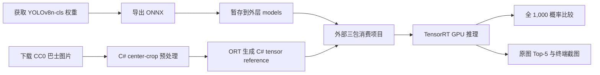
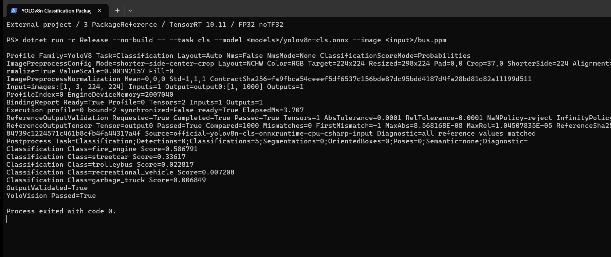
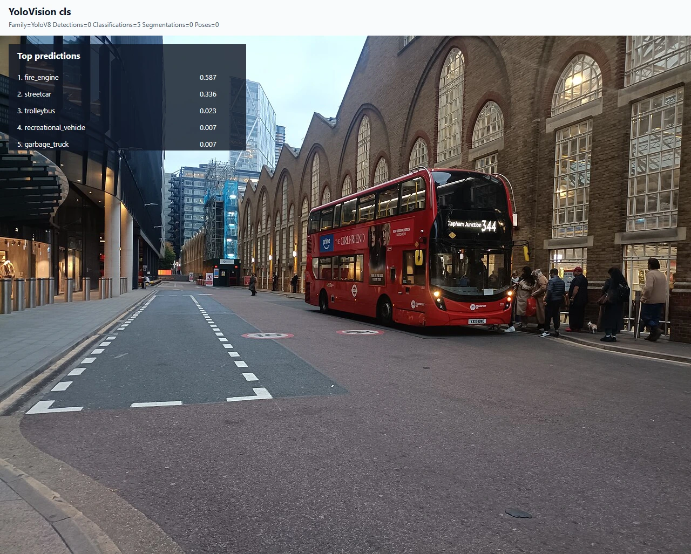

# 使用 TensorRtSharp4.0 在 C# 中运行 YOLOv8n 图像分类

图像分类的输出不是检测框，而是一组“整张图片属于哪个类别”的概率。本教程从一个空的 .NET 控制台项目开始，演示如何获取官方 YOLOv8n-cls 权重、转换并暂存 ONNX、生成 C# 实际预处理 tensor、建立独立 ONNX Runtime 参考、通过三个本地 NuGet 包运行 TensorRT，最后把 Top-5 分类结果叠加到原图并保存程序窗口截图。

本文使用的图片是一辆伦敦双层巴士。最终 Top-1 是 `fire_engine`，而不是人工期望的 `bus`。这不是隐藏掉的坏结果：本文验证的是 C# 预处理、TensorRT 输出和独立 CPU reference 是否一致，不把单张图片的分类结果包装成模型精度证明。

## 本文使用的项目与库

| 项目或库 | 本文职责 |
| --- | --- |
| TensorRtSharp4.0 | 提供 owner-safe 的 TensorRT/CUDA 托管接口、ONNX 构建和推理执行。 |
| YoloVision | 提供图像预处理、YOLO 分类解码、Top-K、JSON 和 SVG 可视化。 |
| TensorRT 10.11 | 在 NVIDIA GPU 上构建并执行静态 ONNX 网络。 |
| CUDA 12.9 / cuDNN 9.22 | 由用户自行安装，作为 TensorRT 的系统依赖。 |
| Ultralytics | 提供 YOLOv8n-cls 权重、ImageNet 类别表和 ONNX 导出工具。 |
| ONNX Runtime CPU | 使用 C# 实际输入 tensor 生成独立的 1,000 值参考输出。 |

本地消费项目只引用以下三个包：

1. `JYPPX.TensorRT.CSharp.API`
2. `JYPPX.TensorRT.CSharp.API.YoloVision`
3. `JYPPX.TensorRT.CSharp.API.Runtime.win-x64.trt10.11.cuda12.9.cudnn9.22.Bridge`

第三个包只包含 `jyppxtrtbridge.dll`。CUDA、cuDNN、TensorRT 和 NVRTC 不会被打进 NuGet 包。

完整流程如下：



## 准备环境与工作目录

需要准备：

- Windows x64 和支持 CUDA 的 NVIDIA GPU；
- .NET 8 SDK；
- TensorRT 10.11、CUDA 12.9、cuDNN 9.22；
- 含 PyTorch、Ultralytics、ONNX、ONNX Runtime、OpenCV 和 Pillow 的 Python 环境。

以下命令假设当前目录是仓库根目录。所有大文件都写到 Git 仓库外层：

```powershell
$repoRoot = (Resolve-Path '.').Path
$workspaceRoot = Split-Path $repoRoot -Parent
$python = '<python-with-ultralytics>'

$assetRoot = Join-Path $workspaceRoot 'downloads/yolov8n-cls-ultralytics-v8.3.0'
$modelRoot = Join-Path $workspaceRoot 'models/YoloVision/Classification/yolov8n-cls-ultralytics-v8.3.0'
$articleInputRoot = Join-Path $workspaceRoot 'downloads/article-assets/yolovision-yolov8n-cls-cc0-bus'
$demoRoot = Join-Path $workspaceRoot 'consumer-workspaces/yolov8n-cls-article'
$artifactRoot = Join-Path $workspaceRoot 'downloads/article-results/yolov8n-cls'

New-Item -ItemType Directory -Force `
  -Path $assetRoot, $modelRoot, $articleInputRoot, $artifactRoot | Out-Null
```

不要把 `$assetRoot`、`$modelRoot`、`$articleInputRoot` 或 `$artifactRoot` 放进仓库目录。

## 模型获取与许可证

本文固定使用 Ultralytics `v8.3.0` 资产和源码提交：

| 项目 | 固定值 |
| --- | --- |
| 权重 URL | `https://github.com/ultralytics/assets/releases/download/v8.3.0/yolov8n-cls.pt` |
| 源码 revision | `ultralytics-v8.3.0@6e43d1e1e5db72afbf686dee6745669bcb124b0a` |
| 权重 SHA256 | `11fa19f2aea79bc960d680a13f82f22105982b325eb9e17a4a5e1a9f8245980a` |
| ImageNet 类别表 | 固定提交中的 `ultralytics/cfg/datasets/ImageNet.yaml` |
| 许可证 | `AGPL-3.0-only` |

使用仓库脚本下载并校验权重、许可证和类别表：

```powershell
pwsh -NoProfile -ExecutionPolicy Bypass `
  -File (Join-Path $repoRoot 'eng/Acquire-YoloV8ClassificationOfficialAssets.ps1') `
  -AssetRoot $assetRoot `
  -PythonPath $python
```

脚本固定 release asset ID、长度与 SHA256，下载后不执行 TensorRT，也不发布任何文件。权重、类别表和转换后的 ONNX 没有获得本项目重新分发授权，因此只保留在本地工作区。

## ONNX 转换与暂存

进入权重目录后执行固定导出命令：

```powershell
Push-Location (Join-Path $assetRoot 'source')
yolo export model=yolov8n-cls.pt format=onnx imgsz=224 opset=17 simplify=True dynamic=False batch=1 device=cpu
Pop-Location

Copy-Item `
  -LiteralPath (Join-Path $assetRoot 'source/yolov8n-cls.onnx') `
  -Destination (Join-Path $modelRoot 'yolov8n-cls.onnx') `
  -Force
```

转换后的文件暂存路径为：

```text
models/YoloVision/Classification/yolov8n-cls-ultralytics-v8.3.0/yolov8n-cls.onnx
```

这里的 `models` 是仓库同级目录，不是仓库内目录。后续 Model Zoo 建立前，所有演示 ONNX 都按这个规则暂存。

校验模型：

```powershell
$onnx = Join-Path $modelRoot 'yolov8n-cls.onnx'
Get-Item $onnx | Select-Object Length
Get-FileHash $onnx -Algorithm SHA256
```

期望结果：

| 属性 | 固定值 |
| --- | --- |
| 长度 | `10,911,331` 字节 |
| SHA256 | `630c022a99885d59f633ab5a614738f8a49be7f361e340fd3ff89b8c19b0768f` |
| 输入 | `images:float32[1,3,224,224]` |
| 输出 | `output0:float32[1,1000]` |
| 最后一个 ONNX 节点 | `Softmax` |

## 准备可公开展示的输入图片

模型资产中的 `bus.jpg` 未获得随项目文章重新分发的批准，因此结果图使用 Wikimedia Commons 的 [Liverpool Street Bus station 2025](https://commons.wikimedia.org/wiki/File:Liverpool_Street_Bus_station_2025.jpg)。作者为 `UK bus Image`，许可证为 [CC0 1.0](https://creativecommons.org/publicdomain/zero/1.0/)。

下载 1280 像素版本并转换成内置预处理器支持的 PPM：

```powershell
$inputJpg = Join-Path $articleInputRoot 'liverpool-street-bus-station-1280.jpg'
$inputPpm = Join-Path $articleInputRoot 'liverpool-street-bus-station-1280.ppm'

Invoke-WebRequest `
  -Uri 'https://upload.wikimedia.org/wikipedia/commons/thumb/d/d4/Liverpool_Street_Bus_station_2025.jpg/1280px-Liverpool_Street_Bus_station_2025.jpg' `
  -OutFile $inputJpg

& $python -c "from PIL import Image; Image.open(r'$inputJpg').convert('RGB').save(r'$inputPpm')"
Get-FileHash $inputJpg, $inputPpm -Algorithm SHA256
```

期望值：

| 文件 | 尺寸 | SHA256 |
| --- | --- | --- |
| JPEG | `1280x961` | `52b889d4fc9baea772ba2d9bbdfdef8b70710f993d7f27d193a965b11e708bcb` |
| PPM | `1280x961` | `80715af66669147b049fec9386152bd45505f4e494a65079fdc55404d4589b8e` |

PPM 提供推理像素，JPEG 嵌入 SVG 结果图。YoloVision 会校验两者与预处理源图尺寸一致。

## 创建本地包消费项目

第一版尚未执行公共 NuGet 发布，所以先从当前源码构建 managed API、YoloVision 和 bridge-only 包：

```powershell
$packageVersion = '4.0.0'
$packageRoot = Join-Path $repoRoot 'artifacts/article-classification-packages'
$feed = Join-Path $workspaceRoot 'local-feed/tensorrtsharp4-classification'

New-Item -ItemType Directory -Force -Path $packageRoot, $feed | Out-Null

dotnet pack (Join-Path $repoRoot 'pack/JYPPX.TensorRT.CSharp.API/JYPPX.TensorRT.CSharp.API.csproj') `
  -c Release -o $packageRoot `
  -p:JYPPXPackageVersion=$packageVersion

dotnet pack (Join-Path $repoRoot 'samples/YoloVision/YoloVision.csproj') `
  -c Release -o $packageRoot `
  -p:JYPPXPackageVersion=$packageVersion

pwsh -NoProfile -ExecutionPolicy Bypass `
  -File (Join-Path $repoRoot 'eng/Invoke-LocalSplitRuntimePackage.ps1') `
  -SourceRuntimeKey win-x64-trt10.11-cuda12.9-cudnn9.22 `
  -Version $packageVersion `
  -SplitPackageRole bridge `
  -SkipManagedPack `
  -SkipConsumerValidation

Copy-Item `
  -LiteralPath (Join-Path $repoRoot 'artifacts/runtime-split-nupkg/win-x64-trt10.11-cuda12.9-cudnn9.22/JYPPX.TensorRT.CSharp.API.Runtime.win-x64.trt10.11.cuda12.9.cudnn9.22.Bridge.4.0.0.nupkg') `
  -Destination $packageRoot `
  -Force
Copy-Item -Path (Join-Path $packageRoot '*.nupkg') -Destination $feed -Force
```

创建仓库外控制台项目：

```powershell
dotnet new console --framework net8.0 --force --output $demoRoot
Set-Location $demoRoot

dotnet add package JYPPX.TensorRT.CSharp.API `
  --version $packageVersion --source $feed
dotnet add package JYPPX.TensorRT.CSharp.API.YoloVision `
  --version $packageVersion --source $feed
dotnet add package JYPPX.TensorRT.CSharp.API.Runtime.win-x64.trt10.11.cuda12.9.cudnn9.22.Bridge `
  --version $packageVersion --source $feed
```

检查 `.csproj` 和 `obj/project.assets.json`：必须恰好有 3 个 `PackageReference`，不得出现 `ProjectReference` 或手工程序集引用。

## 编写程序入口

将 `Program.cs` 写成：

```csharp
using YoloVisionSample;

return YoloVisionCommand.Run(args);
```

`YoloVisionCommand` 负责参数解析、图像预处理、TensorRT engine 生命周期、binding、执行、分类解码、reference 比较、JSON 与 SVG 输出。消费程序不接触裸 `IntPtr`，也不需要自己释放 TensorRT/CUDA owner。

## 编译并运行

先还原并编译外部项目：

```powershell
dotnet restore
dotnet build -c Release --no-restore
```

### 1. 生成 C# 实际输入 tensor

YOLOv8n-cls 使用 `shorter-side-center-crop`，不是 detection 的 letterbox。先执行预处理-only：

```powershell
$inputTensor = Join-Path $artifactRoot 'classification-csharp-input.fp32.bin'

dotnet run -c Release --no-build -- `
  --task cls `
  --family v8 `
  --image $inputPpm `
  --preprocessed-output $inputTensor `
  --input-shape 1x3x224x224 `
  --preprocess-only
```

固定预处理合同为：

- RGB、NCHW、`float32[1,3,224,224]`；
- 短边缩放到 224，得到 `298x224`；
- 从水平方向 `x=37` 开始中心裁剪；
- 像素乘以 `1/255`；
- mean 为 `0,0,0`，std 为 `1,1,1`。

本次 C# tensor SHA256 为 `931ba0af3ea36ad344551f5dbe850dcbe800f464f4d98324a3e8f0447dd6a7a3`。

### 2. 为 C# tensor 生成独立参考

C# 抗锯齿缩放与 Pillow/Ultralytics 可能有逐像素差异，因此 reference 必须基于 C# 实际 tensor 生成，不能直接复用另一个预处理器的输出：

```powershell
$referenceRoot = Join-Path $artifactRoot 'reference'

& $python (Join-Path $repoRoot 'eng/Invoke-YoloVisionClassificationReference.py') `
  --weights (Join-Path $assetRoot 'source/yolov8n-cls.pt') `
  --imagenet-yaml (Join-Path $assetRoot 'source/ImageNet.yaml') `
  --image $inputJpg `
  --onnx $onnx `
  --output-directory $referenceRoot `
  --csharp-tensor $inputTensor
```

脚本会同时验证 PyTorch 与 ONNX Runtime，随后写出：

- `output0-csharp-input-onnxruntime.fp32.bin`；
- `output0-csharp-input.reference.json`；
- 1,000 类 labels；
- Top-5 与所有输入、输出 SHA256。

本次 C# tensor reference SHA256 为 `2e80e6b389f8b68022bcaada3a5958784739c1224571c461b8cfb4fa44317a4f`。

### 3. 执行 TensorRT 正例

让运行时找到用户安装的 TensorRT，并确认没有指定源码树 bridge：

```powershell
$env:JYPPX_TENSORRT_ROOT = $env:TENSORRT_PATH
$env:JYPPX_ENABLE_DEVELOPMENT_PROBING = 'true'
Remove-Item Env:JYPPX_NATIVE_BRIDGE_PATH -ErrorAction SilentlyContinue

$labels = Join-Path $referenceRoot 'imagenet-yolov8n-cls.names'
$reference = Join-Path $referenceRoot 'output0-csharp-input.reference.json'
$outputJson = Join-Path $artifactRoot 'classification-output.json'
$outputSvg = Join-Path $artifactRoot 'classification-annotated.svg'

dotnet run -c Release --no-build -- `
  --model $onnx `
  --labels $labels `
  --image $inputPpm `
  --preprocessed-output $inputTensor `
  --visualization-background $inputJpg `
  --output-json $outputJson `
  --visualization $outputSvg `
  --input-shape 1x3x224x224 `
  --input-name images `
  --output-name output0 `
  --tensor-rt-line 10 `
  --noTF32 `
  --family v8 `
  --task cls `
  --classification-output output0 `
  --class-count 1000 `
  --classification-score-mode probabilities `
  --no-nms `
  --nms-mode none `
  --confidence 0 `
  --top-k 5 `
  --reference-outputs "output0:$reference" `
  --reference-abs-tolerance 0.0001 `
  --reference-rel-tolerance 0.0001
```

下面是仓库外项目仅通过三个 `PackageReference` 执行时的真实窗口：



终端截图来自本次真实运行的 stdout，不是手工填写的结果卡片。窗口显示输入输出合同、预处理、TensorRT binding、全向量比较、Top-5、`OutputValidated=True`、`YoloVision Passed=True` 和退出码 0。

### 4. 查看原图 Top-5

分类任务没有目标框。正确的结果展示方式是在原图上叠加整张图片的 Top-5 类别和概率：



图中结果来自程序生成的 SVG，不是后期手工添加文字。Top-5 为：

| 排名 | ImageNet 类别 | 概率 |
| ---: | --- | ---: |
| 1 | `fire_engine` | `0.58679134` |
| 2 | `streetcar` | `0.33616993` |
| 3 | `trolleybus` | `0.022817276` |
| 4 | `recreational_vehicle` | `0.0072083427` |
| 5 | `garbage_truck` | `0.0068488526` |

红色双层巴士被排到 `fire_engine`，说明这个轻量 ImageNet 模型对该图片存在类别混淆。TensorRT 与 ORT 得到同一 Top-5，只证明部署实现一致，不证明预测语义一定正确。

## 已验证结果

本次运行环境为 Windows x64、NVIDIA GeForce RTX 3060 Laptop GPU、TensorRT 10.11、CUDA 12.9、FP32 且关闭 TF32。

| 验证项 | 结果 |
| --- | --- |
| 外部项目包引用 | 3 |
| `ProjectReference` | 0 |
| 手工程序集引用 | 0 |
| `JYPPX_NATIVE_BRIDGE_PATH` | 未设置 |
| 输入 tensor | `150,528` 个 float32 |
| 输出 tensor | `output0:[1,1000]` |
| 比较值数量 | `1,000` |
| mismatch | `0` |
| first mismatch | `-1` |
| 最大绝对误差 | `8.568168E-08` |
| 最大相对误差 | `1.04507835E-05` |
| Top-5 数量 | `5` |
| 退出码 | `0` |

三个本地包都锚定源码提交 `be2e507ae2d34836982eadc4d18a71d9d6655ab0`：

| 包 | 长度 | SHA256 |
| --- | ---: | --- |
| managed API | `15,230,357` | `140d7cc4f3c2842b5bf601650b955f2ebe9951f910858fc823da2ef6d38f54d8` |
| YoloVision | `119,261` | `79fcf8469ccf0b49102f55752acd0fde24a4e07a7d654b8938b349aa3c031c31` |
| bridge-only | `376,997` | `968e54765bc51228f5893223f8799ab0decb75405df8c765980440a98e9f960c` |

### 受控负例

把 reference 第 0 个值增加 `0.125` 后再次运行，严格验证必须失败：

```text
ReferenceOutputValidation ... Passed=False
ReferenceOutputTensor Tensor=output0 Compared=1000 Mismatches=1 FirstMismatch=0 MaxAbs=0.125
OutputValidated=False
YoloVision Passed=False
```

进程退出码为 1。这证明 reference 不匹配时程序会 fail closed，而不是仍然输出成功。

## 结果文件与复查方法

正例运行会产生：

| 文件 | 用途 |
| --- | --- |
| `classification-csharp-input.fp32.bin` | C# 实际预处理 tensor。 |
| `classification-output.json` | 模型合同、预处理、binding、reference 比较与 Top-5。 |
| `classification-annotated.svg` | 嵌入原图和 Top-5 的矢量结果。 |
| `output0-csharp-input.reference.json` | ORT 对同一 C# tensor 的 1,000 值参考。 |
| `classification-runtime-terminal-source.log` | 截图对应的完整 stdout。 |

建议复查：

```powershell
Get-FileHash `
  (Join-Path $artifactRoot 'classification-output.json'), `
  (Join-Path $artifactRoot 'classification-annotated.svg'), `
  (Join-Path $artifactRoot 'classification-runtime-terminal-source.log') `
  -Algorithm SHA256
```

两张图都来自同一次真实 TensorRT 执行：结果图由该次执行写出的 SVG 渲染，终端图由显示该次 stdout 的 Windows Terminal 窗口直接捕获。图片来源、包哈希、运行哈希和两张 PNG 的 SHA256 记录在 `samples/assets/yolovision-yolov8n-cls-article-visual-assets.json` 与 `samples/assets/yolovision-yolov8n-cls-article-runtime-evidence.json`。

## 常见问题

### `output0` 概率和为 1，但 Top-5 不对

检查 labels 是否严格按 `ImageNet.yaml` 的 `map` 插入顺序生成，并确认共有 1,000 行。类别表顺序错误不会改变概率，却会把 class ID 映射成错误名称。

### TensorRT 与 ORT 有少量误差

确认使用 `--noTF32`，reference 来自同一个 C# tensor，且模型与 reference 的 SHA256 一致。不要通过扩大容差来掩盖输入 tensor 不同的问题。

### 可视化只有结果面板，没有原图

必须同时传入 `--image`、`--visualization` 和 `--visualization-background`。用于预处理的 PPM 与作为背景的 JPEG 尺寸必须完全相同。

### bridge 已复制但 TensorRT DLL 找不到

bridge-only 包只负责项目自己的 native bridge。请安装与包键一致的 TensorRT/CUDA/cuDNN，并让 `JYPPX_TENSORRT_ROOT` 指向 TensorRT 安装根目录。

## 复查与边界

本文已经证明：

- 官方 YOLOv8n-cls 可以转换为固定静态 ONNX 并暂存在外层 `models`；
- C# 内置 center-crop 预处理能够生成可哈希 tensor；
- 独立 ORT reference 与 TensorRT 全 1,000 概率零 mismatch；
- 外部项目只通过 managed、YoloVision、bridge-only 三个本地包完成真实 GPU 推理；
- 原图 Top-5、JSON、完整日志和程序窗口可相互追溯；
- 受控 reference 变更会返回非零退出码。

本文不代表：

- 模型对这张图片的 Top-1 语义一定正确；
- 权重、ONNX 或第三方模型资产获得公开再分发授权；
- 包已经从 nuget.org 或 GitHub Packages 下载；
- 已完成 public-package、post-publish、Owner acceptance 或正式 release proof；
- 已创建 tag、GitHub Release 或执行任何包发布。

模型、reference、tensor、运行日志和中间 SVG 继续保留在仓库外。Git 只保存技术文章、可公开再分发的两张结果 PNG，以及不含模型本体的哈希证据。
