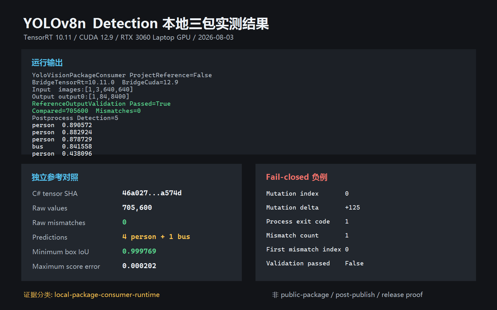

# YoloVision YOLOv8n Detection 本地包消费教程

本文验证 `YoloVision.PackageConsumer` 只通过三个本地 `PackageReference` 使用 TensorRtSharp4.0：managed API、YoloVision 和一个 bridge-only 包。CUDA、cuDNN 与 TensorRT 由用户安装，模型和运行产物留在 Git 仓库外的 E 盘。

这份记录的分类是 `local-package-consumer-runtime`。它不是公共 NuGet feed 下载证明，不是模型再分发授权，不执行 tag、Release、推包或资产上传。

## 模型获取与许可证

固定案例使用 Ultralytics `v8.3.0` 的官方 YOLOv8n detection 权重：

- 权重 URL：<https://github.com/ultralytics/assets/releases/download/v8.3.0/yolov8n.pt>
- 固定源码：`ultralytics-v8.3.0@6e43d1e1e5db72afbf686dee6745669bcb124b0a`
- 权重 SHA256：`f59b3d833e2ff32e194b5bb8e08d211dc7c5bdf144b90d2c8412c47ccfc83b36`
- 模型许可证：`AGPL-3.0-only`
- 获取脚本：`eng/Acquire-YoloV8DetectionOfficialAssets.ps1`
- 测试图片：同一固定源码 revision 的 `bus.jpg`
- 图片 SHA256：`c02019c4979c191eb739ddd944445ef408dad5679acab6fd520ef9d434bfbc63`

执行获取脚本：

```powershell
$python = 'C:\Users\<user>\.conda\envs\ultralytics\python.exe'
$assetRoot = 'E:\GitSpace\TensorRT-CSharp-API-4.0\downloads\yolov8n-det-ultralytics-v8.3.0'

pwsh -NoProfile -ExecutionPolicy Bypass -File .\eng\Acquire-YoloV8DetectionOfficialAssets.ps1 `
  -AssetRoot $assetRoot `
  -PythonPath $python
```

脚本固定并校验权重、`coco.yaml`、许可证、`bus.jpg`、80 类 `coco.names` 和 P6 RGB `bus.ppm`。这些资产没有获得在当前仓库、NuGet、GitHub Packages 或 Release 中公开再分发的批准。

## ONNX 转换与暂存

固定转换命令为：

```powershell
yolo export model=yolov8n.pt format=onnx imgsz=640 opset=17 simplify=True dynamic=False batch=1 device=cpu
```

也可以由独立参考工具执行同一导出合同：

```powershell
& $python .\eng\Invoke-YoloVisionDetectionReference.py `
  --weights "$assetRoot\source\yolov8n.pt" `
  --coco-yaml "$assetRoot\source\coco.yaml" `
  --image "$assetRoot\source\bus.jpg" `
  --onnx "$assetRoot\source\yolov8n.onnx" `
  --output-directory "$assetRoot\reports\independent-reference" `
  --export-onnx
```

转换后的 ONNX 必须暂存在仓库外：

```text
E:\GitSpace\TensorRT-CSharp-API-4.0\models\YoloVision\Detection\yolov8n-ultralytics-v8.3.0\yolov8n.onnx
```

文件长度为 `12,851,047` 字节，SHA256 为 `db28a49ffbb0425f39ae56252e7e0b43d06b357416c7da58872e285560b4221e`。它不会上传当前 GitHub 仓库，后续由单独治理的 Model Zoo 接管。

ONNX 合同为：

```text
images  float32 [1,3,640,640]
output0 float32 [1,84,8400]
```

84 个输出通道是 `4 box + 80 class`，没有独立 objectness，也没有图内 NMS。运行参数必须固定为 `channels-first`、`has-objectness=false` 和 80 类。

## 本地三包验证

先按项目打包流程准备版本相同的三个 `.nupkg`，然后运行：

```powershell
pwsh -NoProfile -ExecutionPolicy Bypass -File .\eng\Test-YoloVisionDetectionLocalPackageConsumer.ps1
```

验证器会：

1. 为 managed、YoloVision 和 bridge-only 包分别创建仅含一个 `.nupkg` 的隔离 feed。
2. 在外层 E 盘创建全新的 `net8.0` 消费者，不允许 `ProjectReference`、`HintPath` 或远程 package source。
3. 校验恢复缓存中的三个包 SHA256 与所选包完全一致。
4. 使用 C# 对 `bus.ppm` 做 640x640 RGB/NCHW letterbox，要求张量 SHA256 为 `46a0278967f1230ef8db59b0b8311a3aba3dce45233f1ba68821418ae02a574d`。
5. 运行 TensorRT 10.11，并对照 ONNX Runtime 的全部 705,600 个 `output0` 值。
6. 使用独立 Ultralytics/PyTorch 结果比较类别、source-space box IoU 和 score。
7. 将 raw reference 的第 0 个值增加 125，要求消费者以退出码 1 严格失败，并报告单个 mismatch。

## 已验证结果



上图由本次真实运行报告生成，保留正例输出、独立参考指标与 fail-closed 负例；不嵌入未获公开再分发授权的测试原图。

本次固定结果为：

| 检查 | 结果 |
| --- | --- |
| 原始输出合同 | `output0:[1,84,8400]` |
| 原始值比较 | `705,600` |
| mismatch | `0` |
| 检测结果 | `4 person + 1 bus` |
| 独立比较最小 box IoU | `0.999768795874011` |
| 独立比较最大 score 误差 | `0.000202418538818305` |
| 受控负例 | exit `1`、mismatch `1`、first index `0` |

轻量证据位于：

```text
samples/assets/yolovision-yolov8n-det-local-package-consumer-runtime-evidence.json
```

本机完整报告、SVG、日志、原始 reference 和模型继续保存在 `artifacts`、`downloads`、`models` 及外层消费者工作区，不进入 Git。

## 复查与边界

重新导出轻量证据：

```powershell
pwsh -NoProfile -ExecutionPolicy Bypass -File .\eng\Export-YoloVisionDetectionLocalPackageConsumerEvidence.ps1
```

exporter 会先验证三包隔离、外部 NVIDIA 依赖、固定资产 SHA、C# 张量身份、raw 比较、五个独立检测结果和受控负例。只有全部成立才写入轻量 JSON。

模型来源、转换方式和外层 ONNX 暂存总表见 [演示模型获取、ONNX 转换与本地暂存目录](demo-model-acquisition-and-onnx-conversion.md)。源码树运行细节见 [YOLOv8n Detection 官方模型 TensorRT + C# 完整验证](yolovision-yolov8-det-real-asset-tutorial.md)。

本地包证据不能替代公共 feed、post-publish、Owner 发布验收或 release proof。未经明确授权，不得上传模型、发布包或创建 Release。
