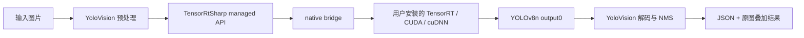
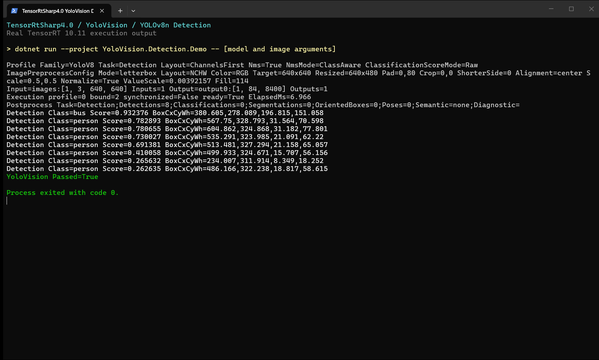
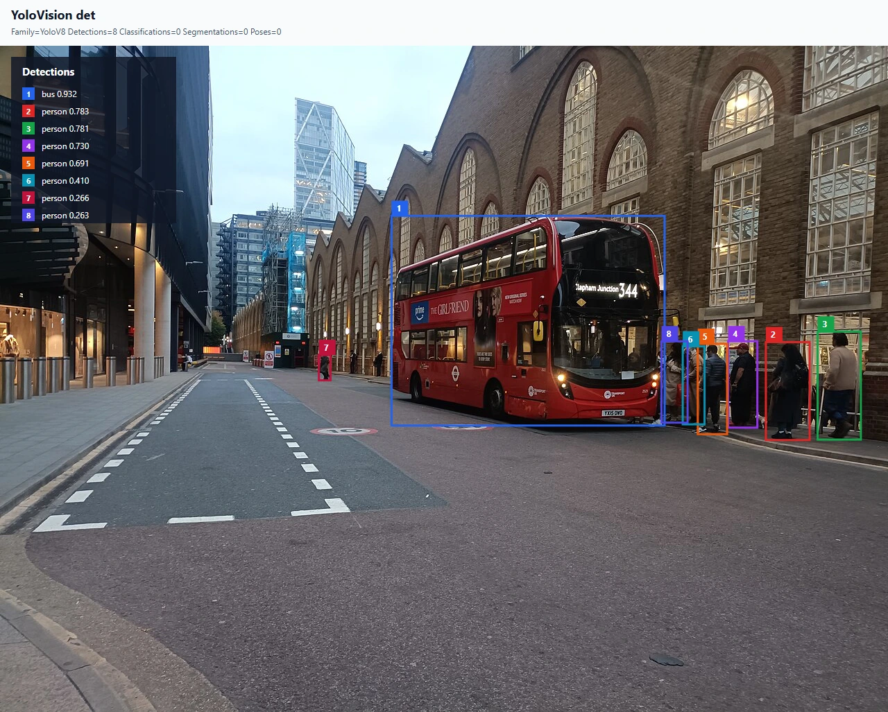

# 使用 TensorRtSharp4.0 在 C# 中运行 YOLOv8n 目标检测

本文从一个空的 .NET 控制台项目开始，完成 YOLOv8n 权重获取、ONNX 转换、本地 NuGet 包引用、图像预处理、TensorRT 推理、后处理和结果可视化。最终程序会把检测框绘制回输入图片，并输出一份 JSON 结果和一张 SVG 可视化图。

本文使用真实模型和真实 TensorRT 运行结果。模型不随 Git 仓库发布；转换后的 ONNX 统一暂存在工作区外层的 `models` 目录，等待后续 Model Zoo 接管。

## 本文使用的项目与库

[TensorRtSharp4.0](https://github.com/guojin-yan/TensorRT-CSharp-API) 是 TensorRT C API 的 C# 封装。本例使用三个职责分离的包：

| 包 | 作用 |
| --- | --- |
| `JYPPX.TensorRT.CSharp.API` | TensorRT managed API、环境探测和通用 ONNX 推理支持。 |
| `JYPPX.TensorRT.CSharp.API.YoloVision` | 图像预处理、YOLO 解码、NMS、报告和可视化。 |
| `JYPPX.TensorRT.CSharp.API.Runtime.win-x64.trt10.11.cuda12.9.cudnn9.22.Bridge` | 只包含项目编译的 native bridge，不包含 NVIDIA 运行库。 |

CUDA、cuDNN 和 TensorRT 必须由使用者自行安装。项目不会再把这些第三方运行库打包进 NuGet 或 GitHub Release。



## 运行环境

本文实测环境如下。不同显卡可以使用相同流程，但 bridge 包必须与本机 TensorRT/CUDA 主版本匹配。

| 项目 | 实测值 |
| --- | --- |
| 操作系统 | Windows 10 64-bit |
| .NET SDK | 10.0.301，目标框架 `net8.0` |
| GPU | NVIDIA GeForce RTX 3060 Laptop GPU |
| NVIDIA Driver | 576.02 |
| TensorRT | 10.11.0 |
| CUDA Toolkit | 12.9 |
| cuDNN | 9.22 |
| 模型 | Ultralytics YOLOv8n detection |

从仓库根目录打开 PowerShell，并用变量表示工作区。后续命令不依赖某台机器的盘符或用户名：

```powershell
$repoRoot = (Resolve-Path .).Path
$workspaceRoot = Split-Path -Parent $repoRoot
$downloadRoot = Join-Path $workspaceRoot 'downloads/yolov8n-det-ultralytics-v8.3.0'
$modelRoot = Join-Path $workspaceRoot 'models/YoloVision/Detection/yolov8n-ultralytics-v8.3.0'
$demoRoot = Join-Path $workspaceRoot 'work/YoloVision.Detection.Demo'
$resultRoot = Join-Path $demoRoot 'results'

New-Item -ItemType Directory -Force -Path $downloadRoot, $modelRoot, $demoRoot, $resultRoot | Out-Null
```

## 模型获取与许可证

本例固定使用 Ultralytics `v8.3.0` 的官方 YOLOv8n 权重：

- 权重 URL：<https://github.com/ultralytics/assets/releases/download/v8.3.0/yolov8n.pt>
- 固定源码：`ultralytics-v8.3.0@6e43d1e1e5db72afbf686dee6745669bcb124b0a`
- 权重 SHA256：`f59b3d833e2ff32e194b5bb8e08d211dc7c5bdf144b90d2c8412c47ccfc83b36`
- Ultralytics 许可证：`AGPL-3.0-only`

项目提供的获取脚本会下载权重、许可证、COCO 标签和转换所需元数据，并逐项校验固定哈希：

```powershell
$python = (Get-Command python).Source

pwsh -NoProfile -ExecutionPolicy Bypass -File ./eng/Acquire-YoloV8DetectionOfficialAssets.ps1 `
  -AssetRoot $downloadRoot `
  -PythonPath $python
```

权重和脚本下载的标准验证图片仅保存在外层 `downloads` 目录，不上传当前 Git 仓库。使用模型前还应根据自己的分发方式确认 Ultralytics 许可证义务。

## ONNX 转换与暂存

转换环境应使用上面的固定源码 revision。下面的命令导出静态 batch、640×640 输入和 opset 17：

```powershell
git clone https://github.com/ultralytics/ultralytics.git (Join-Path $downloadRoot 'ultralytics')
git -C (Join-Path $downloadRoot 'ultralytics') checkout 6e43d1e1e5db72afbf686dee6745669bcb124b0a
& $python -m pip install -e (Join-Path $downloadRoot 'ultralytics')

Push-Location (Join-Path $downloadRoot 'source')
yolo export model=yolov8n.pt format=onnx imgsz=640 opset=17 simplify=True dynamic=False batch=1 device=cpu
Pop-Location

$onnxPath = Join-Path $modelRoot 'yolov8n.onnx'
Copy-Item (Join-Path $downloadRoot 'source/yolov8n.onnx') $onnxPath -Force
Get-FileHash $onnxPath -Algorithm SHA256
```

转换后的模型暂存位置采用相对工作区约定：

```text
models/YoloVision/Detection/yolov8n-ultralytics-v8.3.0/yolov8n.onnx
```

文件长度为 `12,851,047` 字节，SHA256 应为：

```text
db28a49ffbb0425f39ae56252e7e0b43d06b357416c7da58872e285560b4221e
```

模型输入输出合同如下：

```text
images  float32 [1,3,640,640]
output0 float32 [1,84,8400]
```

84 个输出通道由 `4 box + 80 class` 组成，没有独立 objectness，也没有图内 NMS。因此运行参数必须明确指定 `channels-first`、`has-objectness=false` 和 80 类。

## 准备可公开展示的测试图片

文章配图使用 Wikimedia Commons 的 [Liverpool Street Bus station 2025](https://commons.wikimedia.org/wiki/File:Liverpool_Street_Bus_station_2025.jpg)，作者为 `UK bus Image`，许可证为 [CC0 1.0](https://creativecommons.org/publicdomain/zero/1.0/)。CC0 不要求署名，本文仍保留来源，方便复核。

下载 1280 像素版本，并转换为示例预处理器支持的 PPM：

```powershell
$articleAssetRoot = Join-Path $downloadRoot 'article-input'
$jpgPath = Join-Path $articleAssetRoot 'liverpool-street-bus-station-1280.jpg'
$ppmPath = Join-Path $articleAssetRoot 'liverpool-street-bus-station-1280.ppm'
New-Item -ItemType Directory -Force -Path $articleAssetRoot | Out-Null

Invoke-WebRequest `
  -Uri 'https://upload.wikimedia.org/wikipedia/commons/thumb/d/d4/Liverpool_Street_Bus_station_2025.jpg/1280px-Liverpool_Street_Bus_station_2025.jpg' `
  -OutFile $jpgPath

& $python -c "from PIL import Image; Image.open(r'$jpgPath').convert('RGB').save(r'$ppmPath')"
Get-FileHash $jpgPath, $ppmPath -Algorithm SHA256
```

期望哈希：

| 文件 | SHA256 |
| --- | --- |
| JPEG | `52b889d4fc9baea772ba2d9bbdfdef8b70710f993d7f27d193a965b11e708bcb` |
| PPM | `80715af66669147b049fec9386152bd45505f4e494a65079fdc55404d4589b8e` |

## 创建本地包消费项目

第一版尚未执行公共 NuGet 发布，因此这里使用仓库本地打包产物。先按仓库发布构建流程生成三个版本一致的 `.nupkg`，再把选中的包放进一个本地 feed：

```powershell
$packageVersion = '4.0.0'
$feed = Join-Path $workspaceRoot 'local-feed/tensorrtsharp4'
New-Item -ItemType Directory -Force -Path $feed | Out-Null

# 只生成 managed 包和当前环境的 bridge-only 包，不打包 CUDA、cuDNN 或 TensorRT。
pwsh -NoProfile -ExecutionPolicy Bypass -File (Join-Path $repoRoot 'eng/Invoke-LocalReleaseBundle.ps1') `
  -Version $packageVersion `
  -WindowsRuntimeKeys 'win-x64-trt10.11-cuda12.9-cudnn9.22' `
  -WindowsRuntimeDeliveryMode split `
  -WindowsSplitPackageRoles bridge `
  -SkipDocs

dotnet pack (Join-Path $repoRoot 'samples/YoloVision/YoloVision.csproj') `
  -c Release `
  -o (Join-Path $repoRoot 'artifacts/yolovision-nupkg') `
  -p:JYPPXPackageVersion=$packageVersion

# 从 artifacts 中各选一个 4.0.0 包：managed API、YoloVision、当前运行时对应的 bridge-only 包。
Get-ChildItem (Join-Path $repoRoot 'artifacts') -Recurse -Filter '*.nupkg' |
  Where-Object Name -Match '4\.0\.0' |
  Select-Object FullName

$managedPackage = Get-ChildItem (Join-Path $repoRoot 'artifacts') -Recurse -Filter 'JYPPX.TensorRT.CSharp.API.4.0.0.nupkg' |
  Select-Object -First 1
$yoloVisionPackage = Get-ChildItem (Join-Path $repoRoot 'artifacts') -Recurse -Filter 'JYPPX.TensorRT.CSharp.API.YoloVision.4.0.0.nupkg' |
  Select-Object -First 1
$bridgePackage = Get-ChildItem (Join-Path $repoRoot 'artifacts') -Recurse -Filter 'JYPPX.TensorRT.CSharp.API.Runtime.win-x64.trt10.11.cuda12.9.cudnn9.22.Bridge.4.0.0.nupkg' |
  Select-Object -First 1

@($managedPackage, $yoloVisionPackage, $bridgePackage) |
  ForEach-Object {
    if ($null -eq $_) { throw '缺少本地 4.0.0 包，请先执行仓库发布构建流程。' }
    Copy-Item $_.FullName $feed -Force
  }
```

创建控制台项目：

```powershell
dotnet new console --framework net8.0 --force --output $demoRoot
Set-Location $demoRoot

dotnet add package JYPPX.TensorRT.CSharp.API `
  --version $packageVersion --source $feed
dotnet add package JYPPX.TensorRT.CSharp.API.YoloVision `
  --version $packageVersion --source $feed
dotnet add package JYPPX.TensorRT.CSharp.API.Runtime.win-x64.trt10.11.cuda12.9.cudnn9.22.Bridge `
  --version $packageVersion --source $feed
```

项目文件的核心依赖应为：

```xml
<ItemGroup>
  <PackageReference Include="JYPPX.TensorRT.CSharp.API" Version="4.0.0" />
  <PackageReference Include="JYPPX.TensorRT.CSharp.API.YoloVision" Version="4.0.0" />
  <PackageReference Include="JYPPX.TensorRT.CSharp.API.Runtime.win-x64.trt10.11.cuda12.9.cudnn9.22.Bridge" Version="4.0.0" />
</ItemGroup>
```

## 编写程序入口

`YoloVisionCommand` 已经封装命令行解析、图像预处理、TensorRT 执行、YOLO 解码、NMS、JSON 报告和 SVG 可视化。`Program.cs` 只需要把参数交给它：

```csharp
using System;
using JYPPX.TensorRtSharp;
using YoloVisionSample;

internal static class Program
{
    public static int Main(string[] args)
    {
        TensorRtEnvironmentSnapshot environment = TensorRtEnvironmentProbe.GetCurrent();
        Console.WriteLine($"Bridge TensorRT={environment.BuildInfo.TensorRtVersion}");
        return YoloVisionCommand.Run(args);
    }
}
```

这段入口没有 `IntPtr`、手工绑定地址或 CUDA 内存释放逻辑。native 生命周期由 managed API 和 bridge 管理，应用侧只处理参数和结果。

## 编译并运行

先确认用户安装的 TensorRT、CUDA 和 cuDNN DLL 可被系统找到。必要时显式指定 TensorRT 根目录：

```powershell
$env:JYPPX_TENSORRT_ROOT = $env:TENSORRT_PATH
$labelsPath = Join-Path $downloadRoot 'derived/coco.names'
$jsonPath = Join-Path $resultRoot 'detection.json'
$svgPath = Join-Path $resultRoot 'detection.svg'
$tensorPath = Join-Path $resultRoot 'input.bin'

dotnet build -c Release
dotnet run -c Release --no-build -- `
  --model $onnxPath `
  --labels $labelsPath `
  --image $ppmPath `
  --preprocessed-output $tensorPath `
  --output-json $jsonPath `
  --visualization $svgPath `
  --visualization-background $jpgPath `
  --input-shape 1x3x640x640 `
  --input-name images `
  --output-name output0 `
  --tensor-rt-line 10 `
  --family v8 `
  --task det `
  --class-count 80 `
  --layout channels-first `
  --has-objectness false `
  --nms-mode class-aware `
  --confidence 0.25 `
  --iou-threshold 0.45 `
  --top-k 20
```

`--image` 指向用于推理的 PPM；`--visualization-background` 指向同尺寸 JPEG。程序根据真实 letterbox 元数据，把 640×640 模型坐标反变换回 1280×961 原图坐标，再绘制检测框。

## 已验证结果

下面是本次 TensorRT 10.11 实际执行的 Windows Terminal 窗口。截图显示模型合同、预处理、执行耗时、8 个检测结果、`YoloVision Passed=True` 和退出码 0。



终端截图来自本次真实运行的 stdout，不是指标卡片或手工填写的示意图。

程序生成的 SVG 已渲染为 PNG。下图直接嵌入 CC0 输入图，并在原图上绘制编号框；左上角图例给出类别和置信度。



本次图片共得到 8 个目标：

| 类别 | 数量 | 最高置信度 |
| --- | ---: | ---: |
| bus | 1 | 0.932376 |
| person | 7 | 0.782893 |

公交车框覆盖车身主体；右侧 6 名近景行人和道路左侧 1 名远景行人被识别。远景行人的置信度约为 0.266，接近 0.25 阈值，部署时可以按误检/漏检目标提高阈值。

两张图都来自同一次真实 TensorRT 执行：识别结果图由程序输出的 SVG 渲染，终端图由 Windows Terminal 窗口直接捕获。图片来源和 SHA256 记录在 `samples/assets/yolovision-yolov8n-det-article-visual-assets.json`。

## 结果文件

本次命令产生四类文件：

| 文件 | 用途 |
| --- | --- |
| `input.bin` | C# 预处理后的 NCHW float32 输入张量。 |
| `detection.json` | 模型合同、预处理参数和结构化预测结果。 |
| `detection.svg` | 嵌入原图并绘制预测框的矢量结果。 |
| 控制台 stdout | TensorRT binding、执行耗时、预测摘要和退出状态。 |

如果需要 PNG，可以用浏览器无头模式渲染 SVG；这一步只改变图片格式，不重新执行推理：

```powershell
$edge = (Get-Command msedge -ErrorAction Stop).Source
$pngPath = Join-Path $resultRoot 'detection.png'
& $edge --headless=new --hide-scrollbars `
  --window-size=1280,1027 `
  "--screenshot=$pngPath" `
  ([uri]$svgPath).AbsoluteUri
```

## 严格参考验证

文章主流程关注用户可见的完整推理结果。仓库还提供独立的严格验证脚本，用固定输入比较 TensorRT 与 ONNX Runtime 的全部原始输出，并比较 Ultralytics/PyTorch 后处理结果：

```powershell
Set-Location $repoRoot
pwsh -NoProfile -ExecutionPolicy Bypass -File ./eng/Test-YoloVisionDetectionLocalPackageConsumer.ps1
```

固定验证结果为：

| 检查 | 结果 |
| --- | --- |
| 原始输出 | `output0:[1,84,8400]` |
| 比较值数量 | 705,600 |
| mismatch | 0 |
| 独立后处理结果 | 4 person + 1 bus |
| 最小 box IoU | 0.9997687958740106 |
| 最大 score 误差 | 0.0002024185388183053 |
| 受控负例 | exit 1、mismatch 1、first index 0 |

严格验证使用另一张固定图片以保持历史 reference 哈希稳定；该图片未获得随仓库公开再分发的批准，所以不会出现在本文配图中。轻量证据位于 `samples/assets/yolovision-yolov8n-det-local-package-consumer-runtime-evidence.json`。

## 复查与边界

复现失败时按下面顺序检查：

1. `Get-FileHash $onnxPath` 是否等于本文固定 ONNX SHA256。
2. bridge 包的 TensorRT/CUDA 版本是否与本机安装版本一致。
3. `output0` 是否为 `[1,84,8400]`，并且 `--has-objectness false`。
4. 图片是否按 RGB、NCHW、1/255 和 center-letterbox 预处理。
5. 是否同时传入 `--image` 与 `--visualization-background`，确保可视化能做 source-space 反变换。

本文证明源码和本地三包可以完成真实 YOLOv8n TensorRT 推理，也给出了可公开展示的程序截图和原图叠加结果。它不代表公共 NuGet feed 下载证明，不授权上传模型，不替代 post-publish 验证，也不创建 tag、GitHub Release 或发布包。
