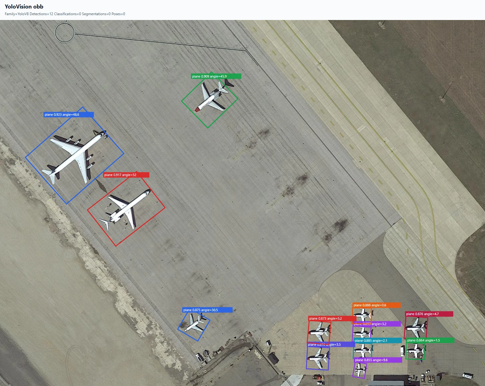
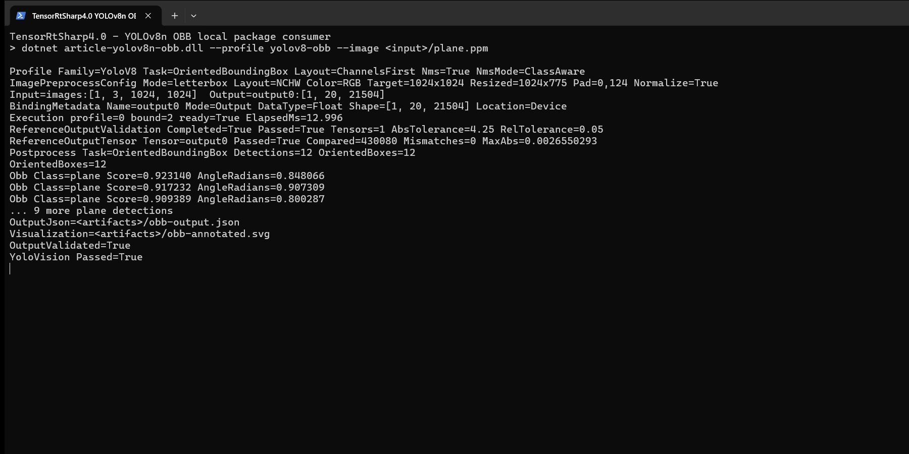

# C# 使用 TensorRtSharp4.0 运行 YOLOv8n OBB 旋转目标检测

本文从模型获取开始，演示如何把官方 YOLOv8n OBB 权重转换为 ONNX，建立只含三个 `PackageReference` 的仓库外项目，再用 TensorRT 10.11 对航拍图片执行旋转目标检测。最终结果不是一段模拟输出，而是 12 个飞机旋转框、原图标注、JSON 报告、完整 raw tensor 对照和真实终端页面。

本文只执行本地构建和验证。CUDA、cuDNN 和 TensorRT 由使用者自行安装；模型暂存在仓库外层 `models` 目录。当前项目仍在开发中，没有创建版本、Release 或发布包。

## 本文使用的项目与库

TensorRtSharp4.0 把示例拆为三个职责清晰的包：

| 包 | 职责 |
| --- | --- |
| `JYPPX.TensorRT.CSharp.API` | TensorRT/CUDA 托管接口、ONNX 解析、binding 与执行。 |
| `applications/YoloVision` | RGB letterbox、YOLOv8 OBB 解码、旋转 NMS、JSON 和 SVG 可视化。 |
| `JYPPX.TensorRT.CSharp.API.Runtime.win-x64.trt10.11.cuda12.9.cudnn9.22.Bridge` | 只携带项目自己的 `jyppxtrtbridge.dll`，不携带 NVIDIA 运行库。 |

示例使用 `.NET 8`。本次验证环境为 NVIDIA GeForce RTX 3060 Laptop GPU、驱动 `576.02`、TensorRT `10.11.0`、CUDA Toolkit `12.9` 和 .NET SDK `10.0.301`。实际选择 Bridge 包时，TensorRT/CUDA/cuDNN 版本必须与宿主机一致。

## 模型获取与许可证

权重来自 Ultralytics 官方 Release：

```text
https://github.com/ultralytics/assets/releases/download/v8.3.0/yolov8n-obb.pt
```

项目把来源固定到 `ultralytics v8.3.0` 和源码提交 `6e43d1e1e5db72afbf686dee6745669bcb124b0a`。权重长度为 `6,567,590` 字节，SHA256 为：

```text
fa6e4cd2691f132875c143135affaa66b5d89394ebb1d07d19770a9b6382c1b8
```

仓库脚本负责下载、固定版本和哈希校验：

```powershell
$repoRoot = Resolve-Path .
$workspaceRoot = Split-Path $repoRoot -Parent
$assetRoot = Join-Path $workspaceRoot 'downloads/yolov8n-obb-ultralytics-v8.3.0'

pwsh -NoProfile -ExecutionPolicy Bypass `
  -File (Join-Path $repoRoot 'eng/Acquire-YoloV8ObbOfficialAssets.ps1') `
  -OutputRoot $assetRoot `
  -PythonPath $env:JYPPX_YOLO_PYTHON
```

演示图片不随模型下载。把已获准使用的素材目录写入环境变量，再复制并核对本文固定输入；文章命令不依赖作者机器上的绝对路径：

```powershell
$demoImageRoot = $env:JYPPX_DEMO_IMAGE_ROOT
if ([string]::IsNullOrWhiteSpace($demoImageRoot)) {
  throw '请先设置 JYPPX_DEMO_IMAGE_ROOT，使其指向本机演示图片目录。'
}

$inputRoot = Join-Path $assetRoot 'input'
$inputPng = Join-Path $inputRoot 'plane.png'
New-Item -ItemType Directory -Force $inputRoot | Out-Null
Copy-Item (Join-Path $demoImageRoot 'plane.png') $inputPng -Force

$expectedImageSha256 = 'dde925501ff0f2bddb7e28198fdd0586620f7a7ef587412717f666b7ea6584c9'
$actualImageSha256 = (Get-FileHash $inputPng -Algorithm SHA256).Hash.ToLowerInvariant()
if ($actualImageSha256 -ne $expectedImageSha256) {
  throw "plane.png SHA256 不匹配：$actualImageSha256"
}
```

权重采用 `AGPL-3.0-only`，本文不把 `.pt` 或 ONNX 放进 Git。演示图片 `plane.png` 由项目所有者提供，并已明确授权用于本仓库技术文章；原图 SHA256 为 `dde925501ff0f2bddb7e28198fdd0586620f7a7ef587412717f666b7ea6584c9`。该授权不扩展为对模型或其他资产的再分发许可。

## ONNX 转换与暂存

在独立 Python 环境安装固定版 Ultralytics、PyTorch、ONNX 和 ONNX Runtime。然后执行官方导出器：

```powershell
$Weights = Join-Path $assetRoot 'source/yolov8n-obb.pt'
$modelRoot = Join-Path $workspaceRoot 'models/YoloVision/OrientedBoundingBox/yolov8n-obb-ultralytics-v8.3.0'
New-Item -ItemType Directory -Force $modelRoot | Out-Null

yolo export model=$Weights format=onnx imgsz=1024 opset=17 simplify=True dynamic=False batch=1 device=cpu
Move-Item (Join-Path (Split-Path $Weights) 'yolov8n-obb.onnx') $modelRoot -Force
```

转换模型暂存在 `models\YoloVision\OrientedBoundingBox\yolov8n-obb-ultralytics-v8.3.0\yolov8n-obb.onnx`，由外层工作区管理，不上传当前仓库。文件长度为 `12,664,838` 字节，SHA256 为：

```text
5f2701ef5326fb5a691999438cfc55a69656323c21ffddebaff8968ab6de2e92
```

静态模型合同为：

```text
images : float32[1,3,1024,1024]
output0: float32[1,20,21504]
```

20 个通道包含 4 个 box 通道、15 个 DOTA 类别通道和 channel 19 的内嵌角度。模型没有独立 objectness；角度单位是 radians，后处理使用 class-aware probabilistic-IoU rotated NMS。

将获准使用的图片转换为 YoloVision 可读的 P6 RGB PPM，同时保留原图给可视化使用：

```powershell
$inputPpm = Join-Path $assetRoot 'derived/plane.ppm'
New-Item -ItemType Directory -Force (Split-Path $inputPpm) | Out-Null
& $env:JYPPX_YOLO_PYTHON -c "from PIL import Image; import sys; Image.open(sys.argv[1]).convert('RGB').save(sys.argv[2], format='PPM')" $inputPng $inputPpm
```

生成独立参考时必须读取 C# 实际预处理得到的 tensor：

```powershell
$artifactRoot = Join-Path $workspaceRoot 'downloads/article-assets/yolovision-yolov8n-obb'
$model = Join-Path $modelRoot 'yolov8n-obb.onnx'
$tensor = Join-Path $artifactRoot 'obb-csharp-input.fp32.bin'

& $env:JYPPX_YOLO_PYTHON `
  (Join-Path $repoRoot 'eng/Invoke-YoloVisionObbReference.py') `
  --onnx-model $model --weights $Weights --input-tensor $tensor `
  --image $inputPng --output-directory (Join-Path $artifactRoot 'reference') `
  --input-shape 1 3 1024 1024 --output-shape 1 20 21504 `
  --max-detections 12
```

脚本输出 ONNX Runtime CPU 的 430,080 值 raw reference，以及 Ultralytics/PyTorch CPU 的旋转框参考。

## 使用公开包准备应用

`applications/YoloVision` 是完整应用并设置为 `IsPackable=false`。它通过共享 props 引用已发布的
`JYPPX.TensorRT.CSharp.API` 4 系列包，以及作者维护的
[OpenCV-CSharp-API](https://github.com/guojin-yan/OpenCV-CSharp-API)。应用本身不发布 YoloVision 案例 NuGet 包。

新建仓库外项目时，可以让 NuGet 获取当前公开预览版，而不在文章中写死具体版本：

```powershell
dotnet add package JYPPX.TensorRT.CSharp.API --prerelease
dotnet add package JYPPX.OpenCV.CSharp.API --prerelease
dotnet add package JYPPX.OpenCV.runtime.win-x64 --prerelease
dotnet add package JYPPX.TensorRT.CSharp.API.Runtime.win-x64.trt10.11.cuda12.9.cudnn9.22.Bridge --prerelease
```

最后一个包 ID 必须按目标机器环境替换。它只包含项目自有 bridge；CUDA、cuDNN、TensorRT 和 NVRTC
继续由用户安装。仓库中的 YoloVision 项目直接运行当前源码，但 TensorRT/CUDA API 来自公开 NuGet 包。

## 编写程序入口

YoloVision 包已经封装参数解析、预处理、TensorRT 执行与结果写出，`Program.cs` 只保留无指针入口：

```csharp
using YoloVisionSample;

return YoloVisionCommand.Run(args);
```

模型合同必须由命令行明确声明，特别是 `class-count=15`、`aux-channel-start=19` 和 `angle-radians`。不能仅凭模型文件名猜测输出布局。

## 编译并运行

还原并编译使用公开包的 YoloVision 应用：

```powershell
dotnet restore ./applications/YoloVision/YoloVision.csproj
dotnet build ./applications/YoloVision/YoloVision.csproj -c Release --no-restore
```

执行真实 TensorRT 推理和全量输出验证：

```powershell
$labels = Join-Path $assetRoot 'derived/dota.names'
$reference = Join-Path $artifactRoot 'reference/output0.reference.json'
$resultJson = Join-Path $artifactRoot 'obb-output.json'
$resultSvg = Join-Path $artifactRoot 'obb-annotated.svg'
$env:JYPPX_TENSORRT_ROOT = $env:TENSORRT_PATH

dotnet run --project ./applications/YoloVision -c Release --no-build -- `
  --model $model --labels $labels --image $inputPpm `
  --preprocessed-output $tensor --input-shape 1x3x1024x1024 `
  --tensor-rt-line 10 --family v8 --task obb `
  --layout channels-first --class-count 15 --has-objectness auto `
  --confidence 0.25 --iou-threshold 0.45 --top-k 12 `
  --aux-channel-start 19 --aux-layout channels-first --angle-radians `
  --reference-outputs "output0:$reference" `
  --reference-abs-tolerance 4.25 --reference-rel-tolerance 0.05 `
  --reference-nan-policy reject --reference-infinity-policy exact --noTF32 `
  --output-json $resultJson --visualization $resultSvg `
  --visualization-background $inputPng
```

## 已验证结果

12 个 `plane` 目标已经按原图坐标绘制为旋转框：



程序运行页面如下。终端截图来自本次真实运行的 stdout，只把工作区路径替换成变量；模型合同、耗时、预测值和验证结论没有改动：



两张图都来自同一次真实 TensorRT 执行：第一张由本次运行写出的 SVG 渲染，第二张是同一次运行的 Windows Terminal 页面。

| 项目 | 实测值 |
| --- | --- |
| TensorRT 退出码 | `0` |
| C# 输入 tensor | `3,145,728` 个 float32，SHA256 `ec8bdbb2ce8fb32bdf23dc9d515a18f9c973b2a970719ee1668322fe68e7739b` |
| letterbox | 原图 `1597x1208`，缩放 `1024x775`，padding `0,124` |
| TensorRT 输出 | `output0:[1,20,21504]` |
| raw 比较值 / mismatch | `430,080` / `0` |
| 最大绝对误差 | `0.0026550293` |
| TensorRT 推理耗时 | `12.996 ms` |
| 旋转框 | `12` 个 `plane`，最高分 `0.923140` |
| 独立 rotated IoU | 最小 `0.926266`，门槛 `0.92` |
| 最大角度误差 | `0.003667` radians，门槛 `0.01` |

小目标中心坐标存在约 `1.58` 像素的系统性差异，来源是 C# 抗锯齿缩放与 Ultralytics/OpenCV 对半像素和 letterbox 舍入的处理差异。本文没有隐藏这个差异，而是用 2 像素坐标门槛、0.92 rotated IoU 门槛和独立 raw tensor 对照共同约束结果。

## 复查与边界

本文已经证明：官方权重可以固定获取并转换；ONNX 可暂存在外层 `models`；仓库外项目只依赖三个本地包；C# 预处理 tensor 可同时驱动 TensorRT 与 ONNX Runtime；旋转框能够恢复到原图，并与独立 PyTorch 参考匹配。

可复核记录位于 `samples/assets/yolovision-yolov8n-obb-article-runtime-evidence.json` 和 `samples/assets/yolovision-yolov8n-obb-article-visual-assets.json`。既有本地包 runner 还包含单值 raw reference 篡改负例，证明 mismatch 会非零退出。

本文不是 public-package、post-publish、Owner acceptance 或 Release 证明。它没有从公开 feed 下载包，没有上传模型、NVIDIA 运行库或证据资产，也没有执行任何发布命令。模型、tensor、raw reference、日志和中间 SVG 继续留在 Git 之外，后续再迁移到独立 Model Zoo。
