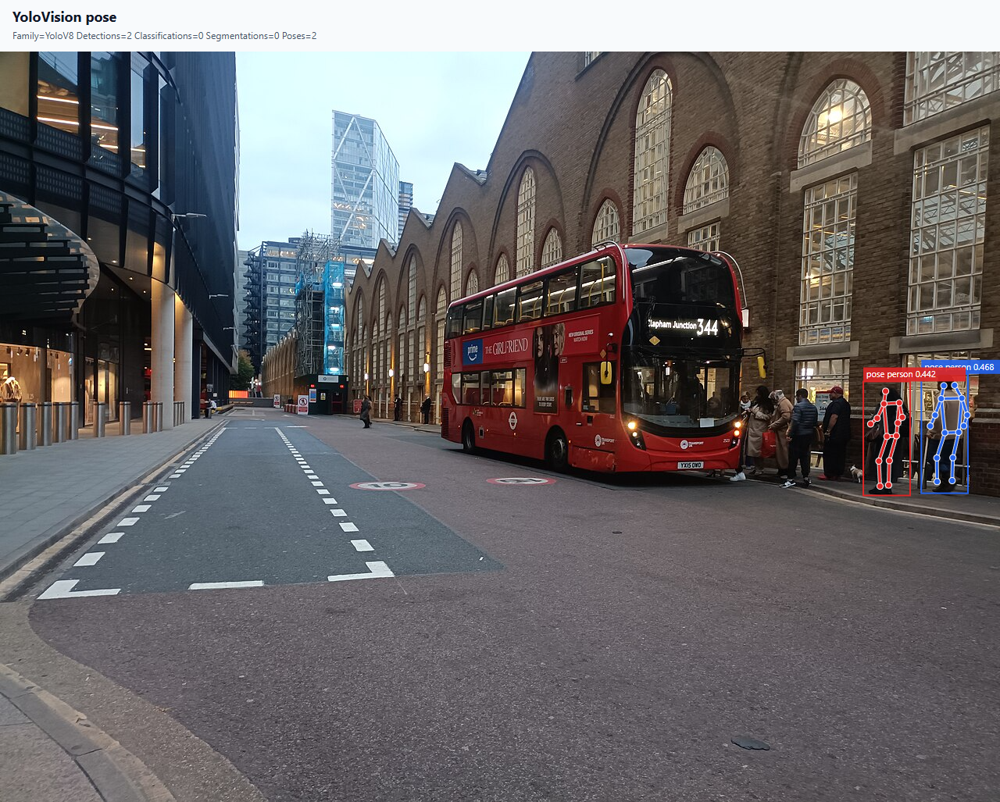
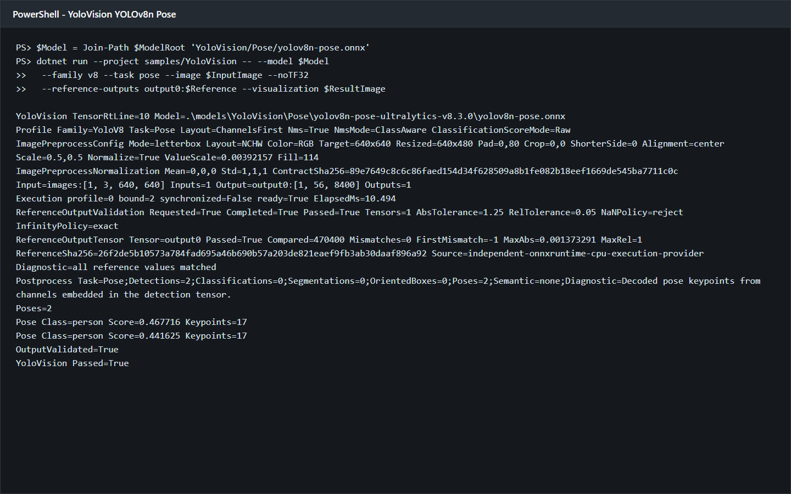

# C# 使用 TensorRtSharp4.0 运行 YOLOv8n Pose

本文从一个空的控制台项目开始，演示如何获取官方 YOLOv8n Pose 权重、转换 ONNX、生成独立参考、引用 TensorRtSharp4.0 的三个本地包，并在 TensorRT 10.11 上完成人体姿态估计。最终结果包含 17 个 COCO 关键点、人体骨架、原图坐标叠加、JSON 报告和严格参考输出比较。

本文只执行本地构建和验证。没有创建版本、Release 或上传包；CUDA、cuDNN 和 TensorRT 均由使用者自行安装。

## 本文使用的项目与库

TensorRtSharp4.0 将本次流程拆成三个职责清晰的包：

| 包 | 职责 |
| --- | --- |
| `JYPPX.TensorRT.CSharp.API` | TensorRT/CUDA 托管接口、ONNX 加载、binding 和执行。 |
| `JYPPX.TensorRT.CSharp.API.YoloVision` | 图像预处理、YOLOv8 Pose 解码、NMS、JSON 和 SVG 可视化。 |
| `JYPPX.TensorRT.CSharp.API.Runtime.win-x64.trt10.11.cuda12.9.cudnn9.22.Bridge` | 只携带项目自己的 `jyppxtrtbridge.dll`，不携带 NVIDIA 运行库。 |

示例程序使用 `.NET 8`。验证环境为 NVIDIA GeForce RTX 3060 Laptop GPU、驱动 `576.02`、TensorRT `10.11.0`、CUDA Toolkit `12.9` 和 .NET SDK `10.0.301`。包名称中的环境矩阵必须与本机安装匹配。

## 模型获取与许可证

权重来自 Ultralytics 官方 Release：

```text
https://github.com/ultralytics/assets/releases/download/v8.3.0/yolov8n-pose.pt
```

项目将来源固定到 `ultralytics v8.3.0` 和源码提交 `6e43d1e1e5db72afbf686dee6745669bcb124b0a`。权重长度为 `6,832,633` 字节，SHA256 为：

```text
c6fa93dd1ee4a2c18c900a45c1d864a1c6f7aba75d84f91648a30b7fb641d212
```

权重采用 `AGPL-3.0-only`。本文不把 `.pt` 或 ONNX 上传到 Git；正式使用前应根据业务分发方式自行完成许可证审查。仓库内的获取脚本会校验 URL、长度和 SHA256：

```powershell
$repoRoot = Resolve-Path .
$workspaceRoot = Split-Path $repoRoot -Parent
$assetRoot = Join-Path $workspaceRoot 'downloads/yolov8n-pose-ultralytics-v8.3.0'

pwsh -NoProfile -ExecutionPolicy Bypass `
  -File (Join-Path $repoRoot 'eng/Acquire-YoloV8PoseOfficialAssets.ps1') `
  -OutputRoot $assetRoot `
  -PythonPath $env:JYPPX_YOLO_PYTHON
```

文章配图使用 Wikimedia Commons 的 `Liverpool Street Bus station 2025`，许可证为 `CC0 1.0`。下载 JPEG 的 SHA256 为 `52b889d4fc9baea772ba2d9bbdfdef8b70710f993d7f27d193a965b11e708bcb`，转换后 PPM 的 SHA256 为 `80715af66669147b049fec9386152bd45505f4e494a65079fdc55404d4589b8e`。

## ONNX 转换与暂存

在独立 Python 环境安装固定版 Ultralytics、ONNX 和 ONNX Runtime，然后执行官方导出器：

```powershell
$Weights = Join-Path $assetRoot 'source/yolov8n-pose.pt'
$modelRoot = Join-Path $workspaceRoot 'models/YoloVision/Pose/yolov8n-pose-ultralytics-v8.3.0'
New-Item -ItemType Directory -Force $modelRoot | Out-Null

yolo export model=$Weights format=onnx imgsz=640 opset=17 simplify=True dynamic=False batch=1 device=cpu
Move-Item (Join-Path (Split-Path $Weights) 'yolov8n-pose.onnx') $modelRoot -Force
```

转换模型暂存在外层 `models/YoloVision/Pose/yolov8n-pose-ultralytics-v8.3.0/yolov8n-pose.onnx`，由 `.gitignore` 排除。文件长度为 `13,514,570` 字节，SHA256 为：

```text
ed1e8d2d2aeb8a2c66e642a16295a72a2990393e3a3843325537da7e11c8a899
```

静态 ONNX 合同是：

```text
images: float32[1,3,640,640]
output0: float32[1,56,8400]
```

56 个通道由 4 个 box 通道、1 个 `person` 分类通道和 `17 * 3` 个关键点通道组成，没有独立 objectness。通道起点固定为 `4 + 1 = 5`。

独立参考必须读取 C# 实际生成的 tensor，而不是另做一套图片预处理：

```powershell
$artifactRoot = Join-Path $workspaceRoot 'downloads/article-assets/yolovision-yolov8n-pose'
$model = Join-Path $modelRoot 'yolov8n-pose.onnx'
$tensor = Join-Path $artifactRoot 'pose-csharp-input.fp32.bin'
$image = Join-Path $workspaceRoot 'downloads/article-assets/pose-input.jpg'

& $env:JYPPX_YOLO_PYTHON `
  (Join-Path $repoRoot 'eng/Invoke-YoloVisionPoseReference.py') `
  --onnx-model $model --weights $Weights --input-tensor $tensor `
  --image $image --output-directory (Join-Path $artifactRoot 'reference')
```

脚本分别输出 ONNX Runtime CPU 的 470,400 值 raw reference，以及 Ultralytics/PyTorch 的 box、score 和 17 个关键点参考。

## 创建本地包消费项目

本次验证使用仓库外项目，确保示例不是依赖 `ProjectReference` 才能运行。先建立目录：

```powershell
$consumerRoot = Join-Path $workspaceRoot 'consumer-workspaces/yolov8n-pose'
New-Item -ItemType Directory -Force $consumerRoot | Out-Null
Set-Location $consumerRoot
dotnet new console --framework net8.0
```

项目文件只包含三个 `PackageReference`：

```xml
<Project Sdk="Microsoft.NET.Sdk">
  <PropertyGroup>
    <OutputType>Exe</OutputType>
    <TargetFramework>net8.0</TargetFramework>
    <ImplicitUsings>enable</ImplicitUsings>
    <Nullable>enable</Nullable>
  </PropertyGroup>
  <ItemGroup>
    <PackageReference Include="JYPPX.TensorRT.CSharp.API" Version="4.0.0" />
    <PackageReference Include="JYPPX.TensorRT.CSharp.API.YoloVision" Version="4.0.0" />
    <PackageReference Include="JYPPX.TensorRT.CSharp.API.Runtime.win-x64.trt10.11.cuda12.9.cudnn9.22.Bridge" Version="4.0.0" />
  </ItemGroup>
</Project>
```

这三个包来自当前源码的本地 feed，不代表已经发布。固定包哈希如下：

| 包 | 长度 | SHA256 |
| --- | ---: | --- |
| managed API | 15,229,493 | `139696bd79be6469d26747b7a3da7ba82e8279c69a9b42e2bf4f5a1ade607898` |
| YoloVision | 120,201 | `c563713e05b76764bcaf1a729f3338e807f940fa3ab81eb02570b9e056c0d3a7` |
| bridge-only | 376,999 | `296eac2d6376cf3c6eaeb9394c662d71b2d838ad7e339cd75587ef7040ebcb2c` |

为避免本机全局 NuGet 缓存中存在相同 ID/版本的旧包，restore 使用该项目专属缓存目录，并逐一比较缓存 nupkg 与本地 feed 的 SHA256。

## 编写程序入口

YoloVision 的命令入口已经封装参数解析、预处理、TensorRT 执行、Pose 后处理和结果写出，因此 `Program.cs` 只需两行：

```csharp
using YoloVisionSample;

return YoloVisionCommand.Run(args);
```

`YoloVisionCommand` 不把 native 指针暴露给消费程序。关键配置均通过命令行显式声明，特别是 `class-count=1`、`keypoint-count=17` 和 `aux-channel-start=5`，避免依靠文件名猜测输出合同。

## 编译并运行

先指定本地 feed 和独立包缓存：

```powershell
$feed = Join-Path $repoRoot 'artifacts/article-pose-packages'
$packages = Join-Path $consumerRoot '.packages'
dotnet restore --source $feed --packages $packages --force --no-cache
dotnet build -c Release --no-restore
```

设置用户已经安装的 TensorRT 路径，再运行完整流程：

```powershell
$env:JYPPX_TENSORRT_ROOT = $env:TENSORRT_PATH
$reference = Join-Path $artifactRoot 'reference/output0.reference.json'
$resultJson = Join-Path $artifactRoot 'pose-output.json'
$resultSvg = Join-Path $artifactRoot 'pose-annotated.svg'

dotnet run -c Release --no-build -- `
  --model $model --labels $labels --input-shape 1x3x640x640 `
  --tensor-rt-line 10 --family v8 --task pose `
  --layout channels-first --has-objectness false --class-count 1 `
  --confidence 0.25 --iou-threshold 0.45 --top-k 10 `
  --keypoint-count 17 --aux-channel-start 5 `
  --image $inputPpm --preprocessed-output $tensor `
  --reference-outputs "output0:$reference" `
  --reference-abs-tolerance 1.25 --reference-rel-tolerance 0.05 `
  --reference-nan-policy reject --reference-infinity-policy exact --noTF32 `
  --output $resultJson --visualization $resultSvg `
  --visualization-background $inputJpeg
```

其中 `labels`、`inputPpm` 和 `inputJpeg` 都由调用方通过变量指向资产目录。正文不依赖作者机器上的绝对路径。

## 已验证结果

这次运行生成的原图叠加结果如下。两个 `person` 都绘制了检测框、可见关键点和 COCO 骨架：



程序运行页面如下。终端截图来自本次真实运行的 stdout，只对工作区路径进行了脱敏排版，数值、tensor 合同和验证结论保持原样：



两张图都来自同一次真实 TensorRT 执行：第一张由该次执行写出的 SVG 渲染，第二张来自该次执行的 stdout。关键结果为：

| 项目 | 实测值 |
| --- | --- |
| TensorRT 退出码 | `0` |
| 输入 tensor | `1,228,800` 个 float32，SHA256 `050935ebf471ec32ab4327d9f5643f0fe1a203289088895205e732e448a8d225` |
| 输出 tensor | `output0:[1,56,8400]` |
| 比较值 | `470,400` |
| mismatch / first mismatch | `0` / `-1` |
| 最大绝对误差 | `0.001373291` |
| TensorRT 推理耗时 | `10.494 ms` |
| 姿态数量 | `2` |
| 两个目标分数 | `0.467716`、`0.441625` |
| 每个目标关键点 | `17` |
| SVG 骨架边 | `27` 条可见边 |

独立 PyTorch 后处理使用完全相同的 C# tensor。两个匹配框的 IoU 分别为 `0.999999` 和 `0.999998`；可见关键点最大坐标误差分别为 `0.000095` 和 `0.000126` 像素，比较结果为通过。

受控负例把 raw reference 第 0 个值增加 `100`，程序必须返回 `1`。实测为 `Mismatches=1`、`FirstMismatch=0`、`OutputValidated=False` 和 `YoloVision Passed=False`，证明参考输出不匹配会阻断成功状态。

## 常见问题

### 能生成 engine，但 `Poses=0`

先检查输出是否确实为 `[1,56,8400]`，并确认 `--class-count 1 --has-objectness false --aux-channel-start 5`。错误的类别数会把关键点通道当作分类分数。

### 框正确，关键点属于另一个人

NMS 后必须通过 `YoloDetection.SourceIndex` 回到原始候选行选择关键点，不能使用 NMS 结果数组下标。YoloVision 当前实现保留了这条绑定关系。

### 点位整体偏移

可视化需要同时传入 `--image` 与 `--visualization-background`。程序使用预处理记录中的 resize、padding 和 scale 把模型坐标逆变换到原图；背景图尺寸必须与预处理源图一致。

### bridge 已复制但找不到 TensorRT DLL

bridge-only 包不携带 CUDA、cuDNN 或 TensorRT。请安装与 bridge 包键一致的 NVIDIA 运行环境，并让 `JYPPX_TENSORRT_ROOT` 或系统搜索路径指向 TensorRT 安装目录。

## 复查与边界

本文已经证明：

- 官方 YOLOv8n Pose 权重可以按固定版本获取并转换为静态 ONNX；
- 转换模型存放在外层 `models`，不进入 Git；
- 仓库外项目只通过三个本地包完成 restore、build 和真实 GPU 推理；
- C# 预处理、TensorRT 全量 raw 输出、独立 PyTorch 后处理、JSON 和原图骨架结果能够相互追溯；
- 受控 reference 变更会非零退出。

本文不表示包已发布到 NuGet 或 GitHub Packages，也不表示模型获得项目再分发授权。它不是 public-package、post-publish、Owner acceptance 或正式 Release 证明。模型、reference、tensor、日志和中间 SVG 继续保留在 Git 仓库外；Git 只保存技术文章、可公开再分发的两张 PNG 和不含模型本体的哈希记录。
