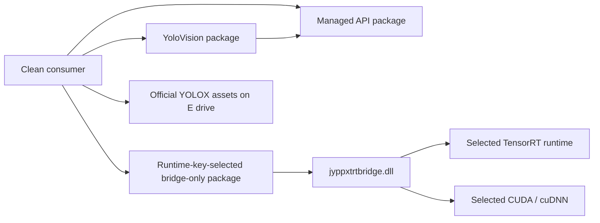

# YoloVision YOLOX 本地 PackageReference 消费者实战

上一篇教程完成了官方 YOLOX-S 在源码树中的真实运行。本篇继续回答更接近用户安装体验的问题：
不引用仓库项目，只使用本地生成的 NuGet 包，能否在一个干净目录里恢复、编译并完成同一张
官方图片的 TensorRT 推理？

答案是可以。本次验证使用三个本地包：

- `JYPPX.TensorRT.CSharp.API`：托管 TensorRT/CUDA API。
- `JYPPX.TensorRT.CSharp.API.YoloVision`：可复用的 YOLO profile、预处理、后处理和命令入口。
- 与 `-RuntimePackageKey` 对应的 TRT8、TRT10 或 TRT11 bridge-only 包：只包含
  `jyppxtrtbridge.dll`。

TensorRT/CUDA/cuDNN 由系统安装或显式选择的本地 runtime 提供。模型、图片、labels、restore
cache 和临时工程全部位于 E 盘，没有把下载资产或 package cache 写到 C 盘。当前主机的真实
矩阵结果是 TRT10、TRT11 通过；TRT8 因缺少 `cudnn64_8.dll`，bridge 编译时主动关闭 ONNX
parser，因此保持受控 blocker。

本次结果是 `local-package-consumer-runtime` 工程证据。它不是从 nuget.org 或 GitHub Packages
下载公开包得到的 `package-consumer-runtime` proof，也不代表模型资产或包已经获准公开发布。

## 1. 三层包结构



YoloVision 项目仍可作为命令行程序直接运行，同时公开：

```csharp
public static class YoloVisionCommand
{
    public static int Run(string[] args);
}
```

原来的 `Program.Main` 只转发到这个入口。这样 CLI 和 PackageReference consumer 使用同一套
参数解析、preprocess、TensorRT enqueue、YOLOX grid/stride decode、NMS、JSON 和 SVG 逻辑，
不会出现“样例能跑、包内实现是另一份代码”的漂移。

公开入口只接受托管字符串数组，不暴露 `IntPtr`、`nint`、`UIntPtr`、`SafeHandle`、device
pointer 或 borrowed TensorRT 对象。

## 2. 准备官方资产

先按官方资产脚本下载并校验：

```powershell
pwsh -NoProfile -ExecutionPolicy Bypass `
  -File .\eng\Acquire-YoloXOfficialAssets.ps1
```

默认目录：

```text
E:\GitSpace\TensorRT-CSharp-API-4.0\downloads\yolox-apache
```

本次固定资产：

| 资产 | SHA256 |
| --- | --- |
| YOLOX-S ONNX | `c5c2d13e59ae883e6af3b45daea64af4833a4951c92d116ec270d9ddbe998063` |
| P6 dog image | `6cb94c9cd0781412598fe179246b09041af4303d388a5ba3c55f760dff11ec2c` |
| COCO labels | `4d4aaea7bee6be2f675d9b53a9195ca36dfe6429f7479f29155da522a6c85930` |

脚本会拒绝 C 盘输出。已存在资产可使用 `-Offline` 重新核验。

## 3. 构建三个本地包

从仓库根目录执行。

主 managed 包：

```powershell
dotnet pack .\pack\JYPPX.TensorRT.CSharp.API\JYPPX.TensorRT.CSharp.API.csproj `
  -c Release `
  -o .\artifacts\managed `
  -p:JYPPXPackageVersion=4.0.0
```

YoloVision 包：

```powershell
dotnet pack .\samples\YoloVision\YoloVision.csproj `
  -c Release `
  -o .\artifacts\yolovision-nupkg `
  -p:JYPPXPackageVersion=4.0.0
```

TRT10 bridge-only 包：

```powershell
cmake --build --preset win-x64-trt10-cuda12-release

pwsh -NoProfile -ExecutionPolicy Bypass `
  -File .\eng\Invoke-LocalSplitRuntimePackage.ps1 `
  -SourceRuntimeKey win-x64-trt10.11-cuda12.9-cudnn9.22 `
  -Version 4.0.0 `
  -SplitPackageRole bridge `
  -Configuration Release `
  -SkipManagedPack `
  -SkipConsumerValidation
```

`JYPPX.TensorRT.CSharp.API.YoloVision.4.0.0.nupkg` 内包含：

```text
lib/net8.0/YoloVision.dll
lib/net8.0/YoloVision.xml
README.md
```

它的 nuspec 只依赖 `JYPPX.TensorRT.CSharp.API 4.0.0`。bridge 包把 DLL 放在标准 NuGet
路径 `runtimes/win-x64/native/jyppxtrtbridge.dll`，因此 clean consumer build 会复制 native
bridge，不需要在消费项目中写本机 DLL 路径。

## 4. Consumer 模板

仓库中的模板位于：

```text
samples/YoloVision.PackageConsumer
```

核心代码先记录实际 bridge build identity，再调用复用入口：

```csharp
Console.WriteLine($"YoloVisionPackageConsumer ProjectReference=False CoreAssembly={typeof(YoloModelProfile).Assembly.GetName().Name}");
TensorRtEnvironmentSnapshot snapshot = TensorRtEnvironmentProbe.GetCurrent();
Console.WriteLine($"YoloVisionPackageConsumer BridgeTensorRt={snapshot.BuildInfo.TensorRtVersion} BridgeCuda={snapshot.BuildInfo.CudaToolkitVersion}");
return YoloVisionCommand.Run(args);
```

项目模板显式引用三个包，不包含 `ProjectReference`。版本占位符由验证脚本根据
`-PackageVersion` 一次性替换，避免本地 feed 同时存在 stable 与 prerelease 包时误选版本。

## 5. 一键 clean restore/build/run

执行：

```powershell
pwsh -NoProfile -ExecutionPolicy Bypass `
  -File .\eng\Test-YoloVisionLocalPackageConsumer.ps1 `
  -RuntimePackageKey win-x64-trt10.11-cuda12.9-cudnn9.22 `
  -PackageVersion 4.0.0
```

默认 clean workspace：

```text
E:\GitSpace\TensorRT-CSharp-API-4.0\consumer-workspaces\yolovision-yolox-local-package-trt10
```

脚本会：

1. 校验 workspace、三个 package feed、模型、labels 和图片都不在 C 盘。
2. 删除旧 workspace，复制 consumer 模板并生成只含本地 file feed 的 `NuGet.config`。
3. 使用 `<clear />` 禁止继承用户 NuGet 源，避免意外从公开源或全局配置恢复同名包。
4. 把 `--packages` 指向 E 盘 workspace，执行强制、无缓存 restore。
5. 解析 `project.assets.json`，要求 project library 数为 0。
6. 要求 consumer 输出中恰好有一个 NuGet 复制的 `jyppxtrtbridge.dll`。
7. 使用官方 ONNX、dog image 和 labels 执行真实 TensorRT build/enqueue。
8. 要求日志同时出现 package consumer marker、实际 bridge TensorRT/CUDA build metadata 和
   `YoloVision Passed=True`，并校验 bridge major 与 runtime key 一致。
9. 复制 stdout、stderr、JSON 和 SVG 到 ignored evidence 目录，计算 SHA256。
10. 删除包含 restore cache、临时 csproj、engine build 输出和 tensor 的整个 E 盘 workspace。

系统安装的 TensorRT/CUDA 根可以显式指定：

```powershell
pwsh -NoProfile -ExecutionPolicy Bypass `
  -File .\eng\Test-YoloVisionLocalPackageConsumer.ps1 `
  -TensorRtRoot 'D:\Program Files\TensorRT-10.11.0.33-cu12' `
  -TensorRtRuntimeRoot 'D:\Program Files\TensorRT-10.11.0.33-cu12' `
  -CudnnRoot 'D:\Program Files\NVIDIA\CUDNN\v9.22' `
  -CudaRoot 'C:\Program Files\NVIDIA GPU Computing Toolkit\CUDA\v12.9'
```

这里的 C 盘 CUDA 是用户已有的系统安装，不是脚本下载的临时资产。脚本不会删除 CUDA、
TensorRT、NuGet 全局缓存、Codex 依赖或用户文件。

## 6. 三版本矩阵

一次执行全部目标版本：

```powershell
pwsh -NoProfile -ExecutionPolicy Bypass `
  -File .\eng\Test-YoloVisionLocalPackageConsumerMatrix.ps1
```

矩阵逐行创建独立 E 盘 workspace/cache，使用 split manifest 推导 bridge package ID 和
TensorRT line。SDK 根目录与运行时 DLL 根目录分开记录；当默认 SDK 目录只有 headers/import
libs 时，脚本只会选择满足 full-runtime manifest 全部 DLL pattern 的已有 assembled runtime。

当前真实结果：

| Runtime key | Bridge build | 结果 | 说明 |
| --- | --- | --- | --- |
| `win-x64-trt8.6-cuda12.1-cudnn8.9` | TRT 8.6.1 / CUDA 12.1 | blocked | cuDNN 根中没有 `cudnn64_8.dll`，bridge 按 CMake 安全门关闭 ONNX parser |
| `win-x64-trt10.11-cuda12.9-cudnn9.22` | TRT 10.11.0 / CUDA 12.9 | passed | 5 detections，`14.360 ms` |
| `win-x64-trt11.0-cuda12.9-cudnn9.22` | TRT 11.0.0 / CUDA 12.9 | passed | 使用 E 盘已校验 assembled runtime，5 detections，`11.679 ms` |

TRT8 行已经完成 PackageReference restore/build、bridge load 和 build identity 查询，但没有
ONNX parser，不能写成 runtime pass。发布 TRT8 YoloVision consumer 前，必须在具备完整 cuDNN
8 runtime 的构建环境重新构建 bridge、重打包并重新冻结 SHA256。

## 7. 本次真实结果

clean consumer restore/build 均为 0 warning、0 error。运行输出：

```text
YoloVisionPackageConsumer ProjectReference=False CoreAssembly=YoloVision
YoloVisionPackageConsumer BridgeTensorRt=10.11.0 BridgeCuda=12.9
Input=images:[1, 3, 640, 640] Output=output:[1, 8400, 85]
Execution ... ElapsedMs=14.238
Detection Class=bicycle Score=0.954854 ...
Detection Class=dog Score=0.913407 ...
Real package-consumer run log final marker: YoloVision Passed=True
```

共得到 5 个检测。预处理 tensor 仍为：

```text
NCHW / BGR / Normalize=False / ValueScale=1
top-left letterbox / fill 114
SHA256=ca4e22bc6d8ebfe70f5aefeae8957d9ad15eb8d3bf99b6a42e016436dcbf1528
```

## 8. 证据与分类

raw 本机证据位于 ignored 目录：

```text
artifacts/yolovision/yolox-local-package-consumer
artifacts/yolovision/yolox-local-package-consumer-matrix
```

可提交的精简记录位于：

```text
artifacts/interface-coverage/yolox-local-package-consumer-runtime-proof-closure.json
```

证据分层必须保持：

| 问题 | 本次结果 |
| --- | --- |
| 真实模型是否运行 | 是 |
| 是否来自无 ProjectReference 的 PackageReference consumer | 是 |
| 是否使用本地 file feed | 是 |
| 是否从公开包地址下载 | 否 |
| 是否是正式 package-consumer-runtime proof | 否 |
| 是否批准公开再分发 | 否 |
| 是否执行 publish | 否 |

因此通过行也只能写成 `local-package-consumer-runtime`，失败行只能写成
`runtime-attempt-blocked`。要晋级公开 package consumer proof，仍需在仓库外 clean workspace
中从真实公开 URL 恢复已发布包，固定公开包 hash、NuGet `.nupkg.metadata` source、host
metadata、stdout/stderr，并由 owner 完成发布与证据审核。

## 小结

这条链证明 YoloVision 不再只能通过源码项目引用使用。相同的 YOLOX 预处理、raw decoder 和
NMS 已经进入独立本地包，可被一个只有 PackageReference 的小型应用调用；bridge-only
交付也能与系统 TensorRT/CUDA 组合完成真实推理。项目开发完成前不保留公开包 handoff
快照，也不执行 NuGet、GitHub Packages、Release 或版本发布。
