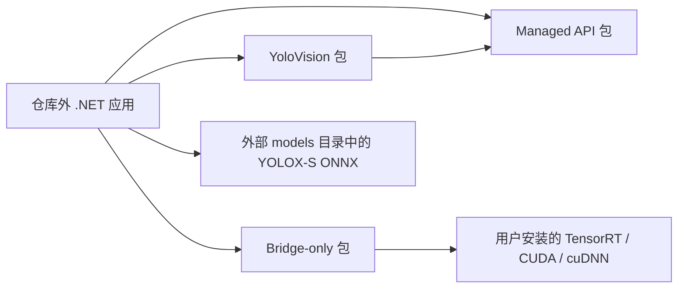
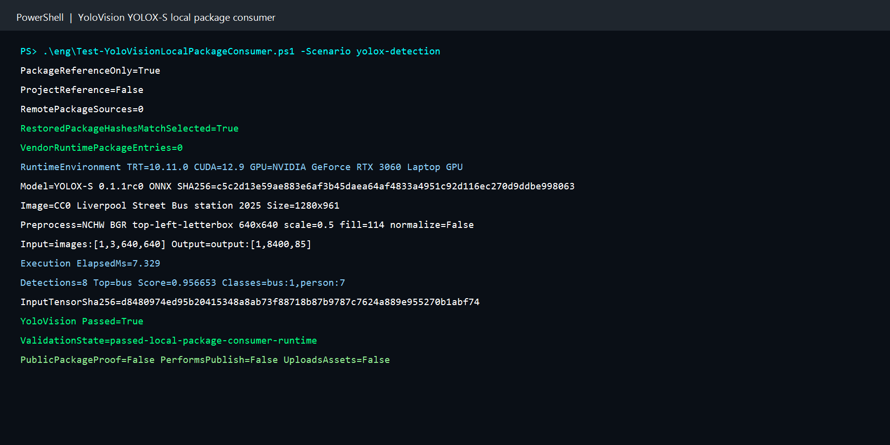
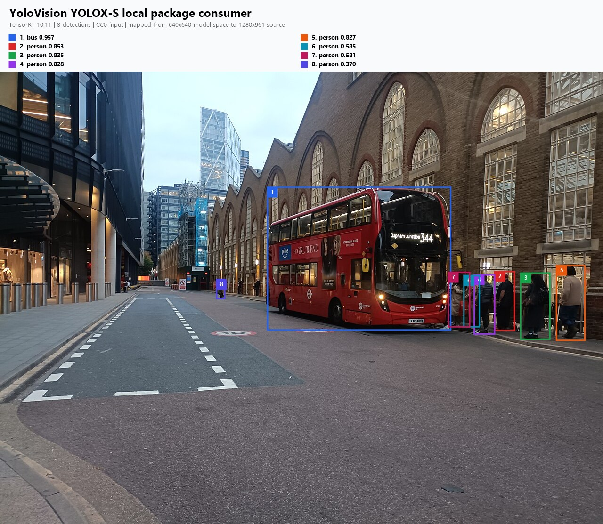

# 使用本地 NuGet 包运行 YOLOX-S：从官方模型到 TensorRT 检测结果

本文演示一个完整的应用消费流程：获取官方 YOLOX-S 模型，确认 ONNX 转换方式，在仓库外创建只含 `PackageReference` 的 .NET 应用，使用 TensorRtSharp4.0 完成 TensorRT 推理，并把检测框绘制回原始图片。

演示使用真实的 TensorRT 10.11、CUDA 12.9 和 RTX 3060 Laptop GPU。最终得到 1 个 bus 和 7 个 person。模型与引擎不提交到 Git；当前阶段也不创建 tag、GitHub Release 或公开包。

## 1. 项目与功能背景

TensorRtSharp4.0 为 C# 提供 TensorRT/CUDA 托管接口，YoloVision 则在其上实现图像预处理、模型 profile、TensorRT enqueue、YOLO 后处理、JSON 报告和可视化。本案例使用三个本地候选包：

| 包 | 职责 |
| --- | --- |
| `JYPPX.TensorRT.CSharp.API` | `JYPPX.TensorRtSharp` 与 `JYPPX.CudaSharp` 托管 API |
| `JYPPX.TensorRT.CSharp.API.YoloVision` | YOLOX profile、预处理、解码、NMS 与命令入口 |
| `JYPPX.TensorRT.CSharp.API.Runtime.*.Bridge` | 只交付项目编译的 `jyppxtrtbridge.dll` |

CUDA、cuDNN 与 TensorRT 始终由使用者自行安装。三个包都不包含 NVIDIA 原厂 DLL。



## 2. 模型、图片与许可证

模型来自 [Megvii YOLOX 0.1.1rc0 官方发布页](https://github.com/Megvii-BaseDetection/YOLOX/releases/tag/0.1.1rc0)，上游仓库使用 Apache-2.0。本文固定提交 `e1052df71842031413f6030723c3607b839c80ce`，官方 ONNX 下载地址为：

```text
https://github.com/Megvii-BaseDetection/YOLOX/releases/download/0.1.1rc0/yolox_s.onnx
```

| 资产 | SHA256 |
| --- | --- |
| `yolox_s.onnx` | `c5c2d13e59ae883e6af3b45daea64af4833a4951c92d116ec270d9ddbe998063` |
| `coco.names` | `4d4aaea7bee6be2f675d9b53a9195ca36dfe6429f7479f29155da522a6c85930` |
| CC0 输入图片 PPM | `80715af66669147b049fec9386152bd45505f4e494a65079fdc55404d4589b8e` |

演示图片是 Wikimedia Commons 的 [Liverpool Street Bus station 2025](https://commons.wikimedia.org/wiki/File:Liverpool_Street_Bus_station_2025.jpg)，许可证为 CC0 1.0，可以随文展示。模型公开再分发仍未获得项目所有者批准，因此 ONNX 只保存在工作区外：

```text
<workspace-root>/models/YoloVision/Detection/yolox-s-megvii-v0.1.1rc0/yolox_s.onnx
```

## 3. 获取模型并放入 models 目录

仓库脚本会从固定 URL 下载官方 ONNX、许可证、COCO 标签来源与上游参考代码，并逐项校验长度和 SHA256：

```powershell
powershell.exe -NoProfile -ExecutionPolicy Bypass `
  -File .\eng\Acquire-YoloXOfficialAssets.ps1
```

下载完成后，把 ONNX 复制到工作区外的统一模型暂存目录：

```powershell
$modelDirectory = Join-Path ..\models `
  'YoloVision\Detection\yolox-s-megvii-v0.1.1rc0'
New-Item -ItemType Directory -Path $modelDirectory -Force | Out-Null
Copy-Item ..\downloads\yolox-apache\source\yolox_s.onnx $modelDirectory
```

`models` 目录不属于 Git 仓库。后续 Model Zoo 建成前，所有演示 ONNX 都按任务和来源版本暂存在这里。

## 4. ONNX 转换方式

本案例直接使用官方 ONNX 发布资产，因此正常使用时不需要再次转换。需要从官方 PyTorch checkpoint 复现时，可在独立 Python 环境执行上游导出器：

```bash
git clone https://github.com/Megvii-BaseDetection/YOLOX.git
cd YOLOX
git checkout e1052df71842031413f6030723c3607b839c80ce
python -m pip install -v -e .

python tools/export_onnx.py \
  --output-name yolox_s.onnx \
  -n yolox-s \
  -c yolox_s.pth
```

`yolox_s.pth` 应从同一官方 release 获取。0.1.1rc0 发布图是 opset 11；导出后应检查输入 `images:[1,3,640,640]` 和输出 `output:[1,8400,85]`，并重新记录 ONNX SHA256。自行导出的图不应假定与本文官方 ONNX 字节一致。

## 5. 构建同提交的三个候选包

先构建 managed 与 YoloVision 包：

```powershell
dotnet pack .\pack\JYPPX.TensorRT.CSharp.API\JYPPX.TensorRT.CSharp.API.csproj `
  -c Release -o .\artifacts\managed `
  -p:JYPPXPackageVersion=4.0.0

dotnet pack .\samples\YoloVision\YoloVision.csproj `
  -c Release -o .\artifacts\yolovision-nupkg `
  -p:JYPPXPackageVersion=4.0.0
```

再打包匹配本机 TensorRT 10.11 的 bridge-only 包：

```powershell
powershell.exe -NoProfile -ExecutionPolicy Bypass `
  -File .\eng\Invoke-LocalSplitRuntimePackage.ps1 `
  -SourceRuntimeKey win-x64-trt10.11-cuda12.9-cudnn9.22 `
  -SplitPackageRole bridge `
  -Version 4.0.0 `
  -Configuration Release `
  -SkipManagedPack `
  -SkipBaseRuntimeBuild `
  -SkipConsumerValidation
```

本次三份包的 nuspec `repository commit` 都是 `5f5230d7406f735c478079d6ef92796f772dafa1`。验证脚本还会要求恢复后的 `.nupkg` SHA256 与所选包逐一相等，防止同版本旧包混入。

## 6. 仓库外消费者如何隔离

模板位于 `samples/YoloVision.PackageConsumer`，只包含三个 `PackageReference`。脚本会在仓库外创建临时工程和独立 NuGet 缓存，并生成如下来源结构：

```xml
<packageSources>
  <clear />
  <add key="managed-api" value="&lt;local-managed-feed&gt;" />
  <add key="yolovision" value="&lt;local-yolovision-feed&gt;" />
  <add key="bridge-only" value="&lt;local-bridge-feed&gt;" />
</packageSources>
```

每个 feed 只放一份选定 nupkg。脚本要求 `ProjectReference=0`、直接程序集引用为 0、恢复图中的 project library 为 0，并确认消费输出中的 native bridge 确实来自所选 bridge 包。

Windows PowerShell 5.1 仍受传统长路径限制，因此 YOLOX 默认工作区使用短名 `yv-yolox-pkg-trt10`。这只影响临时目录名，不影响报告和包 identity。

## 7. 图像预处理合同

YOLOX-S 与常见 YOLOv8 输入不同，本案例的配置必须保持：

| 项目 | 值 |
| --- | --- |
| 输入布局 | NCHW |
| 颜色顺序 | BGR |
| 数值范围 | 原始 `0..255` float，不除以 255 |
| 目标尺寸 | `640x640` |
| resize | 等比例 letterbox |
| 对齐 | 左上角 |
| 填充值 | 114 |

CC0 原图为 `1280x961`，本次缩放到 `640x480`，右下区域由填充值补齐。生成 tensor 共 1,228,800 个 float，SHA256 为 `d8480974ed95b20415348a8ab73f88718b87b9787c7624a889e955270b1abf74`。

## 8. YOLOX 输出解码

`[1,8400,85]` 每行包含 4 个框参数、1 个 objectness 和 80 个类别分数。对于 strides 8、16、32，YoloVision 使用上游 YOLOX 公式恢复网格坐标：

```text
center = (rawXY + grid) * stride
size   = exp(rawWH) * stride
score  = objectness * classProbability
```

随后按 `confidence=0.3` 过滤，并执行 class-aware NMS，IoU 阈值为 `0.45`。坐标先处于 `640x640` 模型输入空间，绘图时再利用 letterbox scale 映射回原图。

## 9. 执行完整验证

下面命令显式传入用户安装的运行库根目录和 CC0 图片；占位符应替换为本机路径：

```powershell
powershell.exe -NoProfile -ExecutionPolicy Bypass `
  -File .\eng\Test-YoloVisionLocalPackageConsumer.ps1 `
  -Scenario yolox-detection `
  -RuntimePackageKey win-x64-trt10.11-cuda12.9-cudnn9.22 `
  -ModelPath '<workspace-root>/models/YoloVision/Detection/yolox-s-megvii-v0.1.1rc0/yolox_s.onnx' `
  -ImagePath '<asset-root>/liverpool-street-bus-station-1280.ppm' `
  -LabelsPath '<asset-root>/coco.names' `
  -TensorRtRoot '<tensor-rt-root>' `
  -TensorRtRuntimeRoot '<tensor-rt-root>' `
  -CudaRoot '<cuda-root>' `
  -CudnnRoot '<cudnn-root>'
```

脚本依次完成本地 feed 隔离、restore、Release build、bridge 来源校验、模型构建、enqueue、解码、NMS、JSON/SVG 输出和证据边界检查。默认会在成功后删除临时工作区；只有调试时才使用 `-KeepWorkspace`。

## 10. 本机执行结果

本次运行环境为 TensorRT 10.11.0、CUDA 12.9、.NET SDK 10.0.301、NVIDIA GeForce RTX 3060 Laptop GPU。核心输出如下：

```text
PackageReferenceOnly=True ProjectReference=False RemotePackageSources=0
RuntimeEnvironment TRT=10.11.0 CUDA=12.9
Input=images:[1,3,640,640] Output=output:[1,8400,85]
Execution ElapsedMs=7.329
Detections=8 Top=bus Score=0.956653 Classes=bus:1,person:7
YoloVision Passed=True
```



同一次运行的 8 个框已经按 scale `0.5` 映射回 CC0 原图：



| 排名 | 类别 | 分数 |
| ---: | --- | ---: |
| 1 | bus | 0.956653 |
| 2 | person | 0.852964 |
| 3 | person | 0.835068 |
| 4 | person | 0.828305 |
| 5 | person | 0.826588 |
| 6-8 | person | 0.584727 / 0.581160 / 0.369597 |

## 11. 证据文件与可复核范围

仓库只提交去本机路径的小型证据：

```text
samples/assets/yolovision-yolox-s-local-package-consumer-runtime-evidence.json
samples/assets/yolovision-yolox-s-local-package-consumer-tensorrt10.11.txt
docs/images/yolovision-yolox-s-local-package-consumer-terminal.png
docs/images/yolovision-yolox-s-local-package-consumer-annotated-cc0.jpg
```

ONNX、TensorRT engine、输入 tensor、raw stdout、临时 NuGet 缓存和完整本机报告都留在 Git 外。精简证据固定三包哈希、模型/图片/tensor 哈希、运行环境、检测结果及两张图片哈希。

本次链路证明：真实 YOLOX-S 可由仓库外、无 `ProjectReference` 的本地包消费者运行，且三个包不携带 CUDA/cuDNN/TensorRT 原厂运行库。它没有执行独立 ONNX Runtime 原始输出比对，因此不能声称跨框架逐值一致；它也不是从公开 feed 下载包得到的公开 package proof。

## 12. 常见问题

### 找不到 TensorRT 或 cuDNN DLL

确认 runtime key 与本机安装版本一致，并显式传入四个运行库根目录。项目不会自动下载 NVIDIA 运行库。

### 出现 `TensorRtApiLine` 等类型加载错误

managed、YoloVision 与 bridge-only 候选包不是同一源码提交。重新执行第 5 节的三包构建，并删除旧临时工作区后再跑。

### Windows PowerShell 报恢复包不存在

先检查完整路径是否超过传统路径上限。当前脚本已使用短工作区名；自定义 `-OutputRoot` 时也应保持路径简短。

### 检测框整体偏移

检查是否错误使用了 center letterbox、RGB 或 `1/255` 归一化。YOLOX 本案例要求 BGR、左上角 letterbox 和原始 `0..255` 数值。

## 13. 结论

这条演示覆盖了模型来源、ONNX 转换、外部模型存放、三包构建、仓库外恢复、真实 TensorRT 推理、YOLOX 解码、检测结果绘制和证据边界。当前候选包可用于继续开发验证，但项目完成并获得明确授权前，不发布新包、不创建 Release，也不上传模型文件。
