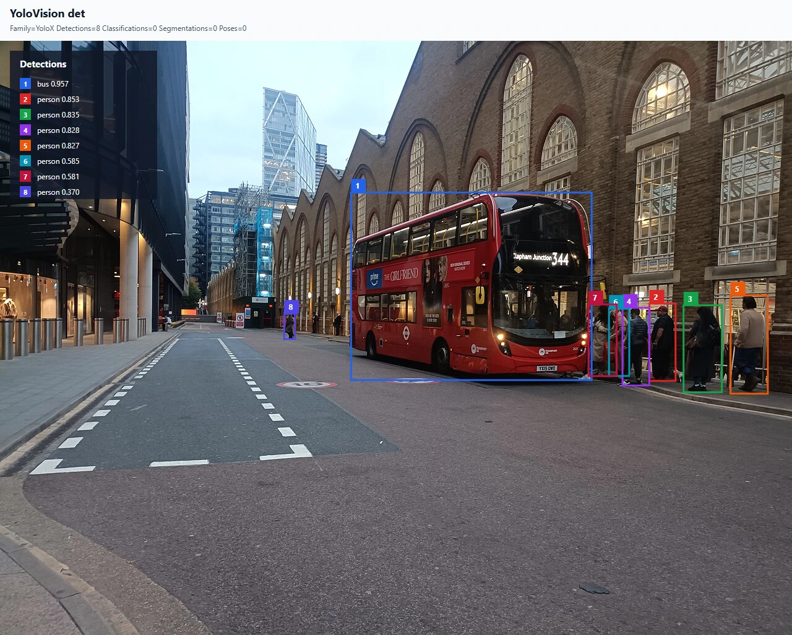
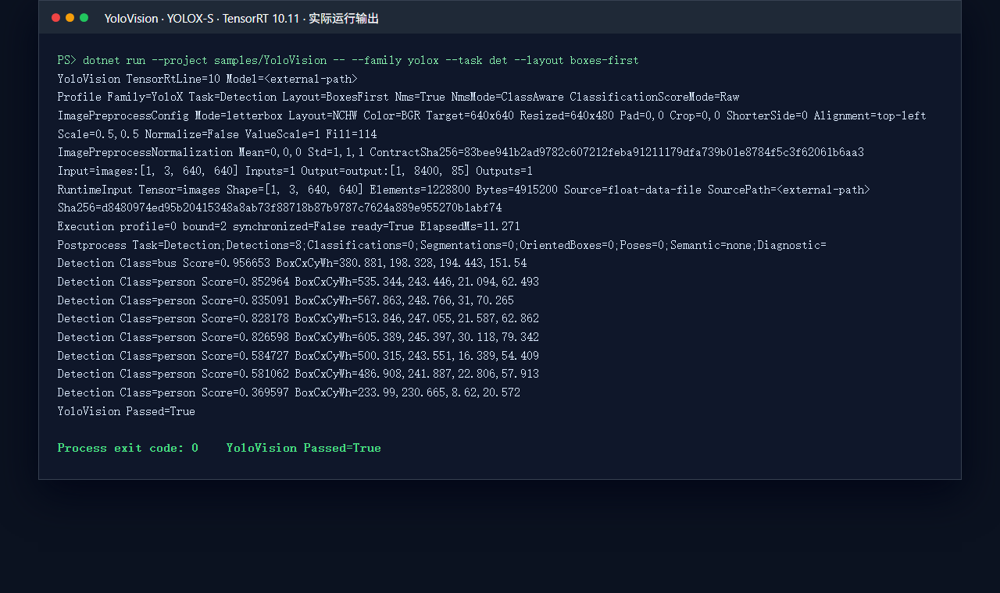

# 使用 TensorRtSharp4.0 在 C# 中运行官方 YOLOX-S 目标检测

本文使用 Megvii 官方 YOLOX-S ONNX，完整演示 `applications/YoloVision` 如何准备模型与图片、执行 YOLOX 专用预处理、调用 TensorRT、解码 `[1,8400,85]` raw head，并把检测框绘制到原图。示例通过 `JYPPX.TensorRtSharp` 使用 TensorRT 托管接口，通过 `JYPPX.CudaSharp` 管理 CUDA 资源；CUDA、cuDNN、TensorRT 和 native bridge 均由使用者自行安装，不随项目打包。

本文只把代码、证据 JSON 和允许再分发的 CC0 结果图提交到仓库。ONNX、输入图片、预处理 tensor、engine 与原始日志保存在仓库外层工作目录，后续可迁移到独立 Model Zoo。

## 本文使用的项目与库

本案例由三个项目层次协作完成：

| 层次 | 项目 | 作用 |
| --- | --- | --- |
| 托管 TensorRT | `src/JYPPX.TensorRtSharp` | 解析 ONNX、创建 execution context、绑定输入输出并读取 TensorRT 结果 |
| 托管 CUDA | `src/JYPPX.CudaSharp` | 提供 CUDA context、stream 与 device memory 的安全封装 |
| 用户示例 | `applications/YoloVision` | 完成图片预处理、YOLOX grid/stride 解码、NMS、JSON 报告和 SVG 可视化 |

YOLOX 与常见 YOLOv8 raw head 的差异不只在 family 名称。官方 YOLOX-S 输出需要先依据 stride 和 grid 还原中心点、宽高，再计算 `objectness * classScore` 并执行 NMS。本项目把这套语义限定在 detection；`cls/seg/obb/pose/sem` 会明确返回不支持，不会落入错误的通用 decoder。

## 模型获取与许可证

官方模型下载地址是 [YOLOX 0.1.1rc0 yolox_s.onnx](https://github.com/Megvii-BaseDetection/YOLOX/releases/download/0.1.1rc0/yolox_s.onnx)，对应上游 revision 为 `0.1.1rc0@e1052df71842031413f6030723c3607b839c80ce`，许可证为 `Apache-2.0`。固定文件长度为 `35858002` bytes，SHA256 为：

```text
c5c2d13e59ae883e6af3b45daea64af4833a4951c92d116ec270d9ddbe998063
```

项目使用 `eng/Acquire-YoloXOfficialAssets.ps1` 获取并校验模型、许可证、官方预处理参考和 COCO 类别文件；来源与哈希记录在 `samples/assets/yolovision-yolox-official-assets.json`。建议将下载目录放在仓库外层：

```powershell
pwsh -NoProfile -ExecutionPolicy Bypass `
  -File ./eng/Acquire-YoloXOfficialAssets.ps1 `
  -OutputRoot <downloads-root>/yolox-apache
```

已有缓存时可增加 `-Offline` 只做哈希复核。模型目前仅用于本地开发验证，`publicRedistributionOwnerApproval=false`，不会上传到 GitHub、NuGet 或 Release。

本次结果图使用 Wikimedia Commons 的 `Liverpool Street Bus station 2025`，许可证为 [CC0 1.0](https://creativecommons.org/publicdomain/zero/1.0/)。图片来源、媒体哈希和转换后的 PPM 哈希记录在 `samples/assets/yolovision-yolox-s-article-visual-assets.json`。

## ONNX 转换与暂存

本次实机运行直接使用官方 release ONNX。转换后的模型统一暂存在仓库外层 models 工作区：

```text
<models-root>/YoloVision/Detection/yolox-s-megvii-v0.1.1rc0/yolox_s.onnx
```

机器可读清单中的工作区路径写作：

```text
models/YoloVision/Detection/yolox-s-megvii-v0.1.1rc0/yolox_s.onnx
```

如果需要从 checkpoint 重建 ONNX，先取得相同 revision 的 YOLOX 源码与 `yolox_s.pth`，再按上游方式执行：

```bash
python3 tools/export_onnx.py --output-name yolox_s.onnx -n yolox-s -c yolox_s.pth
```

重建时应记录 Python、PyTorch、ONNX、opset、YOLOX revision 和输入尺寸。导出图不应仅凭文件名认定兼容，必须检查合同：

```text
images:[1,3,640,640]
output:[1,8400,85]
```

输出的 8400 行来自 `80*80 + 40*40 + 20*20`，每行包含 `cx,cy,w,h,objectness` 和 80 个类别分数。若名称、shape 或列语义不同，应先调整 metadata 与 decoder，不能强行套用本文参数。

## 使用公开包准备应用

`applications/YoloVision` 是完整应用并设置为 `IsPackable=false`。它通过共享 props 引用已发布的
`JYPPX.TensorRT.CSharp.API` 4 系列包，以及作者维护的
[OpenCV-CSharp-API](https://github.com/guojin-yan/OpenCV-CSharp-API)。应用本身不发布 YoloVision 案例 NuGet 包。

新建仓库外项目时，可以让 NuGet 获取当前公开预览版，而不在文章中写死具体版本：

```powershell
dotnet add package JYPPX.TensorRT.CSharp.API --version "4.0.0-*"
dotnet add package JYPPX.OpenCV.CSharp.API --prerelease
dotnet add package JYPPX.OpenCV.runtime.win-x64 --prerelease
dotnet add package JYPPX.TensorRT.CSharp.API.Runtime.win-x64.trt10.11.cuda12.9.cudnn9.22.Bridge --version "4.0.0-*"
```

最后一个包 ID 必须按目标机器环境替换。它只包含项目自有 bridge；CUDA、cuDNN、TensorRT 和 NVRTC
继续由用户安装。仓库中的 YoloVision 项目直接运行当前源码，但 TensorRT/CUDA API 来自公开 NuGet 包。

## 编写程序入口

`applications/YoloVision/Program.cs` 直接调用托管 TensorRT API，不通过 Python 或 `trtexec` 代跑推理。主链路可以归纳为：

```csharp
YoloImagePreprocessResult imagePreprocess = YoloImagePreprocessor.Preprocess(
    imagePath,
    tensorPath,
    profile.InputShape,
    profile.Preprocess);

string[] effectiveArgs = AddOrReplaceArgument(
    args,
    "--input-data",
    imagePreprocess.TensorPath);
OnnxSampleOptions options = OnnxSampleOptions.FromArgs(effectiveArgs, "1x3x640x640");

OnnxSampleMultiOutputResult runtime =
    TensorRtOnnxSample.RunSingleFloatInputOutputs(options);
OnnxSampleOutputTensor output = runtime.PrimaryOutput;

YoloVisionResult result = YoloSampleRunner.DecodeOutput(
    output.Values,
    output.Shape.Values,
    profile);

YoloVisionOutputReport.Write(
    outputJsonPath,
    options,
    runtime,
    runtimeOutputs,
    profile,
    result,
    labels,
    labelsPath,
    imagePreprocess);

YoloVisionVisualizationWriter.Write(
    visualizationPath,
    result,
    labels,
    profile,
    options.InputShape.Values,
    imagePreprocess,
    null,
    visualizationBackgroundPath);
```

内置 YOLOX profile 使用 NCHW、BGR、raw `0..255` float、fill 114 和左上角 letterbox。解码器针对 stride `8/16/32` 逐格执行：

```text
centerX = (rawX + gridX) * stride
centerY = (rawY + gridY) * stride
width   = exp(rawWidth) * stride
height  = exp(rawHeight) * stride
score   = objectness * bestClassScore
```

坐标还原后再执行 class-aware NMS。程序入口显式写出所有影响结果的参数：

```powershell
dotnet run --project ./applications/YoloVision -- `
  --model <models-root>/YoloVision/Detection/yolox-s-megvii-v0.1.1rc0/yolox_s.onnx `
  --labels <asset-root>/coco.names `
  --image <asset-root>/liverpool-street-bus-station-1280.ppm `
  --preprocessed-output <evidence-root>/input-yolox-s.fp32.bin `
  --input-shape 1x3x640x640 `
  --tensor-rt-line 10 `
  --family yolox `
  --task det `
  --layout boxes-first `
  --has-objectness true `
  --nms-mode class-aware `
  --confidence 0.3 `
  --iou-threshold 0.45 `
  --top-k 100 `
  --output-json <evidence-root>/yolox-s-output.json `
  --visualization <evidence-root>/yolox-s-output.svg `
  --visualization-background <asset-root>/liverpool-street-bus-station-1280.jpg
```

`--image` 生成 BGR/NCHW/左上 letterbox 的 float32 tensor；`--visualization-background` 让程序将模型坐标反变换回 1280x961 原图并绘制检测框。

## 编译并运行

先准备使用者安装的 TensorRT、CUDA 和与版本线对应的项目 native bridge。环境变量只用于本机 loader 探测：

```powershell
$env:JYPPX_NATIVE_BRIDGE_PATH = <bridge-root>/jyppxtrtbridge.dll
$env:JYPPX_TENSORRT_ROOT = <TensorRT-root>
$env:JYPPX_ENABLE_DEVELOPMENT_PROBING = "true"
dotnet build ./TensorRtSharp.sln -c Release
```

本次真实运行环境为 RTX 3060 Laptop GPU、驱动 `576.02`、TensorRT `10.11.0.33` 和 CUDA `12.9`。预处理 tensor SHA256 为 `d8480974ed95b20415348a8ab73f88718b87b9787c7624a889e955270b1abf74`，运行输出为 `images:[1,3,640,640] -> output:[1,8400,85]`，最终标记为 `YoloVision Passed=True`，进程退出码为 0。

## 已验证结果

下面两张图都来自同一次真实 TensorRT 执行。第一张是程序生成 SVG 渲染后的原图叠加结果，第二张由同一份日志中的 stdout 脱敏渲染。终端截图来自本次真实运行的 stdout，不是指标卡片或手工填写的示意图。





本次检测结果为：

| 类别 | 数量 | 最高置信度 |
| --- | ---: | ---: |
| bus | 1 | 0.956653 |
| person | 7 | 0.852964 |

推理耗时为 `11.271 ms`。输出数值 SHA256 为 `c5c3762b8cccf0bc57cddfc2b8aec48e0dd2e72ec428df744d28c967bd1bcf9d`，输出 JSON SHA256 为 `76fbcc4431e89940da185571af46fe23553aa8685fba9e040dd0080b8a6d7066`，运行日志 SHA256 为 `a9e2a4b9130627090cdbefcf279a18cc881e2cad509be4951d3979b4c800609e`。完整机器证据位于 `samples/assets/yolovision-yolox-s-article-runtime-evidence.json`。

项目也保留了较早的官方 `dog.jpg` 基线用于回归追溯：其输入 tensor SHA256 为 `ca4e22bc6d8ebfe70f5aefeae8957d9ad15eb8d3bf99b6a42e016436dcbf1528`，当时生成的 engine SHA256 为 `9b31390a786e8f520d4f3f78fbb0444eb7563c4bc8c2dddd5d7861c5c69524b1`，代表性预测为 `bicycle=0.954841`、`dog=0.913382`。engine 哈希依赖 GPU、TensorRT 与 builder 配置，不能作为跨机器固定值；文章配图和主结果以本次 CC0 输入实跑为准。

## 复查与边界

复查时至少确认：

1. ONNX 输入输出名称、shape、objectness 与 80 类列语义和 decoder 合同一致。
2. 预处理确实是 BGR、NCHW、raw `0..255`、fill 114 和左上 letterbox。
3. bus 框覆盖车辆主体，七个 person 框与原图中行人位置对应，坐标没有整体偏移。
4. `YoloVision Passed=True` 且退出码为 0（源码树 real-model-runtime 证据，不是包消费或 Release proof）；JSON、SVG、tensor 与日志哈希可以相互追溯。

本篇证明的是源码树 `real-model-runtime`：官方真实模型、真实图片、TensorRT enqueue、输出读取、YOLOX grid/stride 解码和结果绘制均已完成。它不证明本地或公开 package consumer、公开 NuGet/GitHub 包、post-publish、Owner 接受、Release 或模型公开再分发授权。CUDA、cuDNN、TensorRT、native bridge 和模型文件继续由使用者按版本安装或获取。
